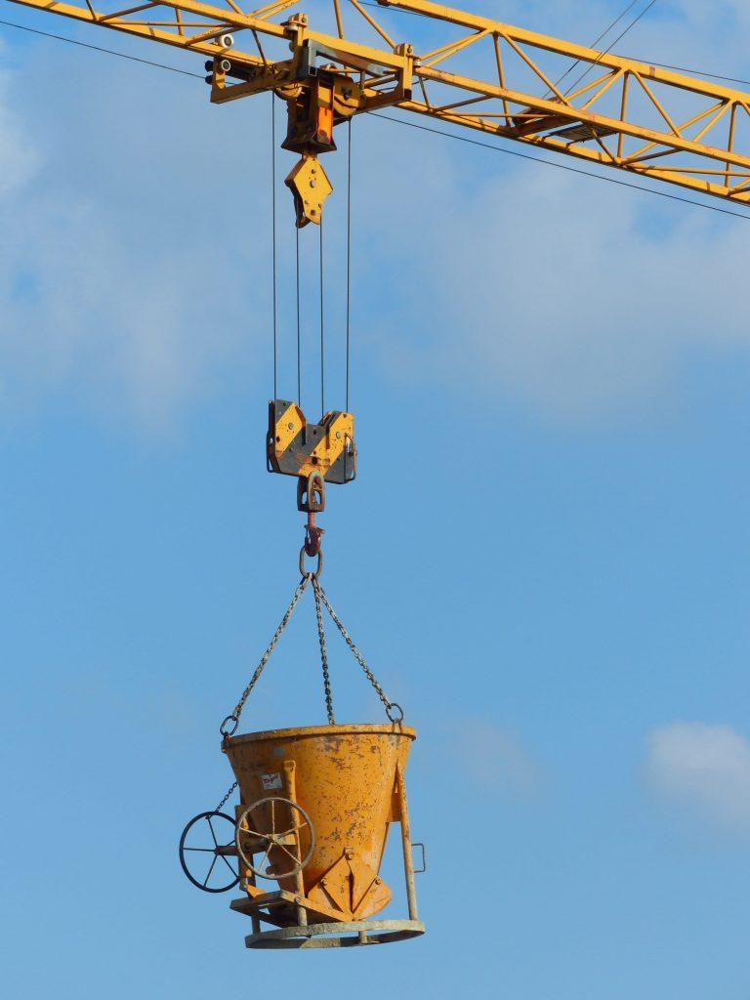
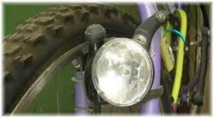
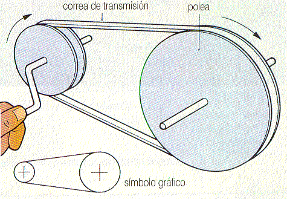
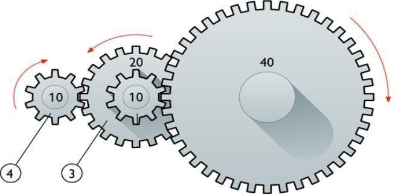
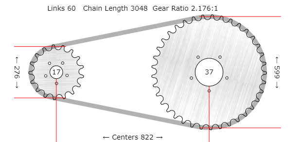

[🔙 Enrere](../) | [🏠 Pàgina principal](http://danimrprofe.github.io/apuntes/)

# MECANISMOS DE TRANSMISIÓN

## TRANSMISIÓN LINEAL
---
# POLITGES

Una politja és un element mecànic format per una roda amb una ranura per on passa una co, cinta o cable. Aquesta corda pot ser arrossegada per una força externa aplicada a l'altre extrem, el que permet desplaçar una càrrega o resistència. Les polees es poden utilitzar en solitari o en conjunt.

---
# Politja mòbil

La politja mòbil no és altra cosa que una politja de ganxo connectada a una corda que té un dels seus extrems ancorat a un punt fix i l'altre (extrem mòbil) connectat a un mecanisme de tracció.

---

L'inconvenient d'aquest muntatge és que per elevar la càrrega hem de fer força en sentit ascendent, cosa que resulta especialment incòmoda i poc efectiva. Per solucionar-ho es recorre a la seva utilització sota la forma de polipast (combinació de politges fixes amb mòbils).

---
# Polipast

Un polipast és un aparell que serveix per elevar o moure càrregues pesades. Aquest aparell està format per un conjunt de polies que van lligades a un ganxo o càrrega.

Quan es tira de la corda del polipasto, la càrrega es mou cap amunt, gràcies a la multiplicació de forces que es produeix amb les polies. El polipasto es pot utilitzar en una gran varietat d'activitats, com en la construcció, el trasllat de mercaderies, en tallers mecànics, entre altres.

https://www.compassproject.net/html5sims/pulleysim/pulley_en.html

---
---
# MECANISMOS DE TRANSMISIÓN
## TRANSMISIÓN **CIRCULAR**
---

# Ruedas de fricción

Las ruedas de fricción consisten en dos ruedas que se presionan entre sí para transferir el movimiento. La rueda motriz, que se encuentra conectada al motor, hace contacto con la rueda conducida y la hace girar.

---

# Dinamo

Este sistema es utilizado en aplicaciones donde se requiere una transmisión de potencia a corta distancia.

---
# Polea y correa

Mecanismo de transmisión de movimiento ``rotativo`` que se utiliza en aplicaciones de mayor distancia.

Consiste en una polea que se encuentra conectada al motor y que hace contacto con una correa que se extiende hacia otra polea, que a su vez transfiere el movimiento a la máquina o dispositivo que se desea mover.

---

Las correas pueden ser de diferentes tipos, como las planas, las trapezoidales o las dentadas, y su elección dependerá del tipo de aplicación.

Simulador: https://www.blocklayer.com/pulley-belteng

---
# Engranajes

Los engranajes de rueda dentada son uno de los mecanismos más utilizados para la transmisión del movimiento. En general, los engranajes de rueda dentada se componen de dos ruedas dentadas que están unidas por un eje. Las ruedas dentadas se encuentran en contacto y los dientes se interbloquean.

---

Las ruedas dentadas se pueden mover en el mismo sentido o en sentidos opuestos. Si las ruedas dentadas se mueven en el mismo sentido, se llama una reducción; si las ruedas dentadas se mueven en sentidos opuestos, se llama una transmisión.

---

Los engranajes de rueda dentada de rueda dentada pueden transmitir un movimiento uniforme a una velocidad diferente.

https://geargenerator.com/

---
# Cadenas

Las ``cadenas`` son uno de los mecanismos más simples para transmitir el movimiento. Una cadena es una serie de ``eslabones`` conectados. Los eslabones pueden girar libremente en torno a su eje.

Las cadenas se utilizan principalmente en bicicletas, motocicletas, motores de bote y trenes de juguete.

---
# Cadenas: simulación

Simulador: https://www.blocklayer.com/chain-sprocket

Calculador motores y cambios de marchas: https://www.blocklayer.com/rpm-gear

---

# Piñones y platos

Se denomina ``piñón`` a la rueda de un mecanismo de cremallera o a la rueda más pequeña de un par de ruedas dentadas

En una etapa de engranaje, la rueda más grande se denomina ``corona``, mientras que en una transmisión por cadena como la de una bicicleta o motocicleta además de corona a la rueda mayor se le puede denominar ``plato``, «estrella» o «catalina»

---
<!-- _class: invert -->