[🔙 Enrere](../) | [🏠 Pàgina principal](http://danimrprofe.github.io/apuntes/)

# Sistemas de retención

Destinados a ``interrumpir`` a voluntad el ``movimiento`` de rotación del eje.

---
# Frenos

Los sistemas de frenado son elementos mecánicos que se utilizan para ``reducir o detener`` el movimiento de una máquina.

---

Su funcionamiento consiste en aumentar las ``resistencias`` que se producen en una máquina durante su funcionamiento.

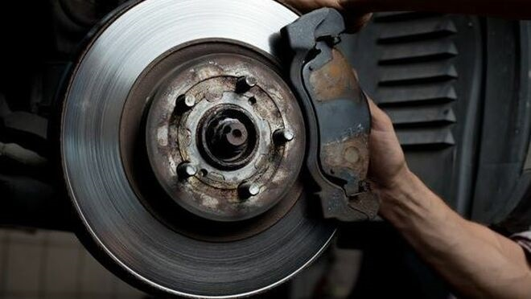

La energía cinética que poseen los elementos móviles se transforma en trabajo durante la deceleración, generando ``calor``.

---

Para prolongar la duración de los elementos de frenado y hacer que los mecanismos vuelvan a estar rápidamente en condiciones de actuar de forma eficaz, se utilizan ``materiales`` adecuados para revestir las superficies de desgaste de los frenos, como el acero con bronce, latón o acero.

---

Las ``pastillas de freno`` pueden estar hechas de materiales metálicos o cerámicos, dependiendo del tipo de freno y de las condiciones de funcionamiento.

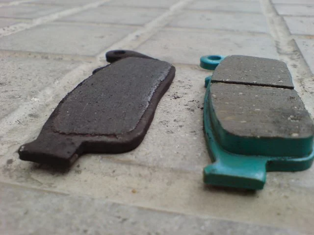

---

# Frenos de tambor

El sistema de freno de tambor se compone de un ``tambor`` que se encuentra en el interior de la rueda, y que gira junto con ella.

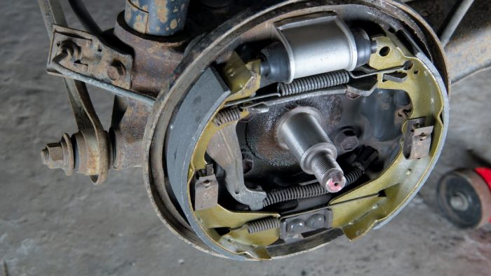

---

Las ``zapatas`` son piezas de metal en forma de arco que se ajustan dentro del tambor, y que se activan para crear fricción y detener la rotación del tambor y, por lo tanto, de la rueda.

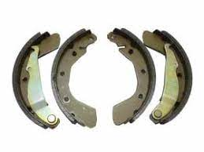

---
Cuando se presiona el pedal de freno, una serie de piezas mecánicas y hidráulicas trabajan juntas para empujar las zapatas contra el tambor, lo que crea la fricción necesaria para detener el vehículo.

---

---

# Tipus

Les sabates de frens poden ser de tipus interior o exterior. En els frens de sabata interior, les sabates pressionen contra la cara interna del tambor per reduir la velocitat. En els frens de sabata exterior, les sabates pressionen contra la cara externa del tambor per realitzar la mateixa funció.

---

# Frens de disc

Els frens de disc funcionen mitjançant una pinça que pren un disc col·locat en l'eix de gir. La pinça pressiona dues pastilles de fre, una a cada costat del disc, per frenar el moviment. Això es fa mitjançant èmbols que s'accionen amb pressió hidràulica.

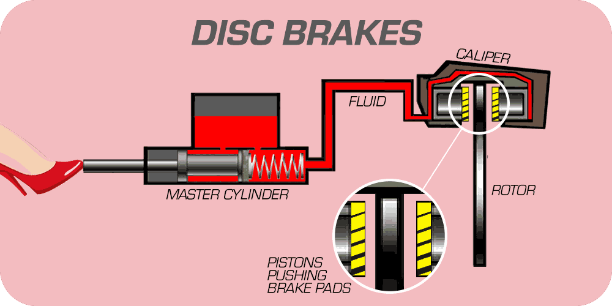

---

El líquid que circula en el sistema de frenat es diu líquid de frens.

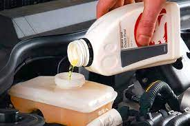

---

# Tipus de frens de disc

Hi ha dos tipus de frens de disc: sistema rígid i sistema flotant. En el sistema rígid, els èmbols pressionen per ambdós costats del disc de manera simultània, mentre que en el sistema flotant, una pinça solidària duu dos pistons, un acciona directament sobre una de les pastilles de fre i l'altre acciona sobre l'altra per mitjà de la porta de la pinça.

---

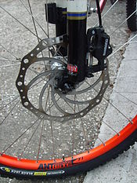

---

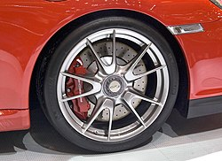

---

# Accionament dels sistemes de frenat

Hi ha diferents tipus d'accionament dels sistemes de frenat que s'utilitzen en vehicles i altres màquines. Els dos tipus més comuns són els sistemes de frenat mecànics i hidràulics.

---

Els sistemes de frenat ``mecànics`` utilitzen una vareta per mitjà d'una palanca per fer girar la lleva i separar les sabates de frens per aplicar-les contra el tambor.

---

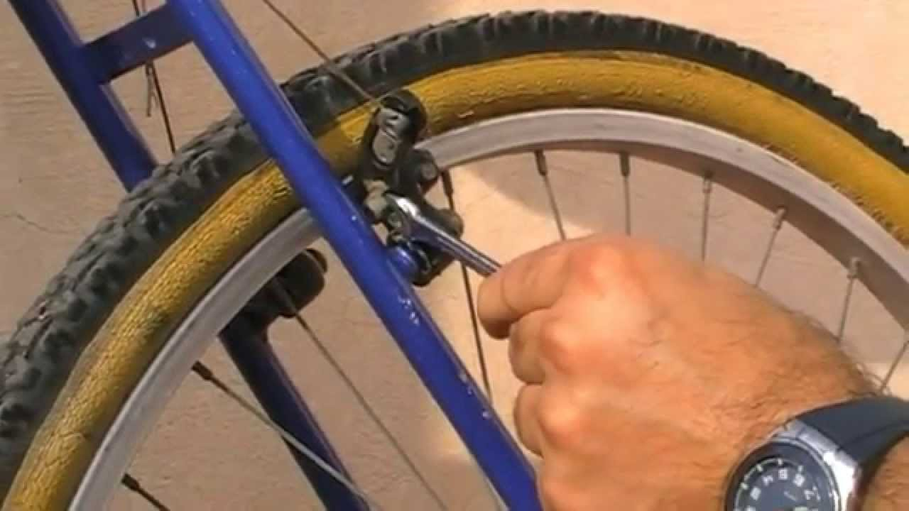

---

# Hidráulicos

Los sistemas de frenado ``hidráulicos`` utilizan un líquido para transmitir la presión a través de una columna de líquido que actúa como transmisor de energía.

---

# Líquidos de freno

El líquido de frenos es un ``fluido`` hidráulico que se utiliza en el sistema de frenos.

Transmite la presión ejercida por el conductor sobre el ``pedal del freno`` a las zapatas o ``pastillas de fren``o, que a su vez generan la ``fricción`` necesaria para detener el vehículo.

---

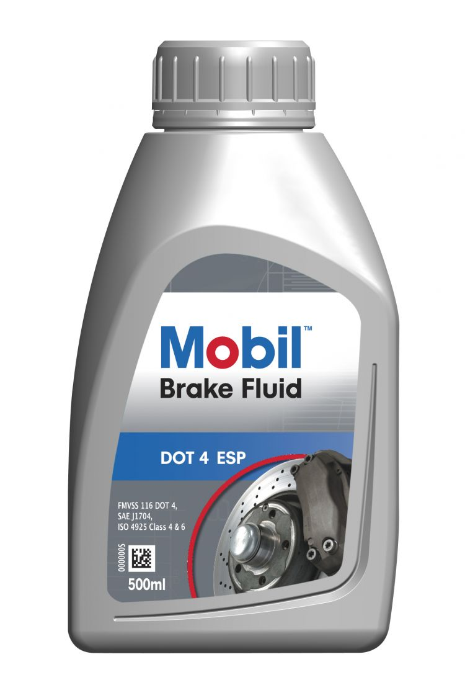

---
# Servofrens

Els servofrens són un tipus especial de sistema de frenat que ajuda a reduir l'esforç de la força que s'ha de realitzar en el pedal de fre. Els servofrens utilitzen una font externa d'energia, com ara l'aire comprimit o l'energia hidràulica, per ajudar a aplicar la força als frens i reduir l'esforç que s'ha de fer en el pedal.

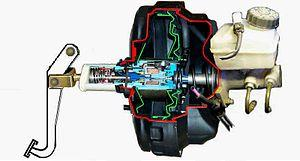

Els servofrens pneumàtics són els més habituals i utilitzen una vàlvula per deixar passar aire comprimit que acciona els èmbols per aplicar la força als frens.

---
# Trinquets

Es un mecanismo que permite que una pieza o componente se mueva en una dirección determinada, pero no en la dirección opuesta. El trinquete generalmente está compuesto por una rueda dentada y una palanca que se encajan entre los dientes de la rueda dentada para evitar que la pieza se mueva hacia atrás.

Permeten rotació d’un eix en un sentit determinat l’impideixen en l’oposat

---

# Sistema de trinquet. Compost de:

- ``Roda dentada``. Dents tenen un costat recte i l’altre corb.
- Nucli o ``trinquet``. Articulat en una part fixa, encaixa en el costat recte de la dent
- Bon funcionament quan el trinquet, en contacte amb la dent, tendeix espontàniament a introduir-se a l’espai lliure.

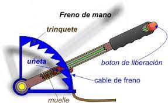

---

# Resorte

Es un componente elástico que se utiliza para almacenar y liberar energía en una variedad de aplicaciones mecánicas.

Los resortes pueden ser de diferentes tipos, como ``helicoidales``, de láminas, de torsión, entre otros, y se utilizan en una amplia gama de aplicaciones, desde relojes hasta vehículos.

---
<!-- _class: invert -->