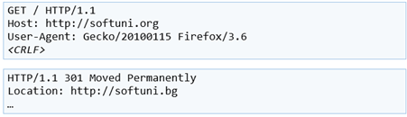
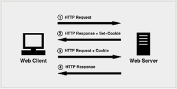

Datos del alumno
Nombre y apellidos		Módulo	
Curso		Fecha	

1.	Explica todo lo que sucede en el ordenador cliente desde que se quiere visitar una página web hasta que la página se muestra en la pantalla del navegador.
2.	¿Qué tipo de aplicaciones permiten aumentar la funcionalidad de una página web, además de HTML? Explica dónde se ejecutan y da ejemplos.
3.	Explica qué diferencias existen entre HTTP y HTML.
4.	Escribe un ejemplo de URL tan completo como puedas, y escribe los nombres de cada parte.
5.	Explica las diferencias entre GET, HEAD y POST
6.	Explica qué son las cabeceras, en qué tipo de mensajes HTTP se utilizan y para qué sirven. 
7.	Explica todo lo que sepas sobre esta transacción HTTP
 

8.	Explica que son y para que sirven las cookies, así como de que manera funciona su intercambio
 
