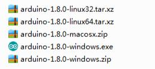
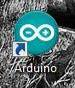
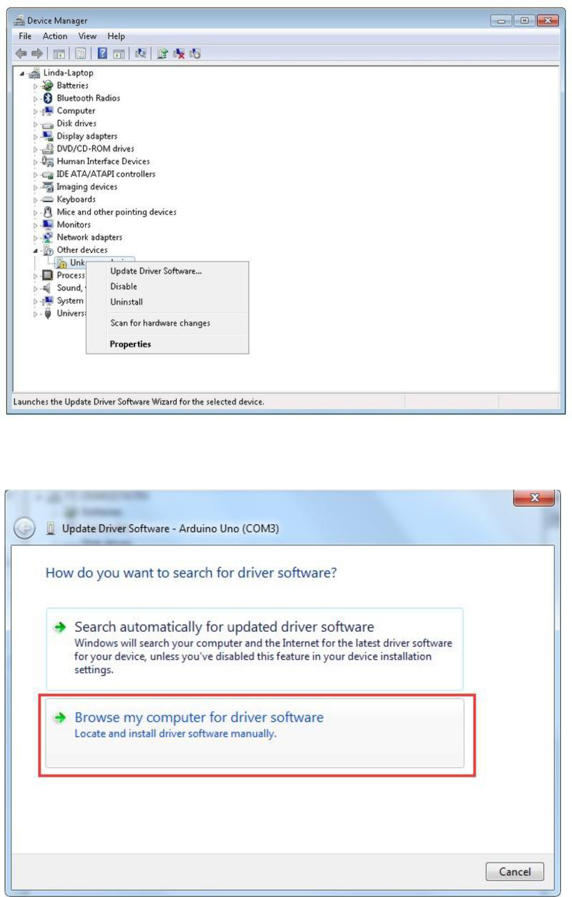
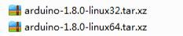

# 00. Instalación IDE 

## Introducción 

El **Entorno de desarrollo integrado (IDE) de Arduino** es el software de la plataforma Arduino. En esta lección, usted aprenderá cómo configurar tu ordenador para usar Arduino y cómo establecer sobre las lecciones que siguen.

## Instalación

Paso 1: Ir a https://www.arduino.cc/en/Main/Software y a continuación de la página.

La versión disponible en este sitio web es generalmente la última versión y la versión actual puede ser más reciente que la versión en el cuadro.

Paso 2 : Descargar el desarrollo software que es compatible con el sistema operativo del ordenador. Windows tomar como un ejemplo aquí

Haga click en Windows Installer.

Haga click en DESCARGAR (JUST DOWNLOAD).

También está disponible en el material que nos proporciona la versión 1.8.0, y las versiones de nuestros materiales son las últimas versiones cuando se hizo este manual.

### Instalación de Arduino (Windows)

Instalar Arduino con el exe. Paquete de instalación.

Haga click en I Agree to see de esta ventana

Click Next

Puede pulsar examinar... elegir una ruta de instalación o directamente en el directorio que desee.

Haga Click en Install para comenzar la instalación

Por último, aparece la siguiente ventana, haga clic en Install para finalizar la instalación.

A continuación, aparece el siguiente icono en el escritorio

Haga doble clic para entrar en el entorno de desarrollo deseado

Directamente puede elegir el paquete de instalación para la instalación y omitir los contenidos abajo y saltar a la siguiente sección. Pero si quieres aprender algunos métodos que no sea el paquete de instalación, por favor lea la sección.

Descomprime el archivo zip descargado, haga doble clic para abrir el programa y entrar en el entorno de desarrollo deseado

## Conexión de placa Arduino

Sin embargo, este método de instalación necesita instalación de **drivers**.

La carpeta de Arduino incluye el propio **programa de Arduino** y los **controladores** que permiten que el Arduino se conecte al ordenador mediante un cable USB. 

Conecte su cable **USB** en el Arduino y en el USB ordenador. La luz en el LED se enciende y usted puede obtener un mensaje de 'Found New Hardware' de Windows. Ignore este mensaje y cancele cualquier intento que Windows hace para tratar de instalar los controladores automáticamente.

## Instalación de drivers

El mejor método de instalación de los controladores USB debe hacerse desde el administrador de dispositivos. Esto es accesible de diferentes maneras dependiendo de la versión de Windows. En Windows 7, primero tienes que abrir el Panel de Control, luego seleccione la opción de ver los iconos, y usted debe encontrar el administrador de dispositivos en la lista.

En 'Otros dispositivos', debería ver un icono de 'dispositivo desconocido' con un triangulo amarillo de advertencia junto a él. Se trata de tu Arduino.

Haga clic derecho sobre el dispositivo y seleccione la opción del menú superior (Update Driver Software...). Pedirá a 'Buscar automáticamente software de controlador actualizado' o "Examinar mi PC para el software de controlador". Seleccione la opción Buscar en este ordenador en la ruta del CD , por ejemplo en D:\arduino1.8.0\drivers.

Haga clic en 'Siguiente' y puede obtener una advertencia de seguridad, si es así, permitir que el software a instalar. Una vez instalado el software, usted recibirá un mensaje de confirmación.

Los usuarios de Windows pueden omitir las instrucciones de instalación, para sistemas Mac y Linux y saltar a la lección 1.

Usuarios de Mac y Linux pueden seguir leyendo esta sección

## Instalación de Arduino (Mac OS X)

Descargar y descomprimir el archivo zip, haga doble clic en Arduino.app para entrar en el IDE de Arduino; el sistema le pedirá que instale la **librería** de tiempo de ejecución de Java si no lo tienes en tu ordenador. Una vez finalizada la instalación se puede ejecutar el IDE de Arduino.

## Instalación de Arduino (Linux)

Usted tendrá que utilizar el comando de instalación. Si está utilizando el sistema de Ubuntu, se recomienda instalar el IDE de Arduino desde el centro de software de Ubuntu.

Consejos: Si tienes problemas en la instalación de los controladores, consulte el UNO R3, MEGA, NANO controlador preguntas más frecuentes.

