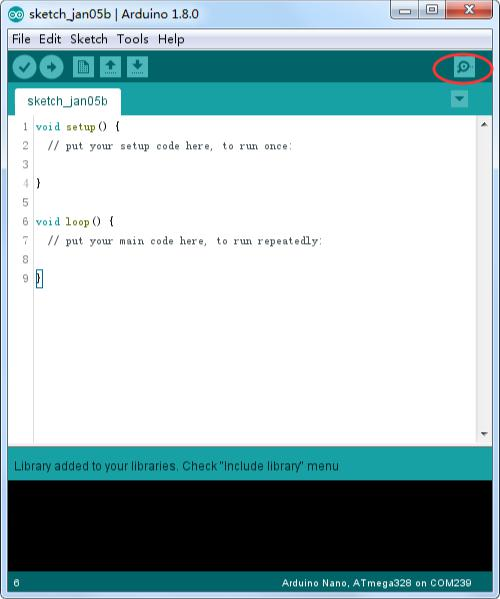
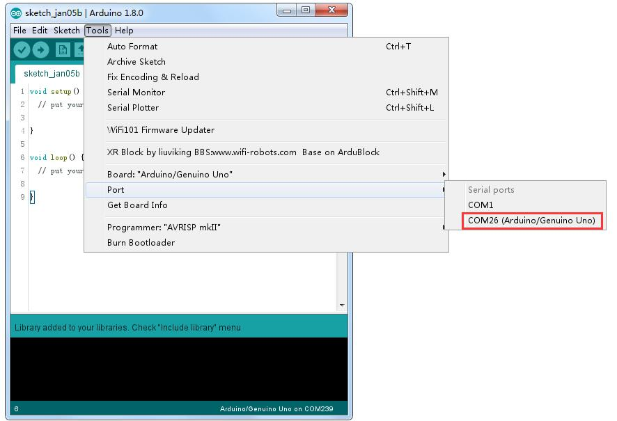
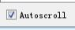

# Monitor serie

Entorno de desarrollo integrado (IDE) de **Arduino** es el software de la plataforma Arduino. Y, porque utilizando un terminal es una gran parte del trabajo con Arduinos y otros microcontroladores, decidieron incluir un terminal de serie con el software. En el entorno de Arduino, esto se llama al Monitor serie.

## Realizar la conexión

Monitor de serie viene con cualquier versión del IDE Arduino. Para abrirlo, simplemente haga
clic en el icono Serial Monitor.

Seleccionar cuál de los puertos a abrir en el Monitor Serial es lo mismo que seleccionar un puerto para cargar código de Arduino. Vaya a herramientas -> Serial Port y seleccione el puerto correcto.

Consejos: Elegir el mismo puerto COM que tienes en el administrador de dispositivos.

Una vez abierto, debería ver algo como esto:

### Configuración

El Monitor Serial ha limitado opciones, pero lo suficiente para manejar la mayoría de sus  necesidades de comunicación serial. El primer ajuste que se puede modificar es la velocidad  en baudios. Haga clic en la velocidad en baudios tasa lista desplegable para seleccionar la  velocidad correcta. (9600 baudios)

Por último, puede establecer el terminal desplazamiento automático o no marcando la casilla en la esquina inferior izquierda

### Pros

El Monitor Serial es una gran manera rápida y fácil para establecer una conexión en serie con  el Arduino. Si ya trabaja en el IDE de Arduino, no hay realmente ninguna necesidad de abrir un terminal separado para Mostrar datos

### Contras

La falta de valores deja mucho que desear en el Monitor Serial, y, para comunicaciones serie avanzadas, no puede hacer el truco.

