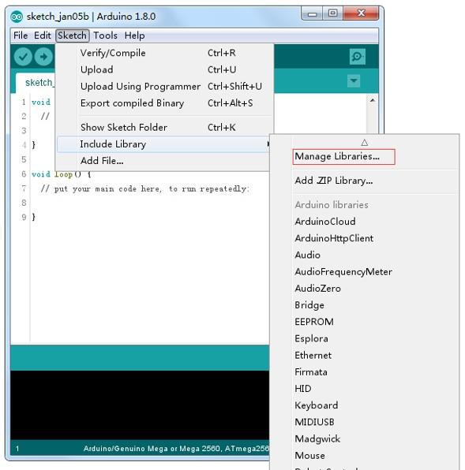
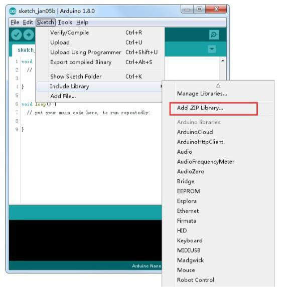

# 01. Librerias y monitor serie

### Instalación de **librerías** adicionales de Arduino 

Una vez que esté instalado con el software de Arduino y utilizando las funciones integradas, puede que desee ampliar la capacidad de tu Arduino con **librería**s adicionales.

### ¿Qué son las librerías? 

Las **librerías** son una colección de funciones que hacen que sea nos facilitan conectar con un  sensor, pantalla, módulo, etcétera. Por ejemplo, la librería **LiquidCrystal** incorporada facilita  hablar con pantallas LCD de caracteres. 

Hay cientos de librerías adicionales disponibles en Internet. Para utilizar las **librerías** adicionales, es necesario instalarlas primero. 

### Cómo instalar una librería 

Mediante el administrador de la **librería**

Para instalar una nueva **librería** en el IDE de Arduino se puede utilizar el **administrador de **librería**** (disponible desde IDE versión 1.8.0). Abra el IDE y haga clic en el menú "Dibujo" y luego la **librería** incluyen > Gestión de **librería**s.  



Encontraremos una lista de **librerías** que ya están instaladas o disponibles para su instalación. En este ejemplo vamos a instalar la **librería** de puente. Desplazarse por la lista para encontrarla, a continuación, seleccione la versión de la **librería** que desea instalar. A veces sólo está disponible una versión de la **librería**. Si no aparece el menú de selección de versión, no te preocupes: es normal.

Hay veces que tienes que esperar, tal como se muestra en la figura. Por favor actualice y esperar


Finalmente haga click en instalar y esperar a que el IDE instale la nueva **librería**. La descarga puede tardar un tiempo dependiendo tu velocidad de conexión. Una vez haya terminado, debe aparecer una etiqueta instalada junto a la **librería** de puente. Una vez instalada puede cerrar el administrador de la **librería**.


Ahora ya puede encontrar la nueva **librería** disponible en el menú de **librería**. Si quieres añadir tu propia **librería** vaya a abrir un nuevo tema en Github.

### Importar una **librería** de .zip 

Las **librería**s se distribuyen a menudo como un archivo ZIP o una carpeta. El nombre de la carpeta es el nombre de la **librería**. Dentro de la carpeta será un archivo .cpp, un archivo .h y a menudo un fichero llamado **keywords.txt**, carpeta de ejemplos y otros archivos requeridos por la **librería**. A partir de la versión 1.0.5, puede instalar **librería**s de partido 3 º en el IDE. Descomprime la librería descargada y dejarlo como está.

En el IDE de Arduino, desplácese a **Sketch > Biblioteca** incluyen. En la parte superior de la lista desplegable, seleccione la opción "agregar. Biblioteca ZIP''.



Se le pedirá para seleccionar la **librería** que desea añadir. Desplácese hasta la ubicación del archivo .zip y luego pincha en abrir.


Volver al dibujo > menú de **librería** de importación. Ahora debe ver la **librería** en la parte inferior del menú desplegable. Está listo para ser utilizado en su lista. El archivo zip se ha incorporado en la carpeta de **librería**s en el directorio de plantillas de Arduino.

Nota: la **librería** estará disponible para utilizar en los dibujos, pero los ejemplos de la **librería** no serán expuestos en el archivo > ejemplos hasta después del IDE se ha reiniciado. Los dos son los enfoques más comunes. Asimismo, pueden manejarse sistemas MAC y Linux. El manual de instalación que se introducirá por debajo como alternativa puede usarse rara vez y los usuarios que no lo necesiten pueden saltarlo

### Manual de instalación 

Para instalar la **librería**, primero salga de la aplicación de Arduino. Luego descomprima el archivo ZIP que contiene la **librería**. Por ejemplo, para instalar una librería llamada "ArduinoParty", descomprime ArduinoParty.zip. Debería contener una carpeta llamada **ArduinoParty**, con archivos como ArduinoParty.cpp y ArduinoParty.h dentro. (Si los archivos .cpp y .h no en una carpeta, debe crear uno. En este caso, usted sería hacer una carpeta llamada "ArduinoParty" y copiar todos los archivos que estaban en el archivo ZIP, como ArduinoParty.cpp y ArduinoParty.h.)

Arrastre la carpeta de ArduinoParty en esta carpeta (la carpeta de **librerías**). Bajo Windows, lo probable es que se llamará "My Documents\Arduino\libraries". Para usuarios de Mac, lo probable es que se llamará "Bibliotecas de Arduino de documentos". En Linux, será la carpeta "libraries" en su programabook.

La carpeta de la **librería** Arduino debe ahora este aspecto (en Windows):

```
Mi Documents\Arduino\libraries\ArduinoParty\ArduinoParty.cpp 
Mi Documents\Arduino\libraries\ArduinoParty\ArduinoParty.h  
Mi Documents\Arduino\libraries\ArduinoParty\examples 
```
o como esta (en Mac y Linux): 

```
Documents/Arduino/libraries/ArduinoParty/ArduinoParty.cpp 
Documents/Arduino/libraries/ArduinoParty/ArduinoParty.h  
Documentos/Arduino/**librería**s/ArduinoParty/ejemplos 
```

Puede haber más archivos que solo los .cpp y .h, sólo asegúrese de que están todos allí. (La **librería** no funcionará si pones los archivos .cpp y .h en la carpeta de **librería**s o si está anidados en una carpeta extra. Visualizador:

Documents\Arduino\libraries\ArduinoParty.cpp y Documents\Arduino\libraries\ArduinoParty\ArduinoParty\ArduinoParty.cpp no funcionarán.)

Reiniciar la aplicación Arduino. Asegúrese de que la nueva **librería** aparece en el directorio -> elemento de menú de **librería** de importación del software. ¡Eso es todo! ¡Ha instalado una **librería**!

### Arduino serie Monitor (Windows, Mac, Linux) 

Entorno de desarrollo integrado (IDE) de Arduino es el software de la plataforma Arduino. Y, porque utilizando un terminal es una gran parte del trabajo con Arduinos y otros microcontroladores, decidieron incluir un terminal de serie con el software. En el entorno de Arduino, esto se llama al Monitor serie.

Realizar la conexión

Monitor de serie viene con cualquier versión del IDE Arduino. Para abrirlo, simplemente haga

clic en el icono Serial Monitor.


Seleccionar cuál de los puertos a abrir en el Monitor Serial es lo mismo que seleccionar un puerto para cargar código de Arduino. Vaya a herramientas -> Serial Port y seleccione el puerto correcto.

Consejos: Elegir el mismo puerto COM que tienes en el administrador de dispositivos.


Una vez abierto, debería ver algo como esto:


### Configuración 

El Monitor Serial ha limitado opciones, pero lo suficiente para manejar la mayoría de sus  necesidades de comunicación serial. El primer ajuste que se puede modificar es la velocidad  en baudios. Haga clic en la velocidad en baudios tasa lista desplegable para seleccionar la  velocidad correcta. (9600 baudios) 


Por último, puede establecer el terminal desplazamiento automático o no marcando la casilla en la esquina inferior izquierda


### Pros 

El Monitor Serial es una gran manera rápida y fácil para establecer una conexión en serie con  el Arduino. Si ya trabaja en el IDE de Arduino, no hay realmente ninguna necesidad de abrir un terminal separado para Mostrar datos  

### Contras 

La falta de valores deja mucho que desear en el Monitor Serial, y, para comunicaciones serie avanzadas, no puede hacer el truco. 

