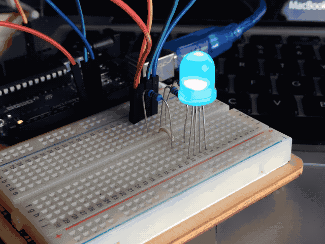
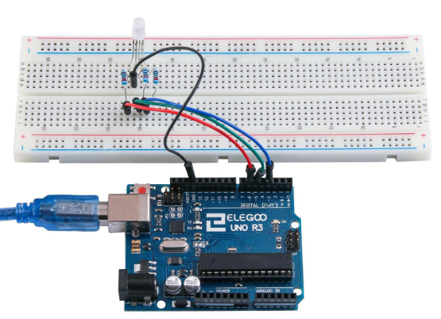

# 04. Led RGB

## Resumen 

Los LED RGB son una forma divertida y fácil para agregar color a sus proyectos. Puesto  que es como regular 3 LED en uno, el uso y conenxión no es muy diferente.  

 

Existen 2 versiones: 

- Ánodo común 
- Cátodo común.  

Ánodo común utiliza 5V en el pin común, mientras que el cátodo común se conecta  a tierra.  
Como con cualquier LED, tenemos que conectar algunas resistencias en línea (3 total)  así que podemos limitar la corriente absorbida.  

En nuestro **programa**, se comienzan con el LED en el estado de color rojo, entonces  se descolora a verde, luego se descolora azul y finalmente hacia el color rojo.  Haciendo esto que nos pasará por la mayor parte del color que se puede lograr.  

## Componentes necesarios

| cantidad | componente| 
| --- | --- |
| 1 | placa arduino |
| 1 | protoboard |
| 4 | cables jumper |
| 1 | LED RGB|
| 3 | resistencias de 220 ohmios |

## RGB

A primera vista, LEDs RGB (rojo, verde y azul) sólo parecen un LED. Sin embargo, dentro del paquete del LED generalmente, hay realmente tres LEDs, uno rojo, uno verde y sí, uno azul. Controlando el **brillo** de cada uno de los LEDs individuales, podemos mezclar prácticamente cualquier color.


Mezclamos colores del mismo modo que sería mezclar pintura en una paleta - ajustando el brillo de cada uno de los tres LEDs. 

Arduino tiene una función **analogWrite** que se puede utilizar con pines marcados con un **~** a la salida de una cantidad variable de energía los LEDs apropiados.

El LED RGB tiene **cuatro pines**. Hay un cable a la conexión positiva de cada uno de los LEDs individuales dentro del paquete y un patilla única que está conectado a los tres lados negativos de los LEDs.


- Cada pin separado de color verde o azul o de rojo se llama ánodo. 

## Color

Los colores los conseguiremos mezclando diferentes cantidades de cada color primario.


La mezcla creará la sensación del color elegido. Podemos controlar el brillo de cada una de las partes de rojas, verdes y azules del LED por separado, lo que es posible mezclar cualquier color que nos gusta.  


Ejemplos:

- Si establece el brillo de todos los tres LEDs al ser el mismo, el color general de la luz  será blanco. 
- Si apagamos el LED azul, para que sólo los LEDs rojo y verdes son el  mismo brillo, la luz aparecerá amarillo.  

## ¿Cómo consigo el color negro?

El color **Negro** no es tanto un color como una ausencia de luz. Por lo tanto, lo más cercano  que podemos llegar a negro con el LED es apagar los tres colores, poniendo sus valores a 0. 

## Teoría (PWM) 

Modulación de ancho de pulso (PWM) es una técnica para el control de potencia. También utilizamos aquí para controlar el brillo de cada uno de los LEDs. El siguiente diagrama muestra que la señal de uno de lo PWM pines en la UNO.  


Aproximadamente cada 1/500 de segundo, la salida PWM producirá un pulso. La  duración de este pulso es controlada por la función 'analogWrite'. Así:

- 'analogWrite(0)' no producirá ningún pulso 
- 'analogWrite(255)' producirá un  pulso que dura todo el camino hasta el pulso siguiente vencimiento, para que la  salida es en realidad todo el tiempo.  

Si especificamos un valor en el analogWrite que está en algún lugar entre 0 y 255, se producir un pulso. 

- Si el pulso de salida es alto para el 5% del tiempo, entonces lo  que nosotros estamos manejando sólo recibirá el 5% de potencia. 
- Si la salida es 5V para el 90% del tiempo, la carga recibirá el 90% de la potencia entregada a él. 

Los LED se encenderán y apagarán en esos periodos, pero nosotros percibiremos que el brillo del LED cambia.

### Esquema

El esquema eléctrico que seguiremos es el siguente:


1. El cátodo o conexión común es el segundo pin, que también es el **más largo **de las cuatro patas y se conectarán a la **tierra** (GND).
2. Cada LED requiere su propia **resistencia de 220 Ω** para prevenir demasiada corriente que fluye a través de él. 
3. Los 3 pines de color (uno rojo, uno verde y uno azul) están conectados a los pines de salida UNO con estas resistencias.


Una vez conectado, debería quedar de la siguiente forma:



### Código programa 1

```c linenums="1" title="pruebaLEDRGB.ino"
// Define pines
#define BLUE 3
#define GREEN 5
#define RED 6

void setup()
{
  pinMode(RED, OUTPUT);
  pinMode(GREEN, OUTPUT);
  pinMode(BLUE, OUTPUT);
}

void loop()
{
  analogWrite(RED, 0);
  analogWrite(GREEN, 255);
  analogWrite(BLUE, 0);
}
```

Una vez probado, puedes intentar estos ejercicios:

1. Combinar varios valores para conseguir colores diferentes
2. Crear un semáforo utilizando delays y cambiando los valores para producir las luces roja, verde y amarilla.

### Código programa 2

```c
// Define pines
#define BLUE 3
#define GREEN 5
#define RED 6

void setup()
{
  pinMode(RED, OUTPUT);
  pinMode(GREEN, OUTPUT);
  pinMode(BLUE, OUTPUT);
  digitalWrite(RED, HIGH);
  digitalWrite(GREEN, LOW);
  digitalWrite(BLUE, LOW);
}

// define variables
int redValue;
int greenValue;
int blueValue;

// main loop
void loop()
{
  #define delayTime 10 // fading time between colors

  redValue = 255; // choose a value between 1 and 255 to change the color.
  greenValue = 0;
  blueValue = 0;

  // this is unnecessary as we've either turned on RED in SETUP
  // or in the previous loop ... regardless, this turns RED off
  // analogWrite(RED, 0);
  // delay(1000);

  for(int i = 0; i < 255; i += 1) // fades out red bring green full when i=255
  {
  redValue -= 1;
  greenValue += 1;
  // The following was reversed, counting in the wrong directions
  // analogWrite(RED, 255 - redValue);
  // analogWrite(GREEN, 255 - greenValue);
  analogWrite(RED, redValue);
  analogWrite(GREEN, greenValue);
  delay(delayTime);
}

redValue = 0;
greenValue = 255;
blueValue = 0;

for(int i = 0; i < 255; i += 1) // fades out green bring blue full when i=255
{
greenValue -= 1;
blueValue += 1;
// The following was reversed, counting in the wrong directions
// analogWrite(GREEN, 255 - greenValue);
// analogWrite(BLUE, 255 - blueValue);
analogWrite(GREEN, greenValue);
analogWrite(BLUE, blueValue);
delay(delayTime);
}

redValue = 0;
greenValue = 0;
blueValue = 255;

for(int i = 0; i < 255; i += 1) // fades out blue bring red full when i=255
{
// The following code has been rearranged to match the other two similar sections
blueValue -= 1;
redValue += 1;
// The following was reversed, counting in the wrong directions
// analogWrite(BLUE, 255 - blueValue);
// analogWrite(RED, 255 - redValue);1
analogWrite(BLUE, blueValue);
analogWrite(RED, redValue);
delay(delayTime);
}
}
```


Primero especificamos a que pines de Arduino he conectado cada LED.

```arduino
// Define Pins 
#define BLUE 3 
#define GREEN 5 
#define RED 6 
```

En el setup, declaramos estos pines como salidas (OUTPUT) para poder enviar corriente hacia los LED.

```arduino
void setup() 
{ 
pinMode(RED, OUTPUT); 
pinMode(GREEN, OUTPUT); 
pinMode(BLUE,OUTPUT); 
digitalWrite(RED, HIGH); 
digitalWrite(GREEN, LOW); 
digitalWrite(BLUE, LOW); 
}
```

Antes de echar un vistazo a la **función loop**, veamos la última función en el proyecto.  

Las variables de definición:

```arduino
redValue = 255; // choose a value between 1 and 255 to change the color.  
greenValue = 0; 
blueValue = 0; 
```

Esta función tiene tres argumentos, uno para el brillo de los LEDs rojos, verdes y azules. En cada caso de que el número será en el rango 0 a 255, donde 0 significa apagado y 255 significa brillo máximo. La función entonces llama 'analogWrite' para ajustar el brillo de cada LED.

Si nos fijamos en la **función loop** se puede ver que ajuste la cantidad de luz roja, verde y azul que queremos mostrar y luego una pausa por un segundo antes de pasar al siguiente color.

```arduino
#define delayTime 10 // fading time between colors  
Delay(delayTime); 
```
