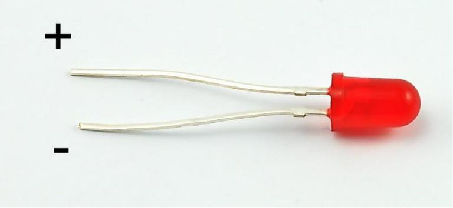
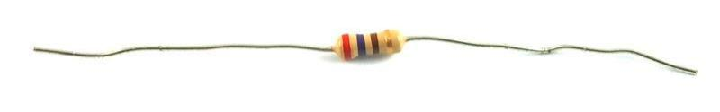
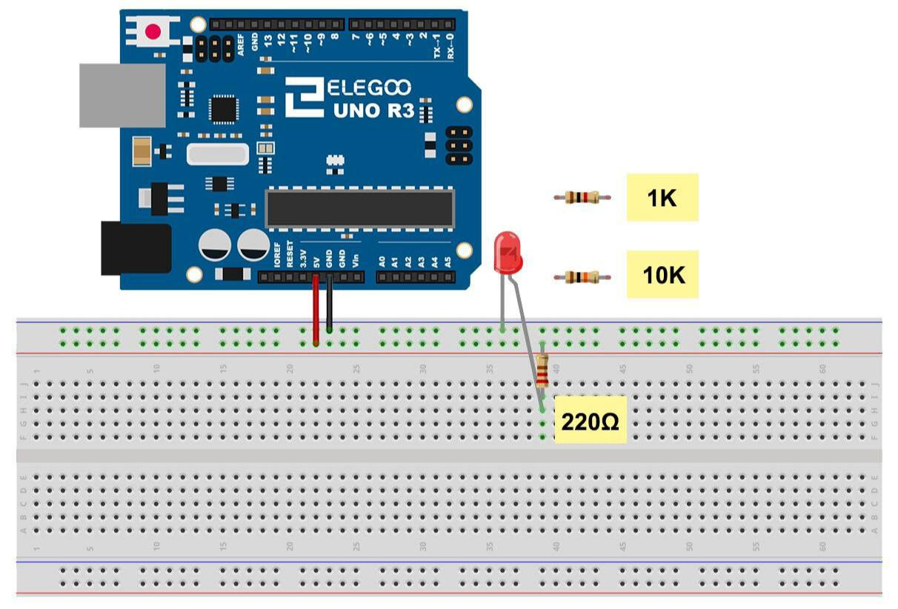

# LED

## Resumen

En esta lección, usted aprenderá cómo cambiar el brillo de un LED usando diferentes valores  de resistencia.
Componente necesario:
```
- [x] (1) x Placa``Arduino`` UNO
- [x] 1 LED rojo de 5 mm
- [x] (1) x resistencia de 220 ohmios
- [x] (1) x resistencia de 1 k ohm
- [x] (1) x resistencia de ohmio 10 k
- [x] (2) x M M cables (cables de puente de macho a macho)
```

## ¿Qué es un LED?

LED es un gran indicador. Utilizan muy poca electricidad durará para siempre.  En esta lección, usarás tal vez el más común de todos los LEDs: un LED de 5mm de color rojo. 5mm se refiere al diámetro del LED. Otros tamaños comunes son 3mm y 10mm.

## ¿Cómo se conecta?

Directamente no se puede conectar un LED a una batería o fuente de tensión porque:

1) El  LED tiene un positivo y un negativo llevar y no se encenderá si se coloca mal y debe utilizarse
2) Un LED con una resistencia para limitar o 'ahogar' la cantidad de corriente que fluye a través de él; ¡de lo contrario, quemará

## Ejemplo de LED



## Advertencia

Si no utilizas un resistencia con un LED, entonces se puede quemar casi de inmediato, como demasiada corriente fluirá a través, calienta y destruye al 'cruce' donde se produce la luz. Hay dos maneras de saber cual es el positivo del LED y que la negativa. En primer lugar, el positivo es más largo.

En segundo lugar, donde la pata del negativo entra en el cuerpo del LED, hay un borde plano para el caso del LED.

Si le sucede que tiene un LED que tiene un lado plano al lado del cable más largo, usted debe saber que la pata es el positivo.

## Resistencias

Como su nombre lo indica, resistencias de resisten el flujo de electricidad. Cuanto mayor sea el valor de la resistencia, resiste más y la menos corriente fluirá a través de él. Vamos a usar esto para controlar Cuánta electricidad fluye a través del LED y por lo tanto, como claramente brilla.

## Resistencias: ejemplo



## Resistencias: unidades

La **unidad** de resistencia se denomina Ohm, que se abrevia generalmente a Ω la letra griega Omega. Porque un Ohm es un valor bajo de resistencia (no resiste mucho a todos), incluye los valores de resistencias en kΩ (1.000 Ω) y MΩ (1.000.000 Ω). Éstos se llaman kiloohmios y megaohmios.

## Resistencias: valores

En esta lección, vamos a utilizar tres valores diferentes de resistencia:

- [x] 220 Ω
- [x] 1 kΩ
- [x] 10 kΩ

## Resistencias: diferencias

Estas resistencias todas se ven iguales, excepto que tienen **rayas de colores** diferentes en ellos. Estas rayas decirte el valor de la resistencia.

El **código** de color resistor tiene tres franjas de colores y luego una banda de oro en un extremo.

## Ejemplo identificación resistencia


## Resistencias: orientación

A diferencia de los **LED**, resistencias no tienen un cable positivo y negativo. Se puede conectar de cualquier manera alrededor.

## Resistencias: medición

Si desconocemos el valor de una resistencia, también podemos medir su valor utilizando un ``multímetro``.

### Conexión

### Esquema


## Simulación

La **placa de desarrollo``Arduino`` UNO** es una conveniente fuente de 5 voltios, que vamos a utilizar para alimentar el LED y la resistencia. No necesita hacer nada con su UNO, salvo que lo conecte un cable USB.

## Simulación: ejemplo



## Resistencias para LED

- Con la resistencia de **220 Ω** en su lugar, el LED debe ser bastante brillante.
- Si cambia  la resistencia 220  Ω para la resistencia de **1 kΩ**, el LED aparecerá regulador un  poco.
- Por último, con el resistor de **10 kΩ** en su lugar, el LED estará casi visible.

## Construcción

Por el momento, tienes 5V va a una pata de la resistencia, la otra pata de la resistencia va al lado positivo del LED y el otro lado del LED va a GND. Sin embargo, si nos mudamos la resistencia por lo que vino después el LED, como se muestra abajo, el LED seguirá la luz.

## Construcción: foto de ejemplo


