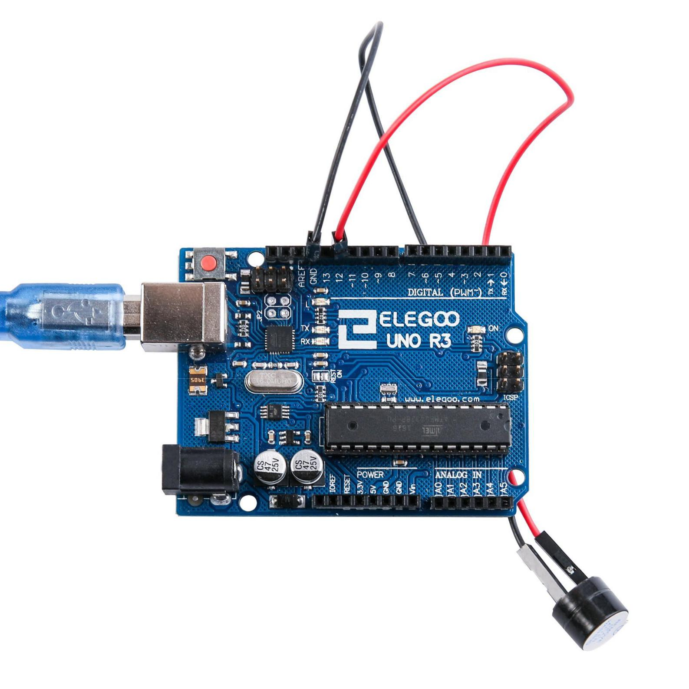

# 6. Zumbador activo

## Resumen 

En esta lección, aprenderá a generar un sonido con un timbre activo.  
Componente necesario: 

|   Cantidad  | Componente |
| --- | -------------------------------------------- |
| 1   | Placa Arduino UNO                               |
| 1   | zumbador de Active x                         |
| 2   | F M cables (cables de hembra a macho DuPont) |

## Zumbador

Un zumbador (también conocido como un buzzer) es un dispositivo electromecánico que produce un sonido audible. Se utiliza en muchos sistemas electrónicos para indicar una señal, como una alarma, una advertencia o una confirmación de acción. También se utiliza para indicar el final de una carrera deportiva o una actividad. Los zumbadores también se utilizan ampliamente en dispositivos de juegos, como consolas de videojuegos, para emitir señales sonoras. Estos dispositivos se pueden alimentar con baterías o conectarse a una fuente de alimentación externa.

## Tipos de zumbadores

Se pueden categorizar en **activos** y **pasivos**. Gire que los pernos  de dos zumbadores boca arriba. Con un tablero de circuito verde es un zumbador  pasivo, mientras que el otro cerrado con una cinta negra es un activo.  

- Un **zumbador activo** tiene una fuente oscilante integrada, por lo que va a generar un sonido cuando se electrifica. El  zumbador activo es a menudo más caro
- Un **zumbador pasivo**  no tiene esa fuente para que no pitan si se utilizan señales de DC; en cambio,  necesitará usar ondas cuadradas cuya frecuencia es entre 2K y 5K manejarlo. 


## Esquema de conexión


## Diagrama


## Montaje



## Código

Jugando con los retardos (delay) conseguiremos frecuencias de sonido distintas.

```c
int buzzer = 12; //pin del zumbador
void setup()
{
 pinMode(buzzer,OUTPUT); //configurar como salida
}
void loop()
{
 unsigned char i;
 while(1)
 {
   //output an frequency
   for(i=0;i<80;i++)
   {
    digitalWrite(buzzer,HIGH);
    delay(1);//wait for 1ms
    digitalWrite(buzzer,LOW);
    delay(1);//wait for 1ms
    }
    //output another frequency
     for(i=0;i<100;i++)
      {
        digitalWrite(buzzer,HIGH);
        delay(2);//wait for 2ms
        digitalWrite(buzzer,LOW);
        delay(2);//wait for 2ms
      }
  }
} 
```
