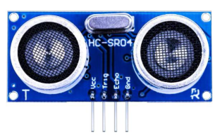
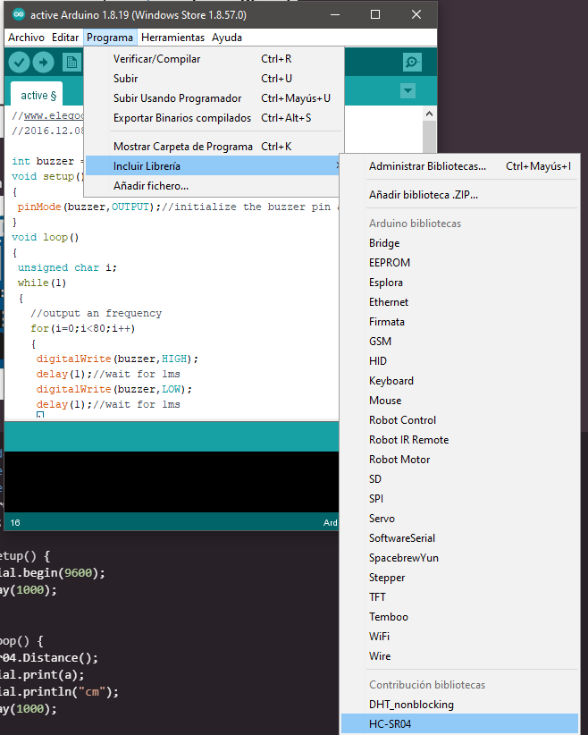

# 10. Módulo Sensor ultrasónico 

El **sensor ultrasónico** es ideal para todo tipo de proyectos que necesitan medidas de distancia, evitando los obstáculos como ejemplos.   

El HC-SR04 incorpora una **librería** diseñada  específicamente para estos sensores.  



## Componentes necesarios

Para hacer una prueba sencilla de funcionamiento del sensor, necesitaremos:

```
(1) x Placa Arduino UNO
(1) x Módulo de sensor ultrasónico  
(4) x F M cables (cables de hembra a macho DuPont)  
```
### Sensor de ultrasonidos 

El módulo **HC-SR04** del sensor ultrasónico nos permite medir distancias entre 2 cm y 400 cm, con una precisión que varía puede alcanzar los 3 mm. 

El principio básico del trabajo es el siguiente:

- Dispara una señal de nivel alto de al menos 10us
- El Módulo envía automáticamente ocho señales de 40 kHz y detecta si hay una señal de retorno, por rebotar en alguna superficie.
- Esta señal de retorno dependerá de la distancia recorrida y, por tanto, de la distancia.

La distancia recorrida se podría calcular en función de:

- La velocidad del sonido
- El tiempo que tardará en ir y volver realmente es el doble de la distancia que hay al objeto.

La formula que nos daría la distancia recorrida podría ser:

```math
distancia = (tiempo  * 340 ) / 2
```

El diagrama de sincronización se muestra a continuación. Sólo tiene que suministrar un pulso de 10us corto a la entrada de activación para iniciar el rango, y luego el módulo enviará una ráfaga de 8 ciclos de ultrasonido a 40 kHz y aumentar su eco. El Echo es un objeto de distancia que es el ancho de pulso y el rango en proporción. 

Se puede calcular el rango a través del intervalo de tiempo entre la señal de disparo de envío y la señal de eco de recepción. La fórmula es la siguiente:

```
Fórmula centímetros: us / 58 = centímetros 
Pulgadas:  us / 148 = inch; O: el rango = tiempo de alto nivel * velocidad (340M / S) / 2; 
```
Sugerimos utilizar más de 60ms de ciclo de medición, con el fin de evitar la señal de disparo a la señal de eco.


## Pines del sensor


## Conexión

Aquí podemos ver como conectar los cuatro pines del sensor al Arduino Uno.


### Diagrama de cableado

El diagrama de cableado es el siguiente. Recordad que utilizamos en general rojo para cables conectados a 5V y negro para 0V o tierra (GND).


### Montaje


### Código

Necesitaremos una **librería** para poder utilizar algunas funciones y comunicarnos con el sensor. Para ello, deberemos de incluirla en nuestro proyecto, de la siguiente forma:



Una vez incluída, ya la podemos utilizar en nuestro programa.

Vamos a utilizar el monitor serie para mostrar los datos por pantalla, por lo menos mientras probamos el programa.

```c
#include "SR04.h" //la librería a utilizar

#define TRIG_PIN 12 //pines donde conectamos
#define ECHO_PIN 11

SR04 sr04 = SR04(ECHO_PIN,TRIG_PIN);
long distancia;

void setup() {
   Serial.begin(9600);
   delay(1000);
}

void loop() {
   distancia=sr04.Distance(); //Devuelve la distancia en Cm.
   Serial.print(distancia);
   Serial.println("cm");
   delay(1000); //Esperaremos 1s entre mediciones
}

```

Abriendo el monitor y podemos ver los datos que vamos imprimiendo desde el programa


Una vez detectados los valores, con estructuras **if-else** podríamos tomar decisiones en nuestro programa para realizar ciertas acciones.
