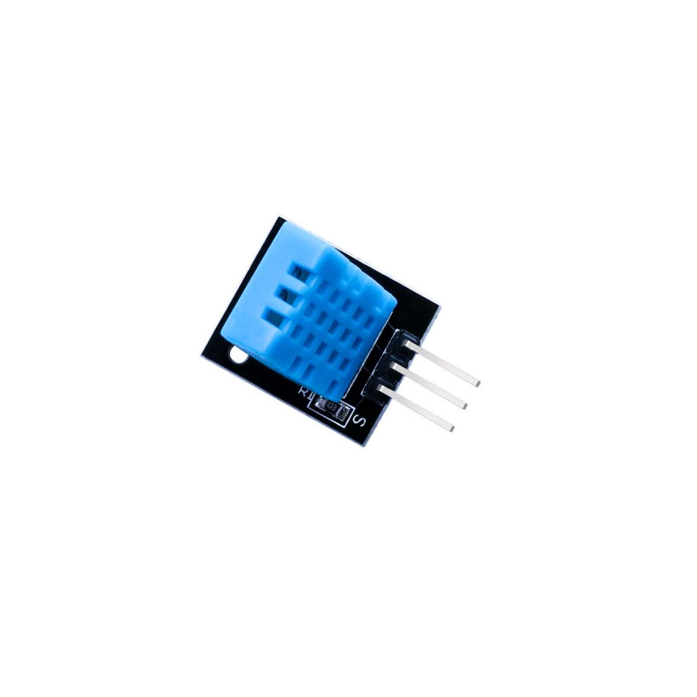

## Lección 11 Sensor de humedad y temperatura DHT11

### Resumen

En este tutorial vamos a aprender cómo usar un sensor de humedad y temperatura **DHT11**.

Otra vez vamos a usar una **librería** diseñada específicamente para estos sensores que harán que nuestro código corto y fácil de escribir.

## Componentes necesarios



```
(1) x Elegoo Uno R3
(1) x módulo de humedad y temperatura DHT11
(3) x F M cables (cables de hembra a macho DuPont)
```

### Sensor de temperatura y humedad

Sensor digital de temperatura y humedad **DHT11** es un Sensor compuesto que contiene la salida de la señal digital calibrado de la temperatura y la humedad. 

Aplicaciones: HVAC, deshumidificador, ensayos e inspección de equipos, bienes de consumo, control automático, automóvil, registradores de datos, estaciones meteorológicas, electrodomésticos, regulador de humedad, humedad médicos y otros medición y control.

## Parámetros del sensor

Humedad relativa:

- Resolución: 16 bits
- Repetibilidad: ±1% H.R.
- Precisión: 25 ° C ±5% hr
- Intercambiabilidad: intercambiables
- Tiempo de respuesta: 1 / e (63%) de 25º c 6s
- 1m / s de aire 6s
- Histéresis: < ± 0.3% RH
- Estabilidad a largo plazo: < ± 0.5% hr / año en

Temperatura:

|                      |                 |
| -------------------- | --------------- |
| Resolución:          | 16 bits         |
| Repetibilidad:       | ±0. 2 ° C       |
| Rango:               | 25 ° C ±2° c    |
| Tiempo de respuesta: | 1 / e (63%) 10S |

Características eléctricas

|                         |                            |
| ----------------------- | -------------------------- |
| Fuente de alimentación: | DC 3.5 ~ 5.5V              |
| Corriente:              | medición 0.3mA espera 60μA |
| Periodo de muestreo:    | más de 2 segundos          |

Descripción de pines

|      |                          |
| ---- | ------------------------ |
| VDD  | alimentación 3,5~5.5V DC |
| DATA | bus de datos             |
| NC   | pin vacío                |
| GND  | tierra                   |

### Esquema de conexión


### Diagrama de cableado


Como se puede ver que sólo necesitamos 3 conexiones al sensor, ya que uno de lo pin no se utiliza.

Las conexiones son: voltaje, tierra y señal de que puede conectarse a cualquier Pin en nuestro UNO.

### Código

```c title="sensorHumedadytemperatura.ino"
#include <dht_nonblocking.h>
#define DHT_SENSOR_TYPE DHT_TYPE_11

static const int DHT_SENSOR_PIN = 2;
DHT_nonblocking dht_sensor( DHT_SENSOR_PIN, DHT_SENSOR_TYPE );

/*
 * Initialize the serial port.
 */
void setup( )
{
  Serial.begin( 9600);
}

/*
 * Poll for a measurement, keeping the state machine alive.  Returns
 * true if a measurement is available.
 */
static bool medir ( float *temperature, float *humidity )
{
  static unsigned long measurement_timestamp = millis( );

  /* Measure once every four seconds. */
  if( millis( ) - measurement_timestamp > 3000ul )
  {
    if( dht_sensor.measure( temperature, humidity ) == true )
    {
      measurement_timestamp = millis( );
      return( true );
    }
  }

  return( false );
}


/*
 * Main program loop.
 */
void loop( )
{
  float temperature;
  float humidity;

  /* Measure temperature and humidity.  If the functions returns
     true, then a measurement is available. */
  if( medir( &temperature, &humidity ) == true )
  {
    Serial.print( "T = " );
    Serial.print( temperature, 1 );
    Serial.print( " deg. C, H = " );
    Serial.print( humidity, 1 );
    Serial.println( "%" );
  }
}
```

## Salida en el monitor

![](media/image97.jpeg" id="image97">
