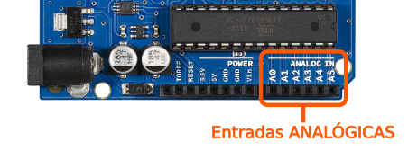
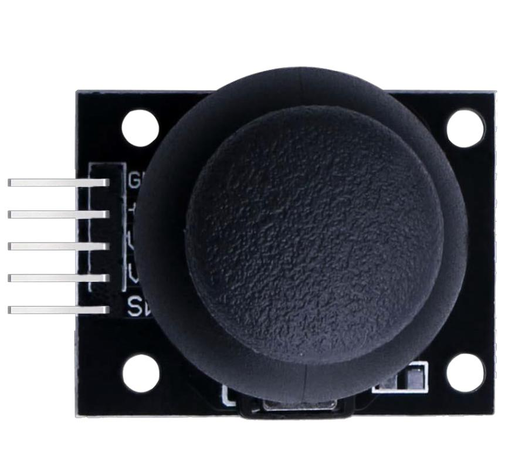
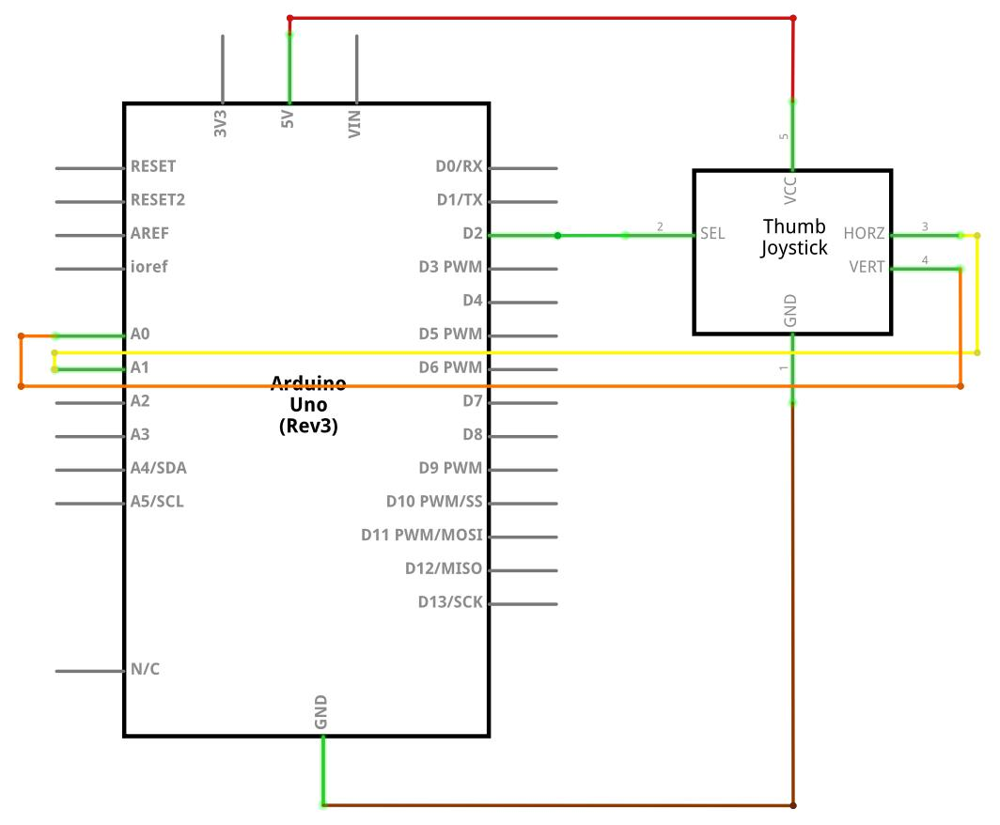
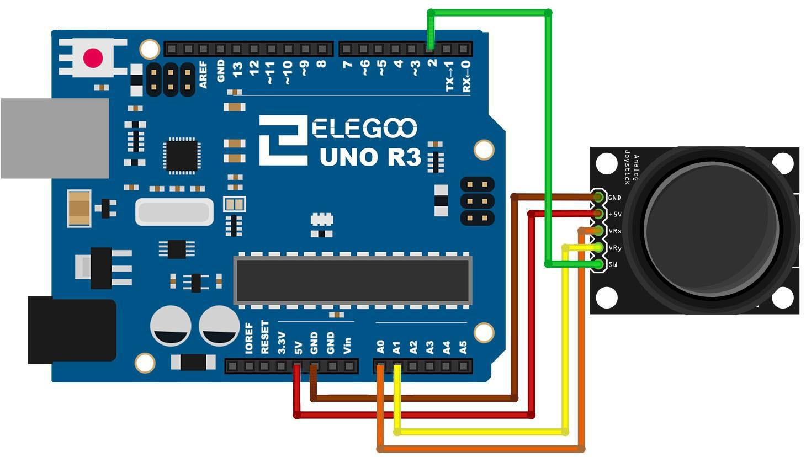
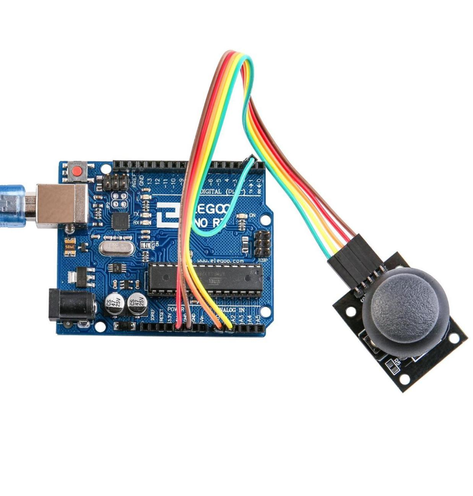
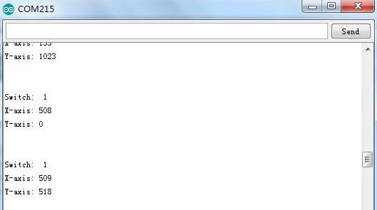

# 12.Joystick analógico

En este tutorial aprenderemos a usar el módulo de joystick analógico.

## Componentes necesarios

```
(1) x Elegoo Uno R3
(1) x módulo de Joystick
(5) x F M cables (cables de hembra a macho DuPont)
```

## ¿Qué pines necesitaremos?

Necesitamos 5 conexiones entre el joystick y la placa Arduino.

Los pines a conectar son:

- Sel
- Y
- X
- Voltaje
- Tierra

Tenemos que usar pines Arduino **analógicos** para leer los datos de los pines que reconocen el movimiento X / Y (vertical y horizontal), puesto que puedo tener diferentes valores (por ejemplo, moverse más rápido o lento).



En cambio, para detectar si pulsamos o no el botón, es suficiente un pin **digital**, puesto que solo tendremos dos valores (pulsado o no pulsado).



## Esquema



## Diagrama de cableado



### Código

```c
// Arduino pin numbers
const int SW_pin = 2; // digital pin connected to switch output
const int X_pin = 0; // analog pin connected to X output
const int Y_pin = 1; // analog pin connected to Y output

void setup() {
  pinMode(SW_pin, INPUT);
  digitalWrite(SW_pin, HIGH);
  Serial.begin(9600);
}

void loop() {
  Serial.print("Switch:  ");
  Serial.print(digitalRead(SW_pin));
  Serial.print("\n");
  Serial.print("X-axis: ");
  Serial.print(analogRead(X_pin));
  Serial.print("\n");
  Serial.print("Y-axis: ");
  Serial.println(analogRead(Y_pin));
  Serial.print("\n\n");
  delay(500);
}
```



## Comprobar funcionamiento

Haga clic en el Serial Monitor botón para encender el monitor serie. Se introducen los conceptos básicos sobre el monitor serial en detalles en la lección 1.



El rango de valores va de 0 a 1024.
