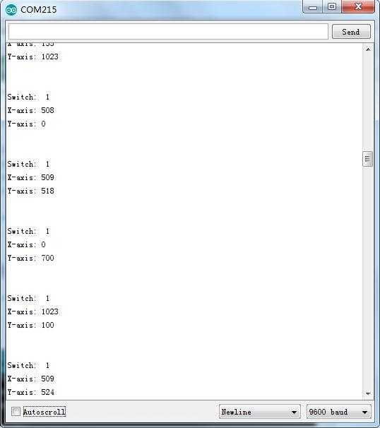

# 12.Joystick analógico

En este tutorial aprenderemos a usar el módulo de joystick analógico.

## Componentes necesarios

```
(1) x Elegoo Uno R3
(1) x módulo de Joystick
(5) x F M cables (cables de hembra a macho DuPont)
```

## Palanca de mando

El módulo tiene 5 pines: VCC, tierra, X, Y, clave. Además, podemos presionar el joystick hacia abajo

Tenemos que usar pines Arduino analógicos para leer los datos de los pines X / Y, y un pin digital para leer el botón. El pin de la Llave está conectado a tierra, cuando el joystick está presionado hacia abajo, y está flotando de otra manera. 

Para obtener lecturas estables del pin Key / Select, debe conectarse a VCC a través de una resistencia pull-up. Las resistencias incorporadas en los pines digitales de Arduino se pueden utilizar. Para obtener un tutorial sobre cómo activar las resistencias pull-up para pines Arduino, configuradas como entradas


## Esquema


## Diagrama de cableado


Necesitamos 5 las conexiones de la palanca de mando.

Las conexiones son: 

- Clave
- Y
- X
- Voltaje
- Tierra

«Y y X» son analógicas y "Clave" es digital. 

### Código

```c
// Arduino pin numbers
const int SW_pin = 2; // digital pin connected to switch output
const int X_pin = 0; // analog pin connected to X output
const int Y_pin = 1; // analog pin connected to Y output

void setup() {
  pinMode(SW_pin, INPUT);
  digitalWrite(SW_pin, HIGH);
  Serial.begin(9600);
}

void loop() {
  Serial.print("Switch:  ");
  Serial.print(digitalRead(SW_pin));
  Serial.print("\n");
  Serial.print("X-axis: ");
  Serial.print(analogRead(X_pin));
  Serial.print("\n");
  Serial.print("Y-axis: ");
  Serial.println(analogRead(Y_pin));
  Serial.print("\n\n");
  delay(500);
}
```


El rango de valores va de 0 a 1024.

Abrir al monitor y puede ver los datos como soplo:

Haga clic en el Serial Monitor botón para encender el monitor serie. Se introducen los conceptos básicos sobre el monitor serial en detalles en la lección 1.

