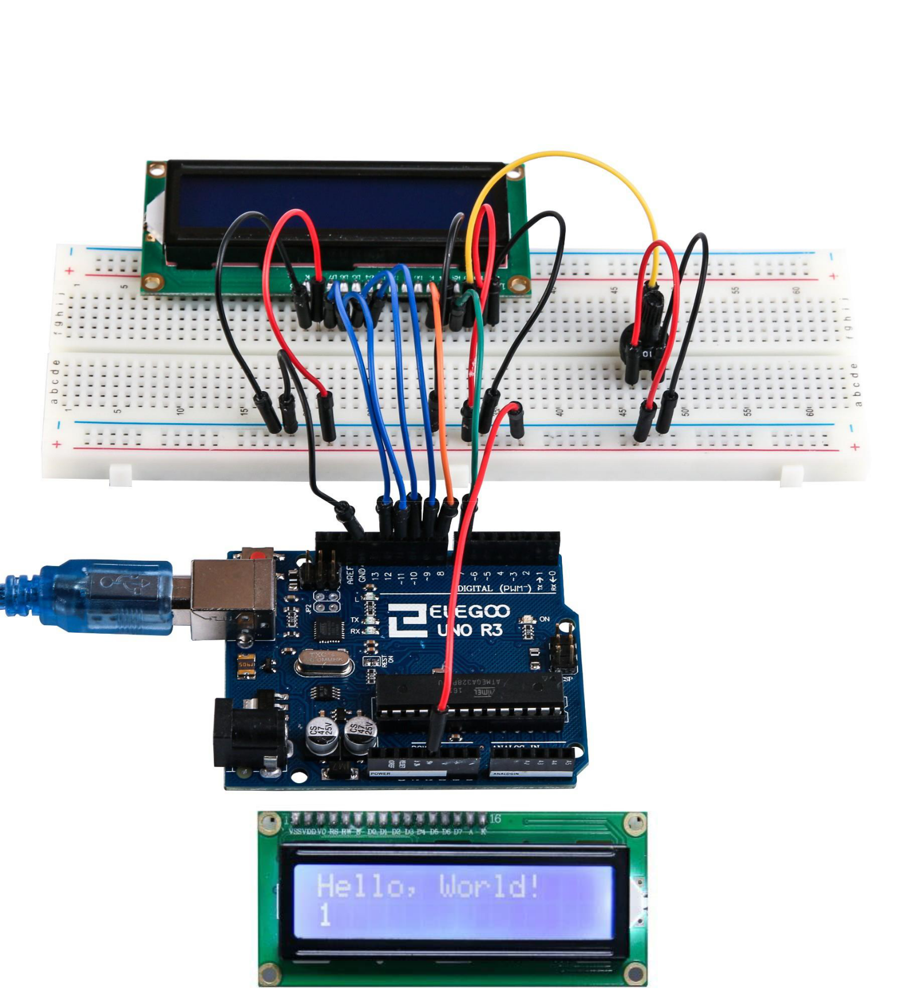

# 14. Pantalla LCD

### Resumen

En esta lección aprendremos a:

1. Conectar la pantalla LCD alfanumérico a su placa de Arduino.
2. Cómo utilizar la función lcd.print () para imprimir datos en la pantalla.
3. Cómo mover el cursor en la pantalla.
4. Cómo encender o apagar la pantalla.
5. Cómo encender o apagar el cursor.
6. Cómo configurar la dirección del cursor.
7. Cómo encender o apagar la luz de fondo.
8. Cómo crear una animación en la pantalla.

La pantalla tiene una retroiluminación de LED y puede mostrar dos filas con hasta 16 caracteres en cada fila. Puede ver los rectángulos para cada carácter en la pantalla y los píxeles que componen cada carácter. La pantalla es blanca en azul y está diseñada para mostrar texto.


En esta lección, se ejecutará el programa de ejemplo de Arduino para la **librería** de la LCD, pero en la siguiente lección, nos pondremos nuestra pantalla para mostrar la temperatura mediante sensores.

### Componentes necesarios

- 1 x [Placa de Arduino Uno](https://www.arduino.cc/en/Main/arduinoBoardUno)
- 1 x [Pantalla LCD alfanumérica 1602](https://www.arduino.cc/en/Main/ArduinoLCDShield)
- 1 x [Cable USB](https://www.arduino.cc/en/Main/USBCable)
* > Potenciómetro (10k)
* > 830 tie-puntos Breadboard
* > M-M cables (cables de puente de macho a macho)

### LCD1602

La mayoria de los LCD1602 tienen 16 patillas, pero algunos de ellos pueden tener 18 patillas. Para el LCD1602 de 16 patillas hay unas patillas llamadas:

- **VSS**: Un pin que se conecta a tierra
- **VDD**: Un pin que se conecta a un + 5V fuente de alimentación

VO: Un pasador que ajusta el contraste de LCD1602

RS: Un registro seleccione pin que controla donde en memoria de la pantalla LCD datos de escritura. Usted puede seleccionar el registro de datos, que es lo que pasa en la pantalla, o un registro de instrucción, que es donde busca controlador de LCD para obtener instrucciones sobre qué hacer.

- R/W: Pin A lectura y escritura que selecciona el modo de lectura o escritura a modo de E:, Permitiendo a un perno con energía de bajo nivel, módulo causas la LDC para ejecutar instrucciones.
- D0-D7: Pernos que leer y escribir datos

A y K: Que el control de la retroiluminación LED de los pernos

## Esquema de conexión


## Diagrama de cableado


La pantalla LCD necesita seis pines de Arduino, todo listo para ser salidas digitales.

También necesita 5V y GND conexiones.

Hay bastantes conexiones que hay que hacer. Alinear la pantalla con la parte superior de la placa ayuda a identificar sus pines sin tener que contar demasiado, especialmente si la placa tiene sus filas numeradas con la fila 1 como la fila superior de la placa. No se olvide del cable amarillo largo que conecta el potenciómetro a la patilla 3 de la pantalla.

## Potenciómetro

El **potenciómetro** se utiliza para controlar el contraste de la pantalla. Es posible que su pantalla se suministre sin pines de cabecera conectados a ella. Si es así, siga las instrucciones de la siguiente sección.

### Codigo

Después de efectuar el cableado, por favor, abra el programa en el código de carpeta lección 22 LCD pantalla y haga clic en UPLOAD para cargar el programa. Ver Lección 2 para obtener más información sobre programa cargar si hay algún error.

Antes de ejecutar esto, asegúrese de que ha instalado la **librería** < LiquidCrystal > o volver a instalarlo, si es necesario. De lo contrario, el código no funcionará.

Lo primero que nota en el dibujo es la línea:

```arduino
#include < LiquidCrystal.h >
```

Esto dice Arduino que queremos utilizar la **librería** de cristal líquido.

A continuación tenemos la línea que teníamos que modificar. Esto define qué pines de Arduino son para conectarse a que pines de la pantalla.

```c
LiquidCrystal lcd (7, 8, 9, 10, 11, 12);
```

Después de subir este código, asegúrese de que se enciende la retroiluminación y ajustar el potenciómetro de toda la manera alrededor hasta que aparezca el mensaje de texto

En la función de **setup**, tenemos dos comandos:

```c
LCD.Begin (16, 2);
LCD.Print ("Hola, mundo!");
```

La primera cuenta la **librería** de cristal líquido cuántas columnas y filas tiene la pantalla. La segunda línea muestra el mensaje que vemos en la primera línea de la pantalla.

En la función de 'loop', aso tienen dos comandos:

```c
lcd.setCursor (0, 1);
LCD.Print(Millis()/1000);
```

El primero establece la posición del cursor (donde aparecerá el siguiente texto) columna 0 y fila 1. Los números de columna y fila comienzan en 0 en lugar de 1.



La segunda línea muestra el número de milisegundos desde que se restableció el Arduino.

```c
//www.elegoo.com
//2016.12.9

/*
  LiquidCrystal Library - Hello World

 Demonstrates the use a 16x2 LCD display.  The LiquidCrystal
 library works with all LCD displays that are compatible with the
 Hitachi HD44780 driver. There are many of them out there, and you
 can usually tell them by the 16-pin interface.

 This sketch prints "Hello World!" to the LCD
 and shows the time.

  The circuit:
 * LCD RS pin to digital pin 7
 * LCD Enable pin to digital pin 8
 * LCD D4 pin to digital pin 9
 * LCD D5 pin to digital pin 10
 * LCD D6 pin to digital pin 11
 * LCD D7 pin to digital pin 12
 * LCD R/W pin to ground
 * LCD VSS pin to ground
 * LCD VCC pin to 5V
 * 10K resistor:
 * ends to +5V and ground
 * wiper to LCD VO pin (pin 3)

 Library originally added 18 Apr 2008
 by David A. Mellis
 library modified 5 Jul 2009
 by Limor Fried (http://www.ladyada.net)
 example added 9 Jul 2009
 by Tom Igoe
 modified 22 Nov 2010
 by Tom Igoe

 This example code is in the public domain.

 http://www.arduino.cc/en/Tutorial/LiquidCrystal
 */

// include the library code:
#include <LiquidCrystal.h>

// initialize the library with the numbers of the interface pins
LiquidCrystal lcd(7, 8, 9, 10, 11, 12);

void setup() {
  // set up the LCD's number of columns and rows:
  lcd.begin(16, 2);
  // Print a message to the LCD.
  lcd.print("Hello, World!");
}

void loop() {
  // set the cursor to column 0, line 1
  // (note: line 1 is the second row, since counting begins with 0):
  lcd.setCursor(0, 1);
  // print the number of seconds since reset:
  lcd.print(millis() / 1000);
}
```
