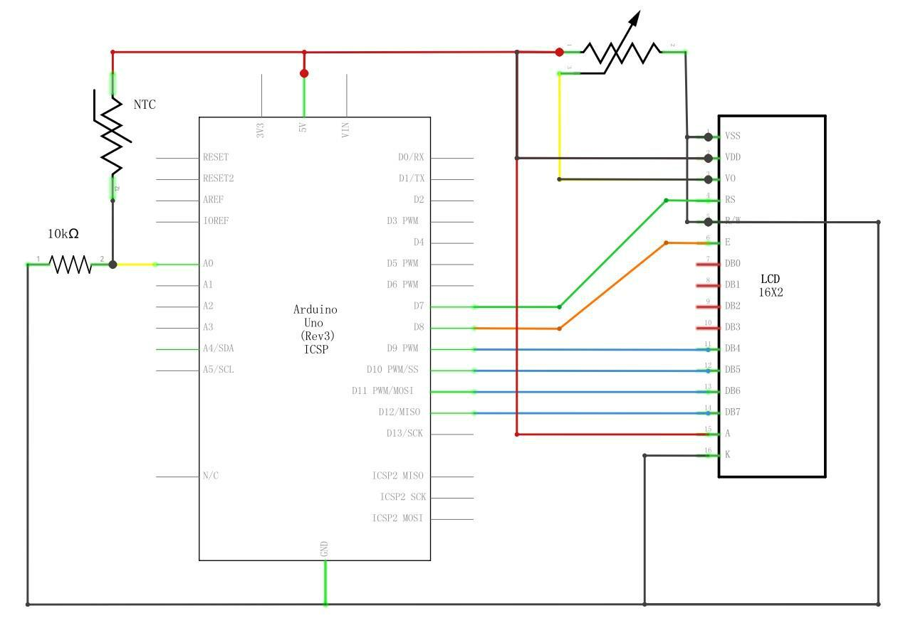
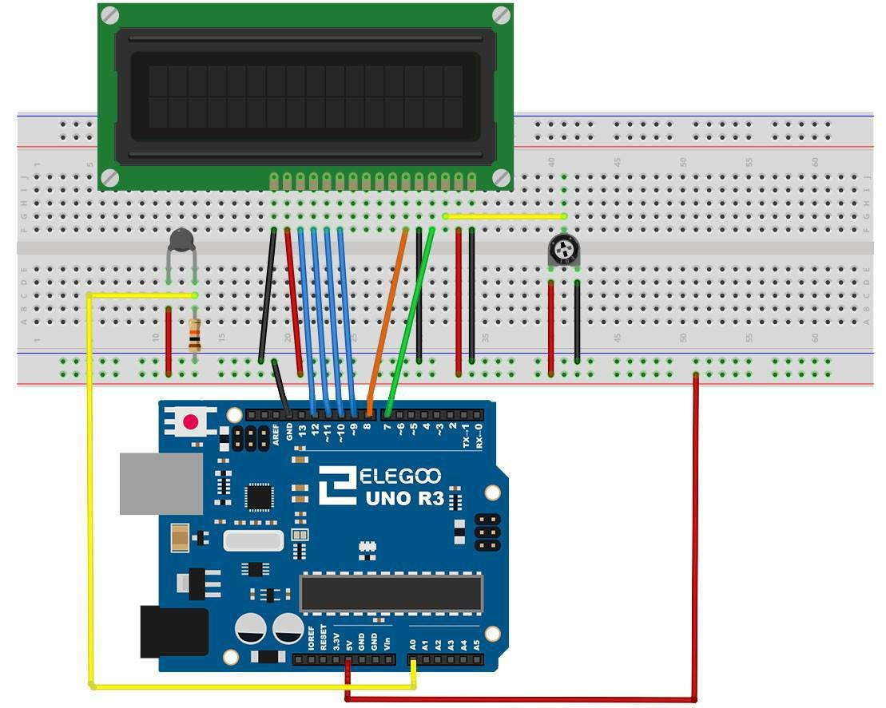
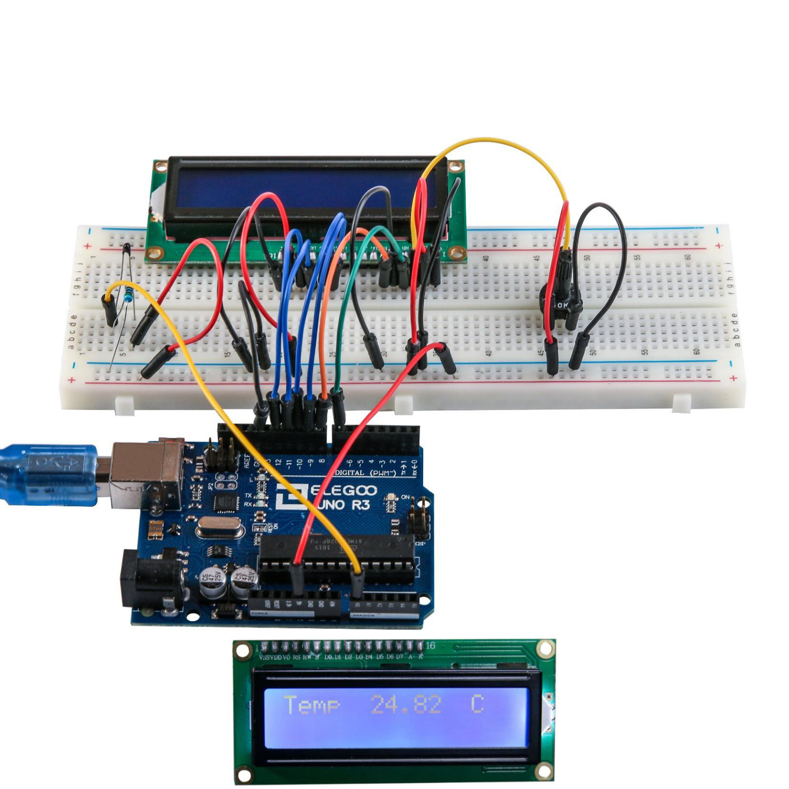

# 15. Termómetro

## Resumen

En esta lección, utilizará una pantalla LCD para mostrar la temperatura.

### Componentes necesarios

> * Elegoo Uno R3
> * LCD1602 Módulo
> * x resistencia de ohmio 10 k
> * x termistor
> * x potenciómetro> * 
> * x 830 tie puntos Breadboard
> * x M M cables (cables de puente de macho a macho)

### Termistor

Un **termistor** es un resistor térmico - un resistor que cambia su resistencia con la temperatura. Técnicamente, los resistores son termistores - sus cambios de resistencia con temperatura - pero el cambio es generalmente muy pequeño y difícil de medir. 

Los termistores están hechos para que la resistencia cambia drásticamente con la temperatura para que pueda ser 100 ohmios o más del cambio por grado!

Hay dos clases de termistores: 

> * NTC (coeficiente de temperatura negativo)
> *  PTC (coeficiente positivo de temperatura). 

En general, usted verá sensores NTC para medir la temperatura. PTC es de uso frecuente como fusibles Reseteables - un aumento de temperatura aumenta la resistencia que significa que conforme pasa más corriente a través de ellos, se calientan y 'estrangular detrás' la corriente, muy útil para la protección de circuitos.

### Conexión



### Esquema

### Diagrama de cableado



El diseño de la placa se basa en el diseño de la **lección 22**, asíque simplificará las cosas si hay esto en la protoboard.

Hay unos cables de puente cerca de la olla que se han movido ligeramente en este diseño.

Los 10 kΩ resistencia y termistores son todas nuevas incorporaciones a la Junta

### Código

Después de efectuar el cableado, por favor, abra el programa en el código de carpeta lección 23 termómetro y haga clic en UPLOAD para cargar el programa. Ver Lección 2 para obtener más información sobre programa cargar si hay algún error.

Antes de ejecutar esto, asegúrese de que ha instalado la **librería** < LiquidCrystal > o volver a instalarlo, si es necesario. De lo contrario, el código no funcionará.

Para obtener más información sobre carga el archivo de **librería**, ver Lección 1. El cableado de esto está basado en la lección 22. Cargar para arriba en su Arduino y encontrará que calienta el sensor de temperatura al poner el dedo en él aumentará la temperatura.

Es útil poner una línea de comentario sobre el comando 'lcd'.

BSED4D5D6D7

LiquidCrystal lcd (7, 8, 9, 10, 11, 12);

Esto facilita las cosas si decides cambiar que utilizas los pernos.

En la **función loop** ahora hay dos cosas interesantes sucediendo. En primer lugar tenemos que convertir la analógica del sensor de temperatura una temperatura real, y en segundo lugar tenemos que encontrar la manera a los mismos.

En primer lugar, echemos un vistazo a cálculo de la temperatura.

```arduino
int tempReading = analogRead(tempPin);
doble tempK = log (10000.0 * ((1024.0/tempReading - 1)));
tempK = 1 / (0.001129148 + (0.000234125 + (0.0000000876741 * tempK * tempK)) * tempK);
float tempC = tempK - 273.15;
floatfloat tempF = (tempC * 9.0) / 5.0 + 32.0;
```

Cambio lecturas se muestra en una pantalla LCD puede ser complicado. El principal problema es que la lectura puede no ser siempre el mismo número de dígitos. Por lo tanto, si la temperatura cambia de 101,50 a 99.00 entonces el dígito adicional de la lectura antigua es en peligro de quedar en la pantalla.

Para evitar esto, escriba la línea de la pantalla LCD cada vez el bucle.

```
lcd.setCursor (0, 0);
LCD.Print ("Temp C");
lcd.setCursor (6, 0);
LCD.Print(tempF);
```

El comentario bastante extraño sirve para recordarles de las 16 columnas de la pantalla. Luego puede imprimir una cadena de esa longitud con espacios donde irá la lectura real.



Para rellenar los espacios en blanco, establecer la posición del cursor por donde la lectura debe aparecer y luego imprimirlo.


