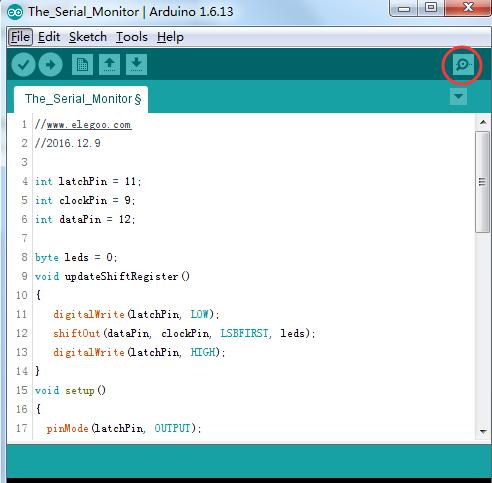
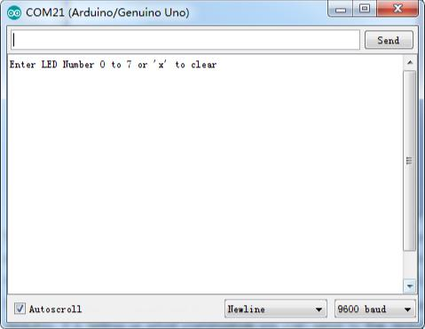
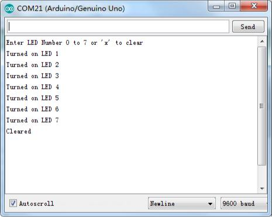

## Lección 17 El monitor Serial

### Resumen

En esta lección, se basará en la lección 16, añadiendo la facilidad de controlar los LEDs desde el ordenador con el Monitor serie del Arduino. El monitor serial es el 'cable' entre el ordenador y tu UNO. Le permite enviar y recibir mensajes de texto, útiles para la depuración y también control de la ONU de un teclado! Por ejemplo, usted será capaz de enviar comandos desde el ordenador para encender LEDs.

En esta lección, utilizará exactamente las mismas piezas y una disposición similar del protoboard como lección 16. Por lo tanto, si aún no lo ha hecho, siga lección 16 ahora.

Medidas adoptadas

Después de que han subido este cableado sobre el UNO, haga clic en el botón derecho en la barra de herramientas en el IDE de Arduino. Es en un círculo el botón a continuación.



Se abrirá la siguiente ventana.

Haga clic en el botón Serial Monitor para encender el monitor serie. Se introducen los conceptos básicos sobre el monitor serial en detalles en la lección 1.



Esta ventana se llama al Monitor Serial y es parte del software del IDE de Arduino. Su trabajo es la que permite a ambos enviar mensajes desde tu ordenador a una placa UNO (por USB) y también recibir mensajes de la placa UNO.

El mensaje "Enter LED número 0 a 7or 'x' para borrar" ha sido enviado por el Arduino. Nos está diciendo qué comandos podemos enviamos a Arduino: o enviar la 'x' (para apagar todos los LEDs) o el número de LED que desea activar (donde 0 es el LED de la parte inferior, 1 es la siguiente, hasta 7 para el LED superior).

Trate de escribir los siguientes comandos en la parte superior del Monitor Serial que es el nivel con el botón 'Enviar'. Presione 'Enviar', después de escribir cada uno de estos caracteres: x 0 3 5

Escribir x voluntad no tienen ningún efecto si los LEDs ya están todos fuera, pero al entrar en cada número, el correspondiente LED deberá encenderse y usted recibirá un mensaje de confirmación de la placa UNO. El Monitor Serial aparecerá como se muestra a continuación.



Escriba x otra vez y pulse 'Enviar' para apagar todos los LEDs

### Código

Después de efectuar el cableado, por favor abra el Serial Monitor del programa en la carpeta de código-lección 25 y haga clic en cargar para cargar el programa. Ver Lección 2 para obtener más información sobre programa cargar si hay algún error.

Como era de esperar, el cableado se basa en el cableado utilizado en la lección 24. Por lo tanto, sólo cubrimos los nuevos bits aquí. Le resultará útil para referirse al dibujo completo en el IDE de Arduino.

En la función de **setup**, hay tres nuevas líneas al final:

```c
void setup()
{
pinMode (latchPin, salida);
pinMode (dataPin, salida);
pinMode (clockPin, salida);
updateShiftRegister();
Serial.Begin(9600);

```

```mientras (!. Serie); Espere hasta que es listo - Leonardo Serial.println ("Enter LED número de 0 a 7 o 'x' para borrar"); }

```
En primer lugar, tenemos el comando 'Serial.begin(9600)'. Esto inicia la comunicación serial, para que la UNO puede enviar comandos a través de la conexión USB. El valor 9600 es la configuración velocidad de la conexión. Esto es la rapidez con la que los datos debe ser enviado. Esto puede cambiar a un valor más alto, pero también tendrás que cambiar al monitor de Arduino Serial el mismo valor. Hablaremos de esto más adelante; por ahora, dejar en 9600.

El comienzo de la línea con 'mientras' asegura que hay algo en el otro extremo de la conexión USB para Arduino hablar antes de que comience el envío de mensajes. De lo contrario, el mensaje puede ser enviado, pero no aparece. Esta línea es realmente sólo es necesaria si está utilizando a un Arduino Leonardo porque el Arduino UNO se restablece automáticamente la placa Arduino al abrir el Monitor de la serie, mientras que esto no sucede con el Leonardo.

La última de las nuevas líneas en **setup** envía el mensaje que vemos en la parte superior del Monitor serie.

La función de 'bucle' es donde sucede toda la acción

```c
void loop()
{
if (Serial.available())
{
char ch = Serial.read();
if (ch >= '0' && ch <= '7')
{
int led = ch - '0';
bitSet(leds, led);
updateShiftRegister();
Serial.print("Turned on LED ");
Serial.println(led);
}
if (ch == 'x')
{
leds = 0;
129 / 165
updateShiftRegister();
Serial.println("Cleared");
}
}
}
```


Todo lo que ocurre dentro del bucle está contenido dentro de una instrucción 'if'. Así que a menos que la llamada a la función incorporada de Arduino 'Serial.available()' es 'true' entonces nada sucederá.

Serial.Available() devuelve 'true' si los datos ha sido enviado a la ONU y allíestá listos para ser procesado. Los mensajes entrantes se llevan a cabo en lo que se llama un búfer y Serial.available() devuelve true si ese buffer es no vacía.

Si un mensaje ha sido recibido, es a la siguiente línea de código:

```c
char ch = Serial.read();
```

Esto lee el siguiente carácter del búfer y elimina del buffer. También asigna a la variable 'ch'. La variable 'ch' es de tipo 'char' que significa 'carácter' y como su nombre indica, tiene un carácter único.

Si usted ha seguido las instrucciones en el prompt en la parte superior del Monitor Serial, luego este personaje serán o bien un número dígito entre 0 y 7 o la letra 'x'. La instrucción 'if' en la línea siguiente comprueba para ver si es un solo dígito por ver si 'ch' es mayor o igual que el carácter ' 0 'y menor o igual que el personaje 7'. Parece un poco extraño comparar caracteres de esta manera, pero es perfectamente aceptable.

Cada carácter está representado por un número único, conocido su valor ASCII. Esto significa que cuando se comparan caracteres usando < = y > = es realmente los valores ASCII que se estaban comparando.

Si pasa la prueba, llegamos a la siguiente línea:

```c
int led = ch-'0';
```

¡Ahora estamos actuando aritmética en los personajes! Estamos restando el dígito '0' de cualquier dígitos fue introducido. Por lo tanto, si escribió '0' y luego '0' a '0' será igual a 0. Si escribió '7' y '7'-'0' será igual al número 7 ya que es realmente los valores ASCII que se utilizan en la sustracción.

Desde sabemos que el número del LED que queremos encender, nos basta establecer este bit en la variable 'leds' y actualizar el registro de desplazamiento. bitSet (leds, led);


updateShiftRegister();

Las dos líneas escriben de nuevo un mensaje de confirmación en el Monitor serie.

```c
Serial.Print ("encendido LED");
Serial.println(LED);
```

La primera línea utiliza Serial.print en lugar de Serial.println. La diferencia entre los dos es que Serial.print no se inicia una nueva línea después de imprimir lo que está en su parámetro. Usamos esto en la primera línea, porque estamos impresión el mensaje en dos partes. En primer lugar el general bits: 'Enciende LED' y luego el número del LED.

El número del LED se realiza en un 'int' variable en lugar de ser una cadena de texto. Serial.Print puede tomar ya sea una cadena de texto dentro de comillas dobles, o un 'int' o para el caso casi cualquier tipo de variable.

Después de la instrucción 'if' que maneja el caso, cuando un dígito se ha manejado, hay una segunda instrucción 'if' que comprueba si la 'ch' es la letra 'x'.

Si (ch == 'x')

{ LE

D=0; updateShiftRegister(); Serial.println("cleared");

}

Si es así, entonces se borran todos los LEDs y envía un mensaje de confirmación.
