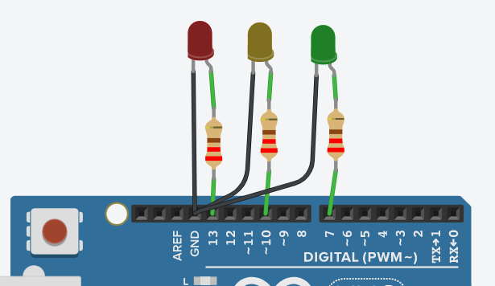

# Práctica semáforo 4 ESO

## Semáforo de coches

### Montaje



### Código

```c
// C++ code
//
void setup()
{
  pinMode(13, OUTPUT);
  pinMode(10, OUTPUT);
  pinMode(7, OUTPUT);
}

void loop()
{
  //Encender verde
  digitalWrite(7, HIGH);
  digitalWrite(10, LOW);
  digitalWrite(13, LOW);
  delay(5000);
  //Encender amarillo
  digitalWrite(7, LOW);
  digitalWrite(10, HIGH);
  digitalWrite(13, LOW);
  delay(2000);
  //Encender rojo
  digitalWrite(7, LOW);
  digitalWrite(10, LOW);
  digitalWrite(13, HIGH);
  delay(5000);
}
```

## Semáforo de coches y peatones

### Montaje


## Semáforo con botón

