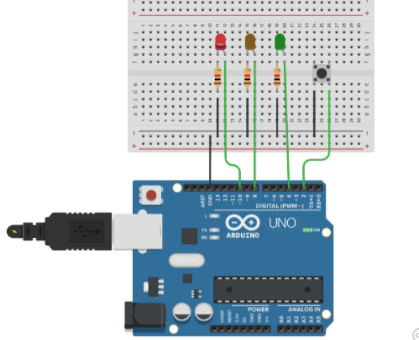
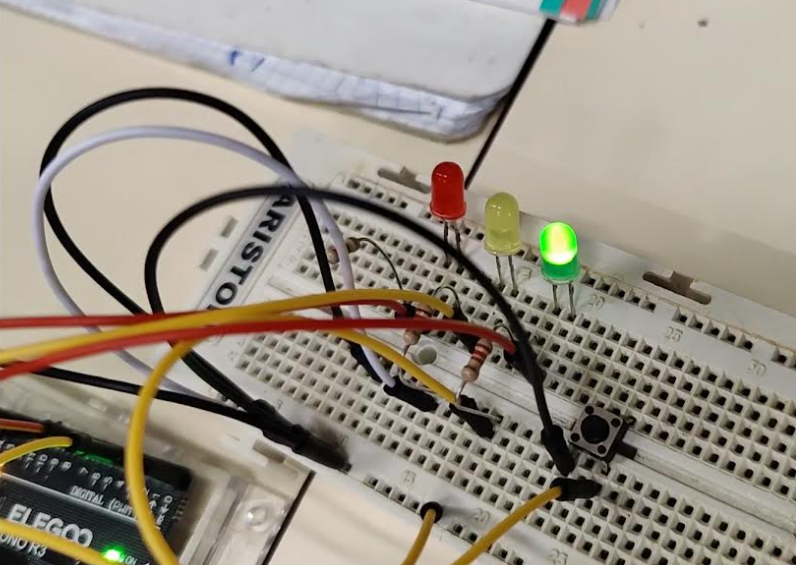

# Trabajo 4º ESO.

Los alumnos de 4º ESO han trabajado el tema de eletrónica analógica utilizando Arduino.

Para ello, han aprendido a diseñar, programar y simular circuitos variados utilizando principalmente resistencias, LEDs y botones.

## Prácticas

Las prácticas que han realizado son:

1. Parpadeo del LED incluído en el arduino

2. Parpadeo de un LED Rojo conectado a arduino.

3. Encender y apagar un LED Rojo a través de un botón
4. Encender y apagar un LED Rojo con dos botones
5. Encender un LED Rojo y otro LED verde mediante dos botones alternativamente.
6. Encender un LED RGB con diferentes combinaciones de colores. El LED se puede programar también como semáforo
7. Crear un semáforo que va cambiando de color con 3 LEDs
8. Modidicar el mismo semáforo para que cambie de color al pulsar un botón

## Procedimiento

Se deberá realizar una simulación con Tinkercad circuits de todo el montaje, así como del código necesario.

Una vez que la simulación sea correcta, pasaremos a implementar el circuito físicamente y programarlo.

Es importante que cada grupo guarde una **foto o video** del circuito para poder valorarlo a posteriori.
