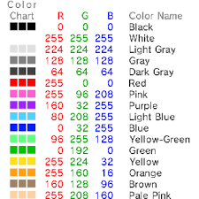
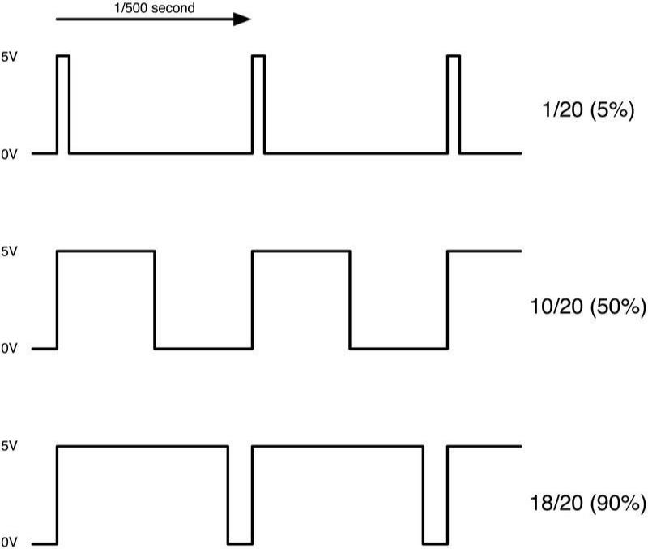
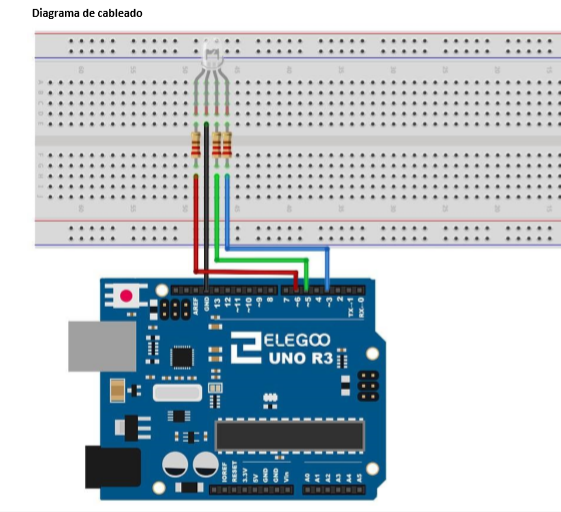
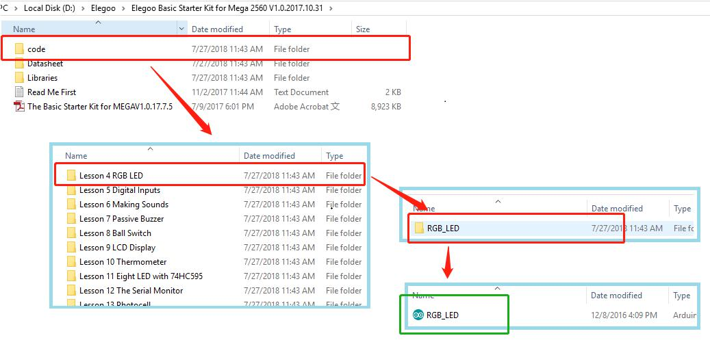

# LED RGB
## Arduino

---

## Resumen

Los LED RGB son una forma divertida y fácil para agregar color a sus proyectos. Puesto  que es como regular 3 LED en uno, el uso y conexión no es muy diferente.

---


---

Existen 2 versiones:

- Ánodo común
- Cátodo común.

---

- Ánodo común utiliza 5V en el pin común, mientras que el cátodo común se conecta  a tierra.
- Como con cualquier LED, tenemos que conectar algunas resistencias en línea (3 total)  así que podemos limitar la corriente absorbida.

---

En nuestro **programa**, se comienzan con el LED en el estado de color rojo, entonces  se descolora a verde, luego se descolora azul y finalmente hacia el color rojo.  Haciendo esto que nos pasará por la mayor parte del color que se puede lograr.

## Componentes necesarios

| cantidad | componente                 |
| -------- | -------------------------- |
| 1        | placa``Arduino``           |
| 1        | protoboard                 |
| 4        | cables jumper              |
| 1        | LED RGB                    |
| 3        | resistencias de 220 ohmios |

---

## RGB

A primera vista, LEDs RGB (rojo, verde y azul) sólo parecen un LED. Sin embargo, dentro del paquete del LED generalmente, hay realmente tres LEDs, uno rojo, uno verde y sí, uno azul. Controlando el **brillo** de cada uno de los LEDs individuales, podemos mezclar prácticamente cualquier color.


---

Mezclamos colores del mismo modo que sería mezclar pintura en una paleta - ajustando el brillo de cada uno de los tres LEDs.

Arduino tiene una función **analogWrite** que se puede utilizar con pines marcados con un **~** a la salida de una cantidad variable de energía los LEDs apropiados.

---

# Pines

El LED RGB tiene **cuatro pines**. Hay un cable a la conexión positiva de cada uno de los LEDs individuales dentro del paquete y un patilla única que está conectado a los tres lados negativos de los LEDs.


Cada pin separado de color verde o azul o de rojo se llama ánodo.

---

# Color

Los colores los conseguiremos mezclando diferentes cantidades de cada color primario.



---

La mezcla creará la ``sensación`` del color elegido. Podemos controlar el brillo de cada una de las partes de rojas, verdes y azules del LED por separado, lo que es posible mezclar cualquier color.


---

## Ejemplos

- Si establece el brillo de todos los tres LEDs al ser el mismo, el color general de la luz  será blanco.
- Si apagamos el LED azul, para que sólo los LEDs rojo y verdes son el  mismo brillo, la luz aparecerá amarillo.

---

## 쮺칩mo consigo el color negro?

El color **Negro** no es tanto un color como una ausencia de luz. Por lo tanto, lo más cercano  que podemos llegar a negro con el LED es apagar los tres colores, poniendo sus valores a 0.

---

## Teoría (PWM)

La forma de dar más o menos potencia a cada color es utilizando una señal del tipo ``PWM``.

La **modulación de ancho de pulso (PWM)** es una técnica para el control de potencia. La utilizamos aquí para controlar el brillo de cada uno de los LEDs.

---



---

# Ciclo de trabajo

Aproximadamente cada 1/500 de segundo, la salida PWM producirá un pulso. La  duración de este pulso es controlada por la función 'analogWrite'. Así:

- 'analogWrite(0)' no producirá ningún pulso.
- 'analogWrite(255)' producirá un  pulso que dura todo el camino hasta el pulso siguiente vencimiento, para que la  salida es en realidad todo el tiempo.

---

Si especificamos un valor en el **analogWrite** que está en algún lugar entre 0 y 255, se producir un pulso.

- Si el pulso de salida es alto para el 5% del tiempo, entonces lo  que nosotros estamos manejando sólo recibirá el 5% de potencia.
- Si la salida es 5V para el 90% del tiempo, la carga recibirá el 90% de la potencia entregada a él.

Los LED se encenderán y apagarán en esos periodos, pero nosotros percibiremos que el brillo del LED cambia.

---

## Esquema

El esquema eléctrico que seguiremos es el siguente:

- Cada patilla de un color debe conectarse a una salida digital etiquetada como ``PWM``
- La patilla común, irá conectada a un pin de tierra, etiquetado como ``GND``

---


---

## Conexión

1. El cátodo o conexión común es el segundo pin, que también es el **más largo** de las cuatro patas y se conectarán a la **tierra** (GND).
2. Cada LED requiere su propia **resistencia de 220 Ω** para prevenir demasiada corriente que fluye a través de él.
3. Los 3 pines de color (uno rojo, uno verde y uno azul) están conectados a los pines de salida UNO con estas resistencias.

---



---

Una vez conectado, debería quedar de la siguiente forma:

---


## Código programa 1

```c linenums="1" title="pruebaLEDRGB.ino"
// Define pines
#define BLUE 3
#define GREEN 5
#define RED 6

void setup()
{
  pinMode(RED, OUTPUT);
  pinMode(GREEN, OUTPUT);
  pinMode(BLUE, OUTPUT);
}

void loop()
{
  analogWrite(RED, 0);
  analogWrite(GREEN, 255);
  analogWrite(BLUE, 0);
}
```

---

Una vez probado, puedes intentar estos ejercicios:

1. Combinar varios valores para conseguir colores diferentes
2. Crear un semáforo utilizando delays y cambiando los valores para producir las luces roja, verde y amarilla.

### Código programa 2

```c linenums="1" title="pruebaLEDRGB.ino"
// Define pines
#define BLUE 3
#define GREEN 5
#define RED 6

void setup()
{
  pinMode(RED, OUTPUT);
  pinMode(GREEN, OUTPUT);
  pinMode(BLUE, OUTPUT);
  digitalWrite(RED, HIGH);
  digitalWrite(GREEN, LOW);
  digitalWrite(BLUE, LOW);
}

// define variables
int redValue;
int greenValue;
int blueValue;

// main loop
void loop()
{
  #define delayTime 10 // fading time between colors

  redValue = 255; // choose a value between 1 and 255 to change the color.
  greenValue = 0;
  blueValue = 0;

  // this is unnecessary as we've either turned on RED in SETUP
  // or in the previous loop ... regardless, this turns RED off
  // analogWrite(RED, 0);
  // delay(1000);

  for(int i = 0; i < 255; i += 1) // fades out red bring green full when i=255
  {
  redValue -= 1;
  greenValue += 1;
  // The following was reversed, counting in the wrong directions
  // analogWrite(RED, 255 - redValue);
  // analogWrite(GREEN, 255 - greenValue);
  analogWrite(RED, redValue);
  analogWrite(GREEN, greenValue);
  delay(delayTime);
}

redValue = 0;
greenValue = 255;
blueValue = 0;

for(int i = 0; i < 255; i += 1) // fades out green bring blue full when i=255
{
greenValue -= 1;
blueValue += 1;
// The following was reversed, counting in the wrong directions
// analogWrite(GREEN, 255 - greenValue);
// analogWrite(BLUE, 255 - blueValue);
analogWrite(GREEN, greenValue);
analogWrite(BLUE, blueValue);
delay(delayTime);
}

redValue = 0;
greenValue = 0;
blueValue = 255;

for(int i = 0; i < 255; i += 1) // fades out blue bring red full when i=255
{
// The following code has been rearranged to match the other two similar sections
blueValue -= 1;
redValue += 1;
// The following was reversed, counting in the wrong directions
// analogWrite(BLUE, 255 - blueValue);
// analogWrite(RED, 255 - redValue);1
analogWrite(BLUE, blueValue);
analogWrite(RED, redValue);
delay(delayTime);
}
}
```

---



---

Primero especificamos a que pines de``Arduino`` he conectado cada LED.

```arduino
// Define Pins
#define BLUE 3
#define GREEN 5
#define RED 6
```

En el setup, declaramos estos pines como salidas (OUTPUT) para poder enviar corriente hacia los LED.

```arduino
void setup()
{
pinMode(RED, OUTPUT);
pinMode(GREEN, OUTPUT);
pinMode(BLUE,OUTPUT);
digitalWrite(RED, HIGH);
digitalWrite(GREEN, LOW);
digitalWrite(BLUE, LOW);
}
```

---

Antes de echar un vistazo a la **función loop**, veamos la última función en el proyecto.

Las variables de definición:

```arduino
redValue = 255; // choose a value between 1 and 255 to change the color.
greenValue = 0;
blueValue = 0;
```

---

Esta función tiene tres argumentos, uno para el brillo de los LEDs rojos, verdes y azules. En cada caso de que el número será en el rango 0 a 255, donde 0 significa apagado y 255 significa brillo máximo. La función entonces llama 'analogWrite' para ajustar el brillo de cada LED.

Si nos fijamos en la **función loop** se puede ver que ajuste la cantidad de luz roja, verde y azul que queremos mostrar y luego una pausa por un segundo antes de pasar al siguiente color.

```arduino
#define delayTime 10 // fading time between colors
Delay(delayTime);
```
