# LED interno

## Resumen

En esta lección, usted aprenderá cómo programar el tablero de regulador UNO R3 a parpadear el LED integrado de Arduino y cómo descargar programas pasos básicos

Componente necesario:

- [x] (1) x Arduino Uno R3

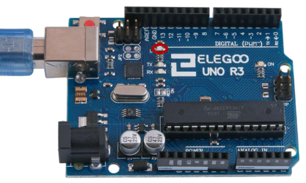

## Placa Arduino UNO R3

La placa de UNO R3 tiene unas filas de conectores a ambos lados que se utilizan para  conectar varios dispositivos electrónicos y plug-in **shields** que amplían su capacidad. También tiene un LED luminoso podemos controlar. Este  LED está construido sobre el UNO R3 y se refiere a menudo como la 'L' LED.

Este LED parpadea cuando se conecta a un enchufe del USB. Esto es porque las placas se envían generalmente con el programa de 'Blink' pre-instalado.

En esta lección, vamos a reprogramar el tablero UNO R3 con nuestro propio directorio de Blink y luego cambiar la tasa a la que parpadea.

En la lección 0, configurar el IDE de Arduino y aseguró que podría encontrar el puerto serie correcto para conectarse a la placa UNO R3. Ahora ha llegado el momento para poner el  programa de prueba y la placa de UNO R3.

El IDE de Arduino incluye una gran colección de dibujos de ejemplo, se puede cargar y usar.  Esto incluye un directorio de ejemplo para hacer el parpadeo del LED de 'L'.

Cargar el programa de 'Blink' que encontrarás en el sistema de menús del IDE bajo archivo >  ejemplos > 01 conceptos básicos

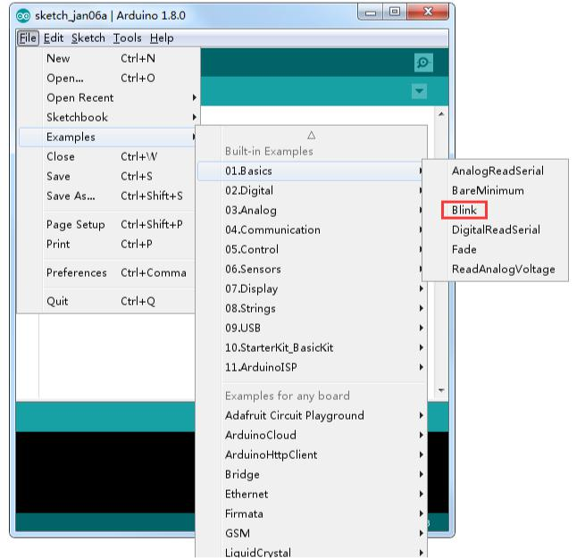

Cuando se abre la ventana de dibujo, agrandarla para que puedan ver el dibujo completo en la ventana.

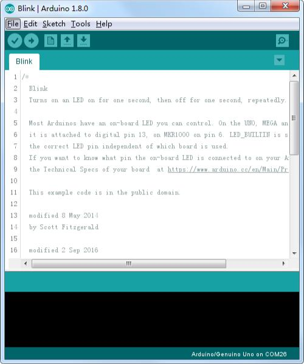

Los dibujos de ejemplo incluidos con el IDE de Arduino son de 'sólo lectura'. Es decir, puedes subir a una Junta de UNO R3, pero si cambia, no se puede guardar como el archivo  mismo.
Puesto que vamos a cambiar este programa, lo primero que tienes que hacer es guardar su propia copia.

En el menú archivo en el IDE de Arduino, seleccione `Guardar como.` y guarde el dibujo con  el nombre 'MyBlink'

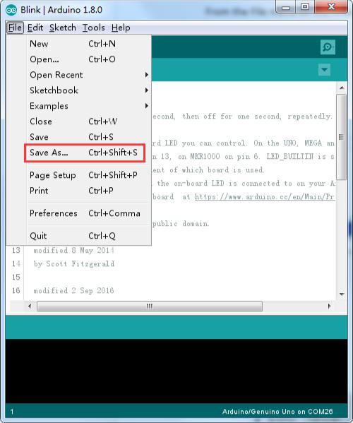

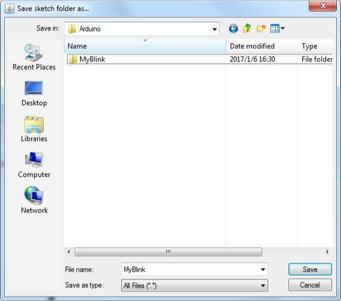

Ha guardado su copia de 'Blink' en su programabook. Esto significa que si alguna vez quiere encontrar otra vez, puede simplemente abrir usando el archivo > opción de menú de Sketchbook.

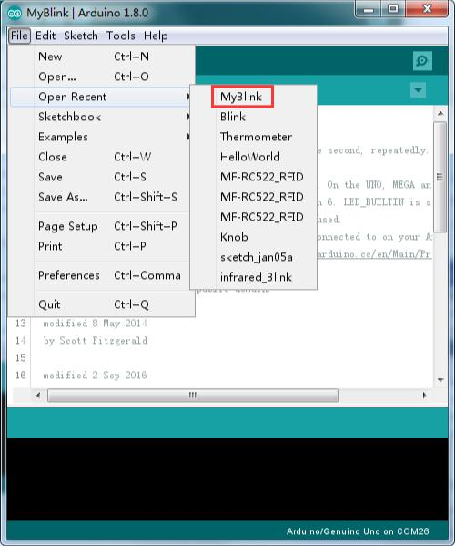

Conecte la placa de Arduino al ordenador con el cable USB y compruebe que la **Board Type** y **Puerto serie** están ajustados correctamente.

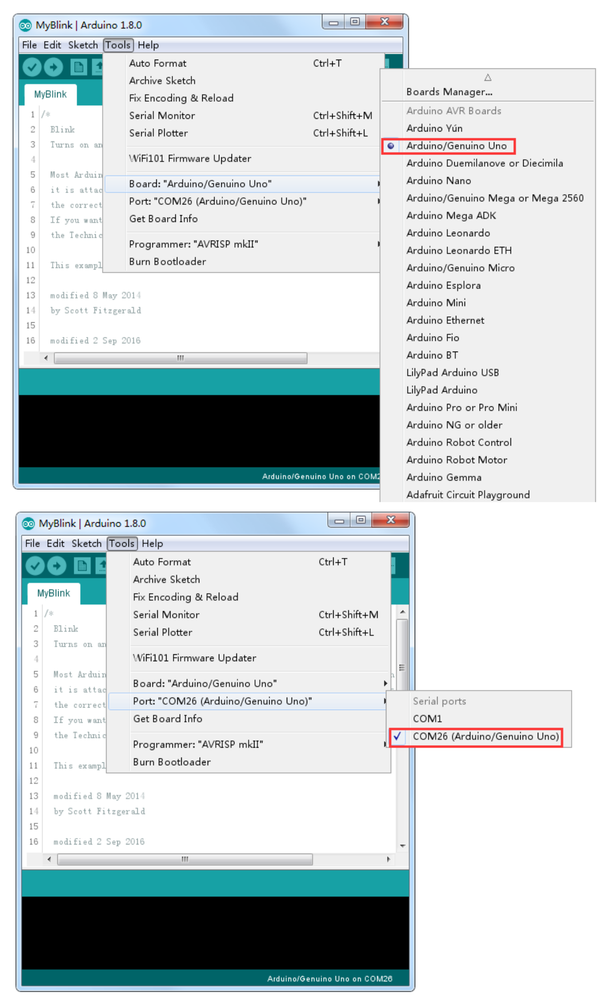

Nota:

- El tipo de tarjeta y puerto Serial aquí no son necesariamente la misma que se muestra en la imagen. Si usas 2560, entonces usted tendrá que elegir Mega 2560 como el tipo de Junta, otras opciones se pueden hacer de la misma manera.
- El puerto serie (COM) puede ser diferente, del tipo COM3 o COM4 en su ordenador. Un puerto COM correcto se supone que es COMX (arduino XXX), que es por los criterios de  certificación.

El IDE de Arduino mostrará la configuración actual en la parte inferior de la  ventana.


Haga clic en el botón **subir**. El segundo botón de la izquierda en la barra de herramientas.


Si usted mira el área de estado del IDE, verá una barra de progreso y una serie de mensajes. Al principio, que dice 'Bosquejo compilar...'. Esto convierte el dibujo en un formato adecuado para subir a la Junta.

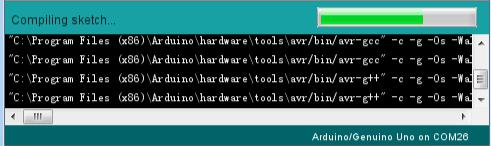

A continuación, el estado cambiará a **subir**. En este punto, los LEDs de la Arduino deben comenzar a parpadear como se transfiere el dibujo.

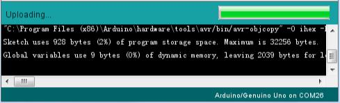

Por último, el estado cambiará a 'Done'.

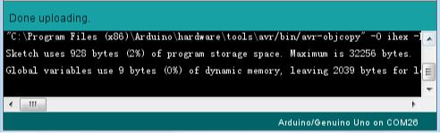

El otro mensaje nos dice que el **programa** está utilizando 928 bytes de 32.256 bytes  disponibles. Después de la etapa de compilación Sketch... podría obtener el siguiente mensaje de error:

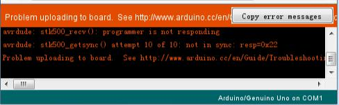

Puede significar que su Junta no está conectado a todos, o no se ha instalado los drivers (si es necesario) o que se ha seleccionado el puerto serial incorrecto.

Si encuentras esto, volver a la lección 0 y verifique su instalación.

Una vez completada la carga, la Junta debe reiniciar y empiezan a parpadear.

El código abierto

Tenga en cuenta que una gran parte de este esquema se compone de comentarios. Estas no son instrucciones de programa real; por el contrario, sólo explican cómo funciona el programa. Están allí para su beneficio.

### Comentarios

- Todo entre /* y */ en la parte superior del **programa** es un Comentario de bloque; explica lo que el **programa** es para.
- Los comentarios de una sola línea comienzan con // y hasta el final de esa línea se considera un comentario.

La primera línea de código es:

```arduino
int led = 13;
```

Creamos una variable con un nombre y guardamos el número de pin al que el LED está  conectado a. A continuación, tenemos la función de 'configuración'. Otra vez, como dice el comentario, este se ejecuta cuando se presiona el botón de reset. También se ejecuta cada vez que la  Junta se reinicia por alguna razón, como poder primero se aplica a él, o después de un **programa** se ha subido

```arduino
void setup() {
// Inicializa el pin digital como salida.
pinMode(led, OUTPUT);
}
```

Cada programa Arduino debe tener una función de **setup** (configuración), y las instrucciones que contendrá se insertan entre las llaves { y }.

En este caso, es un comando, que, como dice el comentario dice la placa Arduino que vamos  a utilizar el pin LED como salida.

También es obligatorio para un boceto tener una función de **loop**. A diferencia de la función  de **setup** que se ejecuta sólo una vez, después de un reset, la función **loop**, después que haya terminado de ejecutar sus comandos, empezar inmediatamente otra vez.

```arduino
void loop() {
digitalWrite(led, HIGH); // Encienda el LED (alto es el nivel de voltaje)
delay(1000); // Espere un segundo
digitalWrite(led, LOW); // Apagar el LED por lo que la tensión baja
delay(1000); // Espere un segundo
}
```
Dentro de la función **loop**, los comandos en primer lugar activar el pin del LED (alto), girar a 'retraso' de 1000 milisegundos (1 segundo), entonces el pin LED apagado y pausa para  otro segundo.

### Cambiar la frecuencia de parpadeo

Ahora vas a que el LED parpadee más rápido. Como puede haber adivinado, la clave de esto radica en cambiar el parámetro () para el comando 'retardo'.

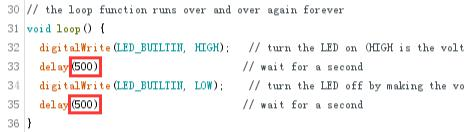

Este período de retardo en milisegundos, así que si desea que el LED parpadee dos veces tan rápidamente, cambiar el valor de 1000 a 500. Esto entonces pausa durante medio segundo cada retraso en lugar de un segundo entero.

Sube otra vez el **programa** y verás que el LED comienza a parpadear más rápidamente.
