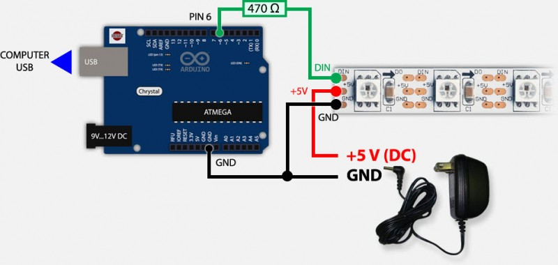

# LED tira

## Introducción

Los LEDs se están volviendo cada vez más populares como un medio para iluminar un espacio. Uno de los tipos de LEDs más nuevos y populares es el WS2812B. Estos LEDs ofrecen una serie de ventajas sobre los LEDs tradicionales, como la capacidad de cambiar de color y la capacidad de crear una gran variedad de efectos de iluminación.

El **WS2812B** es un tipo de LED direccionable. Esto significa que cada LED individual se puede controlar de forma **independiente**. Esto le da la capacidad de crear algunos efectos de iluminación realmente geniales. Por ejemplo, puede crear un espectáculo de luces en el que cada LED sea de un color diferente y todos cambien de color al mismo tiempo.

## Alimentación

Las tiras **WS2812B** pueden alimentarse a través de una batería o de una fuente de alimentación externa.

- El voltaje necesario para que funcione correctamente la tira de led WS2812B es de 5V.
- Un led WS2812B necesita un mínimo de 60mA para funcionar.

## La librería FASTLED

**FastLED** es una librería de código abierto para programar tira de LEDs RGB direccionables y controladores. Está diseñada para simplificar el proceso de crear efectos de iluminación complejos y se puede usar con una amplia variedad de hardware.

## Conexión




## Cabecera

```c  linenums="1" title="pruebaLED.ino"
#include<FastLED.h> // header file

#define NUM_LEDS 60 // number of led present in your strip
#define DATA_PIN 6 // digital pin of your arduino

CRGB leds[NUM_LEDS];

void setup() {
  FastLED.addLeds<WS2812B, LED_PIN, GRB>(leds, NUM_LEDS);
  FastLED.setBrightness(50);
}

void loop() {
  leds[0] = CRGB::Green; //glow 1st led as green
  leds[1] = CRGB::Blue; //glow 2nd led as blue
  FastLED.show(); // apply the function on led strip
  delay(30);
}
```

## Parpadeo (blink)

```c  linenums="1" title="parpadeoLED.ino"
void loop() {
  leds[0] = CRGB::Blue;
  FastLED.show();
  delay(200);
  leds[0] = CRGB::Black;
  FastLED.show();
  delay(200);
}
```

Para apagar la luz:

```c
leds[0] = CRGB::Black;
```

# Iluminar todos los LED de golpe

Para ello podemos utilizar la función `fill_solid`.

```c
fill_solid(leds, NUM_LEDS, CRGB:Red);
```

Arcoiris

```c
fill_rainbow(leds, NUM_LEDS, 0,255 / NUM_LEDS);
```

## LED Chaser

```c
// chase forward
void loop()
{
  for(int dot = 0;dot < NUM_LEDS; dot++) {
    leds[dot] = CRGB::Red;
    FastLED.show();
    leds[dot] = CRGB::Black;
    delay(300);
  }
}

// chase backward

void loop()
{
  for(int dot=NUM_LEDS ; dot >=0 ; dot--) {
    leds[dot] = CRGB::Red;
    FastLED.show();
    leds[dot] = CRGB::Black;
    delay(300);
  }
}

// chase both

void loop() {
  for(int dot=(NUM_LEDS-1) ; dot >=0 ; dot--) {
    leds[dot] = CRGB::Green;
    FastLED.show();
    leds[dot] = CRGB::Black;
    delay(300);
  }

  for(int dot = 0;dot < NUM_LEDS; dot++) {
    leds[dot] = CRGB::Red;
    FastLED.show();
    leds[dot] = CRGB::Black;
    delay(300);
  }
}
```

## Serial glow

```c
void loop()
{
  for(int dot=(NUM_LEDS-1) ; dot >=0 ; dot--) {
    leds[dot] = CRGB::HotPink;
    FastLED.show();
    delay(300);
  }

  for(int dot = 0;dot < NUM_LEDS; dot++) {
    leds[dot] = CRGB::Blue;
    FastLED.show();
    delay(300);
  }
}

```
