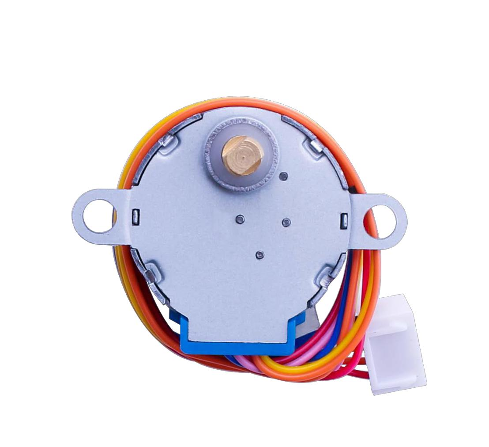
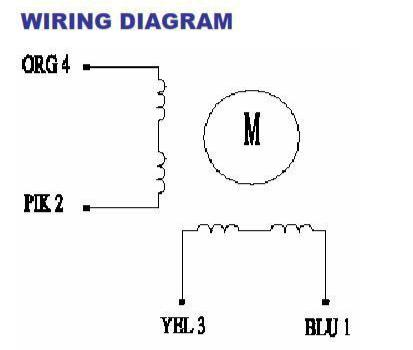
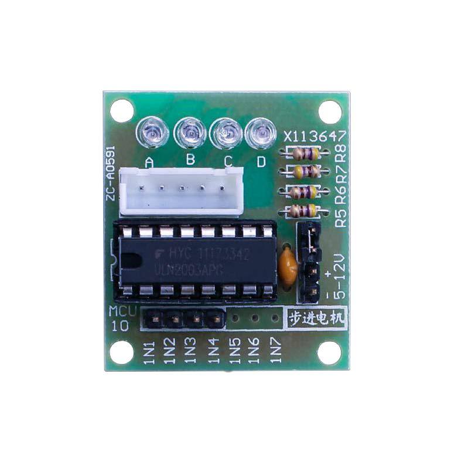
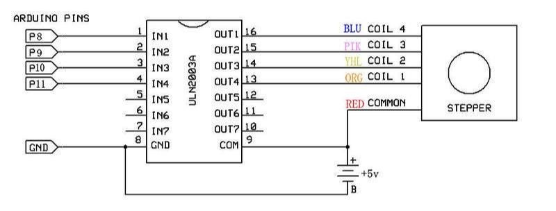
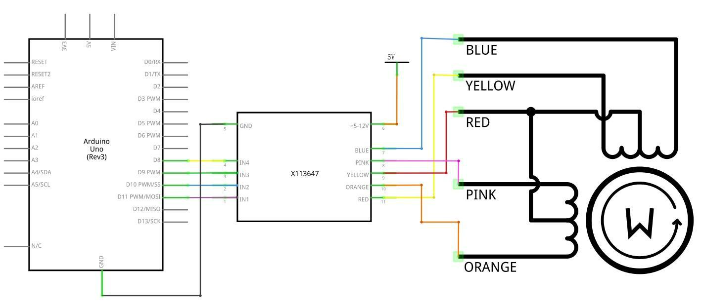
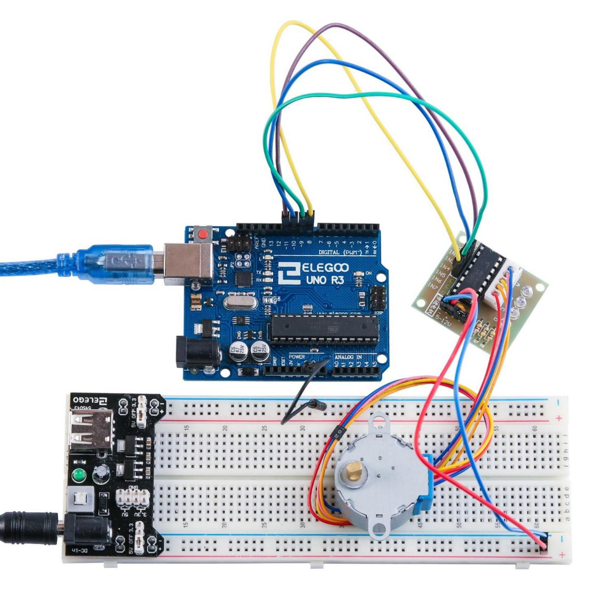

# Motor paso a paso

## Resumen

En esta lección, usted aprenderá una manera divertida y fácil para manejar un motor paso a paso.

El paso a paso que estamos utilizando viene con su propio tablero de conductor, lo que es fácil conectar con nuestro UNO

## Componentes necesarios

- (1) x Elegoo Uno R3
- (1) x 830 tie-points breadboard
- x módulo de controlador de motor paso a paso de x ULN2003
- x Motor paso a paso
- x 9V1A Adaptador
- x Power supply module
- x F-M cables (cables de hembra a macho DuPont)
- M-M wire (hilo puente de macho a macho)

## ¿Cómo funciona un motor paso a paso?

Un motor paso a paso es un dispositivo electromecánico que convierte pulsos eléctricos en movimientos mecánicos discretos. El eje o eje de un motor paso a paso gira en incrementos discretos cuando impulsos de mando eléctrico se aplican a él en la secuencia correcta. La rotación de los motores tiene varias relaciones directas a estos pulsos de entrada aplicadas. La secuencia de los pulsos aplicados se relaciona directamente con la dirección de rotación de ejes motor. La velocidad de la rotación de los ejes motor está directamente relacionada con la frecuencia de los pulsos de entrada y la duración de la rotación está directamente relacionada con el número de pulsos de entrada aplicada. Una de las ventajas más importantes de un motor paso a paso es su capacidad para ser controlado con precisión en un sistema de lazo abierto. Control de lazo abierto significa que ninguna información de retroalimentación de posición es necesario. Este tipo de control elimina la necesidad de costosos dispositivos de detección y regeneración como codificadores ópticos. Su posición es conocida simplemente por hacer el seguimiento de los pulsos de entrada de paso

28BYJ-48 los parámetros del motor paso a paso

Modelo: 28BYJ-48

> * Tensión nominal: 5 VDC
> * Número de fase: 4
> * Cociente de la variación de velocidad: 1/64
> * Ángulo de paso: 5,625 ° 64
> * Frecuencia: 100Hz
> * Resistencia de la C.C.: 50Ω±7 %(25 ° C)
> * Inactivo en tracción frecuencia: > 600Hz
> * Frecuencia ociosa de hacia fuera-tracción: > 1000Hz En tracción par > 34.3mN.m(120Hz)
> * Posicionamiento automático par > 34.3mN.m Par de fricción: 600-1200 gf.cm
> * Tire un par: 300 gf.cm
> * Resistencia de aislamiento > 10MΩ(500V) Aislantes de electricidad : 600VAC/1mA/1s Grado de aislamiento : A
> * Subida de temperatura < 40K(120Hz) Ruido < 35dB (120Hz, No carga, 10cm

## Esquema de circuitos

El motor de pasos bipolar tiene generalmente cuatro cables que salen de él. A diferencia de los motores PAP unipolares, steppers bipolares no tienen ninguna conexión común de centro. Tienen dos juegos independientes de bobinas en lugar de otro. Se pueden distinguir de steppers unipolares midiendo la resistencia entre los cables. Debe encontrar dos pares de cables de igual resistencia. Si tienes las puntas de su medidor conectado a dos cables que no están conectados (es decir, no conectada a la bobina del mismo), debería ver resistencia infinita (o sin continuidad).
## ULN2003 Placa conductora

Descripción del producto

> * Tamaño: 42mmx30mm
> * Chip de controlador de uso ULN2003, 500mA
> * A. B. C. D LED que indica las cuatro fases las condiciones de trabajo motor paso a paso.
> * Blanco jack es el conector estándar motor cuatro fase paso a paso.
> * Pines de alimentación son separados
> * Mantuvimos las clavijas del resto de la viruta del ULN2003 para sus prototipos más.

La forma más sencilla de conexión un paso a paso unipolar a Arduino es utilizar un desglose para chip de ULN2003A transistor array. El ULN2003A contiene siete controladores de transistor Darlington y es algo asícomo tener siete transistores TIP120 todo en un paquete. El ULN2003A puede pasar hasta 500 mA por canal y tiene una caída de tensión interna de 1V cuando en. También contiene diodos de abrazadera interna para disipar las puntas de tensión al manejar cargas inductivas.

Para controlar el paso a paso, aplicamos tensión a cada una de las bobinas en una secuencia específica.

La secuencia iría así:

Estos son esquemas que muestran cómo un paso a paso unipolar de interfaz motor a cuatro pines controlador utilizando un ULN2003A y mostrando cómo la interfaz usando cuatro com

## Conexión

## Esquema

## Diagrama de cableado

Estamos utilizando 4 pines para controlar el paso a paso.

- Los pines 8-11 controlan el motor paso a paso.
- Conectamos la tierra de a UNO para el motor paso a paso.

## Código

