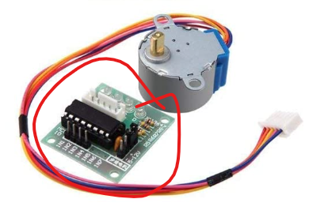
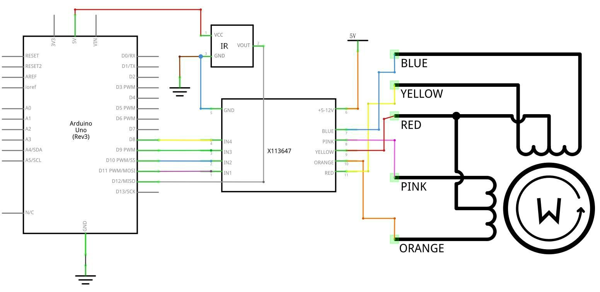
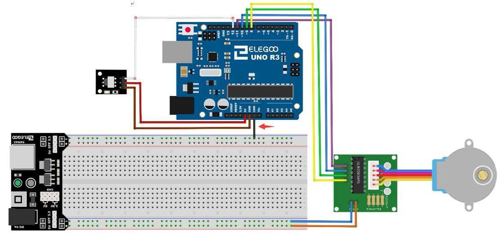
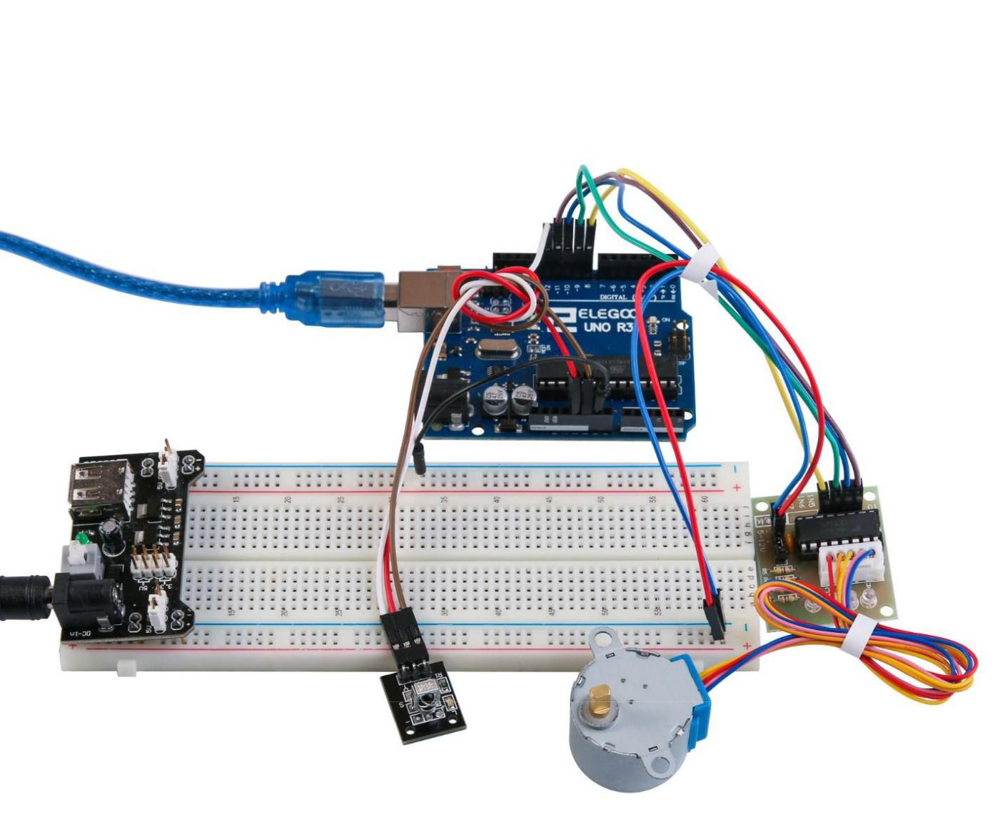

# Motor paso a paso mando

---

## Resumen

Veremos cómo funciona el motor de pasos de 4 fases **ULN2003 28BYJ-48** y el controlador de motor de 5V.

---

## El motor

El motor de pasos de 4 fases ULN2003 28BYJ-48 es un motor de pasos pequeño y económico que se puede controlar con un microcontrolador. El motor tiene 4 fases, cada una con 2 polos. Cada fase requiere energía para que el imán se atraiga o se repulse. Los 4 imanes del motor de pasos están dispuestos de forma que se atraigan y se repulsen en secuencia, lo que hace que el eje del motor gire.


---

## El controlador

Para controlar el motor de pasos de 4 fases, se necesita un controlador de motor. El controlador de motor de 5V es un circuito integrado que se usa para controlar el motor de pasos.



El controlador de motor tiene 8 salidas, cada una conectada a una fase del motor. Para hacer que el motor gire, se activan las salidas en secuencia.

---

## Componentes necesarios

> * (1) x Elegoo Uno R3
> * x 830 tie-points breadboard
> * x IR receiver module
> * x IR remote
> * x ULN2003 stepper motor driver module
> * x Stepper motor
> * x Power supply module
> * x 9V1A Adaptador
> * x F-M cables (cables de hembra a macho DuPont)
> * x M-M cable (hilo puente de macho a macho)

---

### Esquema



---

### Diagrama de cableado



---

Estamos utilizando 4 pines para controlar el paso a paso y el 1 pin del sensor IR.

- Los ``pines 8-11`` controlan el motor paso a paso
- El ``pin 12`` recibe la información de IR.

Conectamos los 5V y la tierra al sensor. Como medida de precaución, usar un protoboard alimentación potencia el motor paso a paso ya que puede utilizar más energía y no queremos dañar la fuente de alimentación del Arduino.

---



---

# Mando

El código reconoce sólo 2 valores desde el control remoto IR: VOL + y VOL-.

- Presionando VOL + del control remoto el motor hará un giro completo hacia la derecha.
- VOL- para hacer una rotación completa en sentido antihorario.

---

## Ejemplo 1

```c

 Este código hace que el motor gire en sentido horario y antihorario.

void setup()
{
  pinMode(8, OUTPUT);
  pinMode(9, OUTPUT);
  pinMode(10, OUTPUT);
  pinMode(11, OUTPUT);
}

void loop()
{
  //Gira el motor en sentido horario
  digitalWrite(8, HIGH);
  digitalWrite(9, LOW);
  digitalWrite(10, LOW);
  digitalWrite(11, LOW);
  delay(1000);

  digitalWrite(8, LOW);
  digitalWrite(9, HIGH);
  digitalWrite(10, LOW);
  digitalWrite(11, LOW);
  delay(1000);

  digitalWrite(8, LOW);
  digitalWrite(9, LOW);
  digitalWrite(10, HIGH);
  digitalWrite(11, LOW);
  delay(1000);

  digitalWrite(8, LOW);
  digitalWrite(9, LOW);
  digitalWrite(10, LOW);
  digitalWrite(11, HIGH);
  delay(1000);

  //Gira el motor en sentido antihorario
  digitalWrite(8, LOW);
  digitalWrite(9, LOW);
  digitalWrite(10, LOW);
  digitalWrite(11, HIGH);
  delay(1000);

  digitalWrite(8, LOW);
  digitalWrite(9, LOW);
  digitalWrite(10, HIGH);
  digitalWrite(11, LOW);
  delay(1000);

  digitalWrite(8, LOW);
  digitalWrite(9, HIGH);
  digitalWrite(10, LOW);
  digitalWrite(11, LOW);
  delay(1000);

  digitalWrite(8, HIGH);
  digitalWrite(9, LOW);
  digitalWrite(10, LOW);
  digitalWrite(11, LOW);
  delay(1000);
}
```