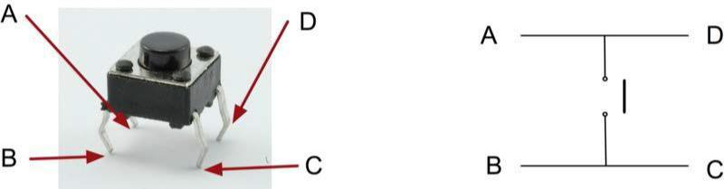
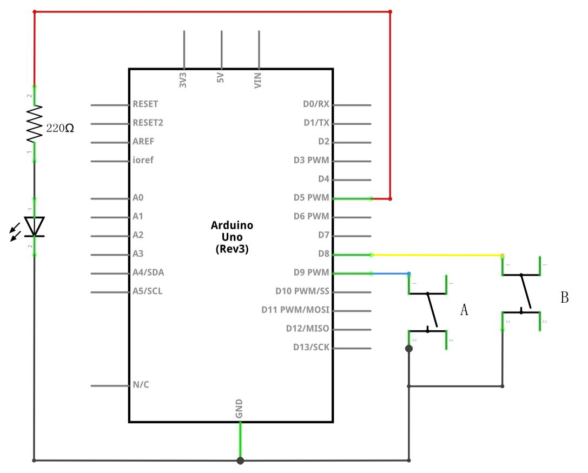
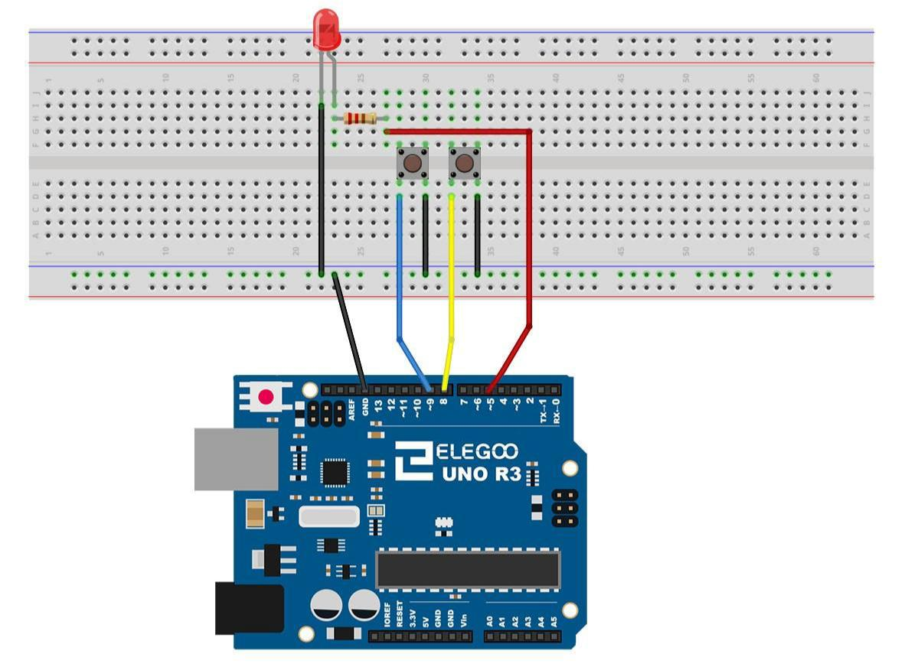
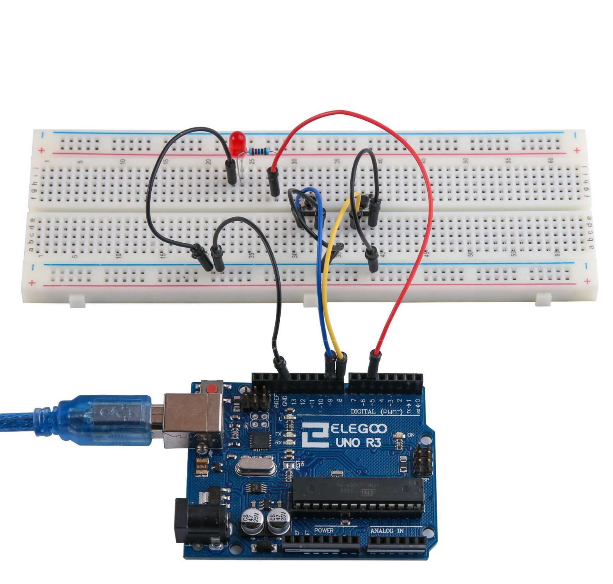

[🔙 Enrere](../) | [🏠 Pàgina principal](http://danimrprofe.github.io/apuntes/)

# Boton

## Arduino

---

## Resumen

En esta lección, aprenderemos a utilizar los botones con entradas digitales para  encender y apagar un LED.

- Al presionar el primer botón se encenderá el LED
- Al pulsar el otro botón se apagará el LED.

---

## Componentes

Antes de comenzar necesitaremos los siguientes componentes:

| cantidad | componente                |
| -------- | ------------------------- |
| 1        | Placa``Arduino`` UNO      |
| 1        | protoboard                |
| 1        | LED rojo                  |
| 1        | resistencia de 220 ohmios |
| 2        | interruptores             |
| 7        | cables jumper             |

---

### Pulsadores

Los interruptores son componentes muy simples. Cuando pulse un botón, conectan dos contactos para que la electricidad fluya a través de ellos. Los interruptores de esta lección tienen **cuatro conexiones**, que pueden ser un poco confusas.

---

En realidad, hay realmente dos conexiones eléctricas.
- Los pines B y C están siempre conectados entre sí, al igual que A y D.
- Al pulsar el botón, se conectan los 4.
- En realidad dos de los pines no los necesitamos



---

## Esquema de conexión

---



---

## Diagrama de cableado



---

## Las conexiones que vamos a tener que realizar son las siguientes:



---

Aunque los cuerpos de los interruptores son cuadrados, los pasadores sobresalen de los lados opuestos del interruptor.

Esto significa que los pines sólo estarán lo suficientemente separados cuando se colocan correctamente en la placa de pruebas.
Recuerde que el LED tiene que tener el cable negativo más corto a la izquierda.

---

## Explicación del código

- Pulsando el botón izquierdo se encenderá el **LED**.
- Pulsando el botón derecho apagará.

---

La primera parte del proyecto define tres variables para las tres patas que se van a utilizar. El 'ledPin' es el pin de salida y 'pinBotonA' se refiere al interruptor más cerca de la parte superior de la placa y 'buttonBpin' para el otro interruptor.

---

La función de **setup** define el ledPin como una salida normal, pero ahora tenemos las dos entradas para ocuparse.

En este caso, utilizamos el conjunto el pinMode ser **INPUT_PULLUP** como este:

- El modo pin de **INPUT_PULLUP** significa que el pin debe ser utilizado como una entrada, pero que si nada mas se conecta a la entrada, la entrada tendra el valor **HIGH**.
- En otras palabras, el valor predeterminado de la entrada es **HIGH**, a menos que se ponga a **LOW** al pulsar el botón.

---

Por esta razón los interruptores están conectados a tierra. Cuando un interruptor se presiona, se conecta la clavija de entrada a la tierra, para que ya no es alta.

Puesto que la entrada es normalmente alta y va sólo baja cuando se pulsa el botón, la lógica es un poco boca abajo. Nosotros nos encargaremos de esto en la **función loop**

---

# Función Loop
En la **función loop** hay dos declaraciones de 'si'. Uno para cada botón. Cada uno hace un 'digitalRead' en la entrada adecuada.

Recuerde que si se presiona el botón, la entrada correspondiente será baja, si el botón A es bajo, entonces  **digitalWrite** pone el valor HIGH el PIN al que tenemos conectado el LED, y este se enciende.

---

## Código completo

```c linenums="1" title="pruebaBoton.ino"
int ledPin = 5; //pin a que hemos conectado el LED
int pinBotonA = 9; //pin al que hemos conectado el boton A
int pinBotonB = 8; //pin al que hemos conectado el boton B

void setup()
{
  pinMode(ledPin, OUTPUT);
  pinMode(pinBotonA, INPUT_PULLUP);
  pinMode(pinBotonB, INPUT_PULLUP);
}

void loop()
{
  if (digitalRead(pinBotonA) == LOW)
  {
    digitalWrite(ledPin, HIGH);
  }
  if (digitalRead(pinBotonB) == LOW)
  {
    digitalWrite(ledPin, LOW);
  }
}
```
