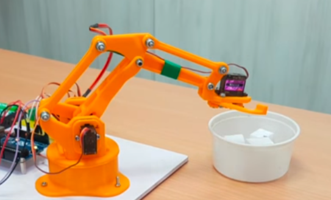
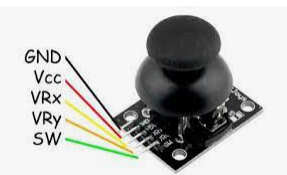

# Braç robòtic

Durant el curs, estam intentant fer un braç robòtic combinant la [impressió 3D](https://danimrprofe.github.io/apuntes/impresion3D/) i la placa [Arduino](https://danimrprofe.github.io/apuntes/arduino/).

# Projecte i peces

Les peces s'imprimiran utilitzant la impressora, a partir del projecte creat a thingiverse.

El projecte és aquest: https://www.thingiverse.com/thing:1015238

 

# Control con joystick

En esta fase vamos a probar a controlar el brazo a través de un joystick analógico.

Para ello, conectaremos el joystick al arduino.



# Conexiones

Los joysticks analógicos tienen dos ejes principales: el eje X y el eje Y, que corresponden a las posiciones horizontal y vertical del joystick.

```c
// Connexions del joystick
const int pinJoystickX = A0; // Connecta la sortida X a l'Analog Pin A0
const int pinJoystickY = A1; // Connecta la sortida Y a l'Analog Pin A1
```

## Llegir valors

```c
// Llegeix els valors del joystick
valorJoystickX = analogRead(pinJoystickX);
valorJoystickY = analogRead(pinJoystickY);
```

# Valores

Los valores analógicos se leen en un rango de 0 a 1023, donde:

- **0** representa la posición mínima
- **1023** la posición máxima del joystick en cada eje.

Es común que los joysticks en reposo generen un valor central alrededor de aproximadamente **512**.

# Mapeo

Tenemos dos rangos de valores diferentes:

- El servo necesita posiciones de 0 a 180
- El joystick da valores de 0 a 1023

Necesitamos mapear los valores del joystick a valores del servo, de tal forma que cualquier valor del joystick corresponda a un valor de posición del servo.

```c
// Mapeja els valors del joystick a l'interval d'angles del servo (0-180)
int angleServoX = map(valorJoystickX, 0, 1023, 0, 180);
int angleServoY = map(valorJoystickY, 0, 1023, 0, 180);
```

# Programa completo

```c
#include <Servo.h>

// Connexions del joystick
const int pinJoystickX = A0; // Connecta la sortida X a l'Analog Pin A0
const int pinJoystickY = A1; // Connecta la sortida Y a l'Analog Pin A1

// Connexió del servo
const int pinServo = 9; // Connecta el pin de senyal del servo al Pin digital 9

// Valors de llindar per determinar la direcció del moviment del joystick
const int llindar = 10;

// Variables per emmagatzemar els valors del joystick
int valorJoystickX = 0;
int valorJoystickY = 0;

Servo servo;

void setup() {
  // Inicialitza el servo
  servo.attach(pinServo);

  // Inicialitza la comunicació sèrie
  Serial.begin(9600);
}

void loop() {
  // Llegeix els valors del joystick
  valorJoystickX = analogRead(pinJoystickX);
  valorJoystickY = analogRead(pinJoystickY);

  // Mapeja els valors del joystick a l'interval d'angles del servo (0-180)
  int angleServoX = map(valorJoystickX, 0, 1023, 0, 180);
  int angleServoY = map(valorJoystickY, 0, 1023, 0, 180);

  // Controla el servo basant-se en el moviment del joystick
  servo.write(angleServoX);

  // Imprimeix els valors del joystick i l'angle del servo
  Serial.print("Joystick X: ");
  Serial.print(valorJoystickX);
  Serial.print("  Y: ");
  Serial.print(valorJoystickY);
  Serial.print("  Angle del servo X: ");
  Serial.println(angleServoX);

  // Afegim una petita pausa per evitar lectures contínues
  delay(100);
}

```