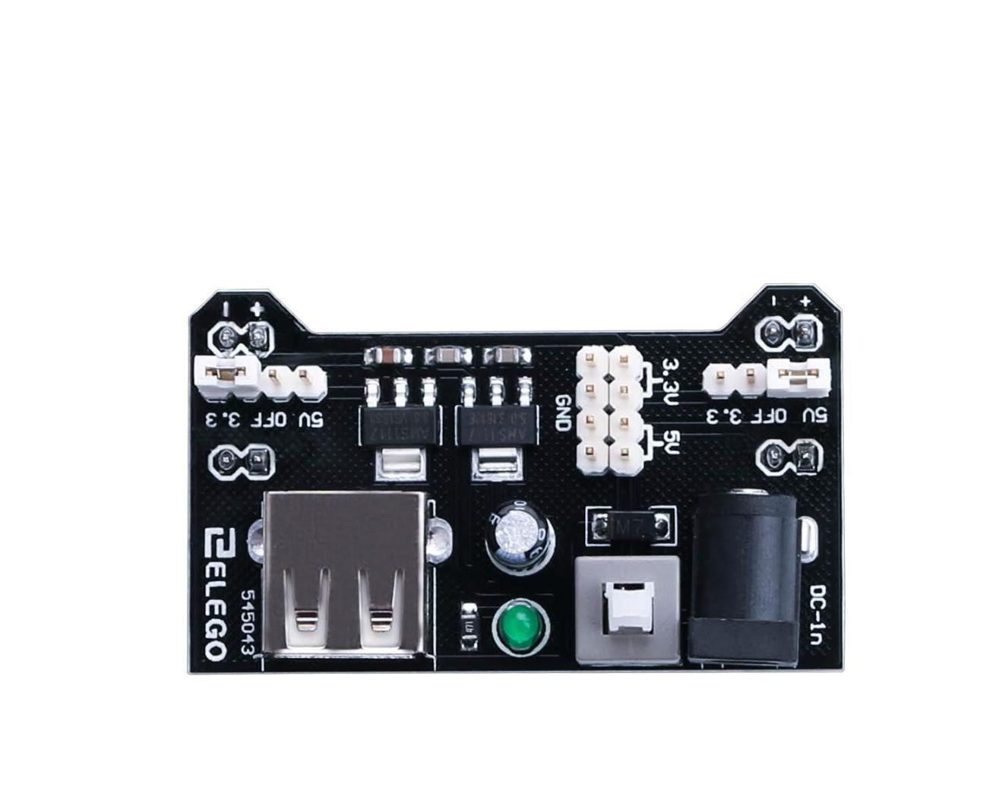
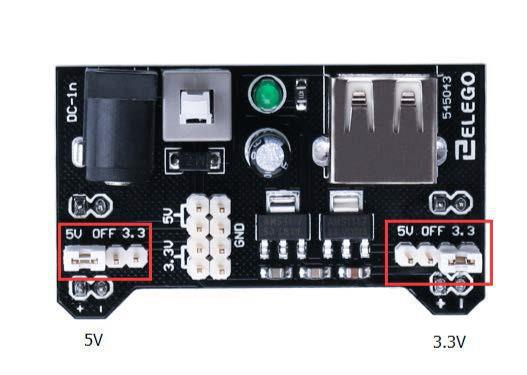
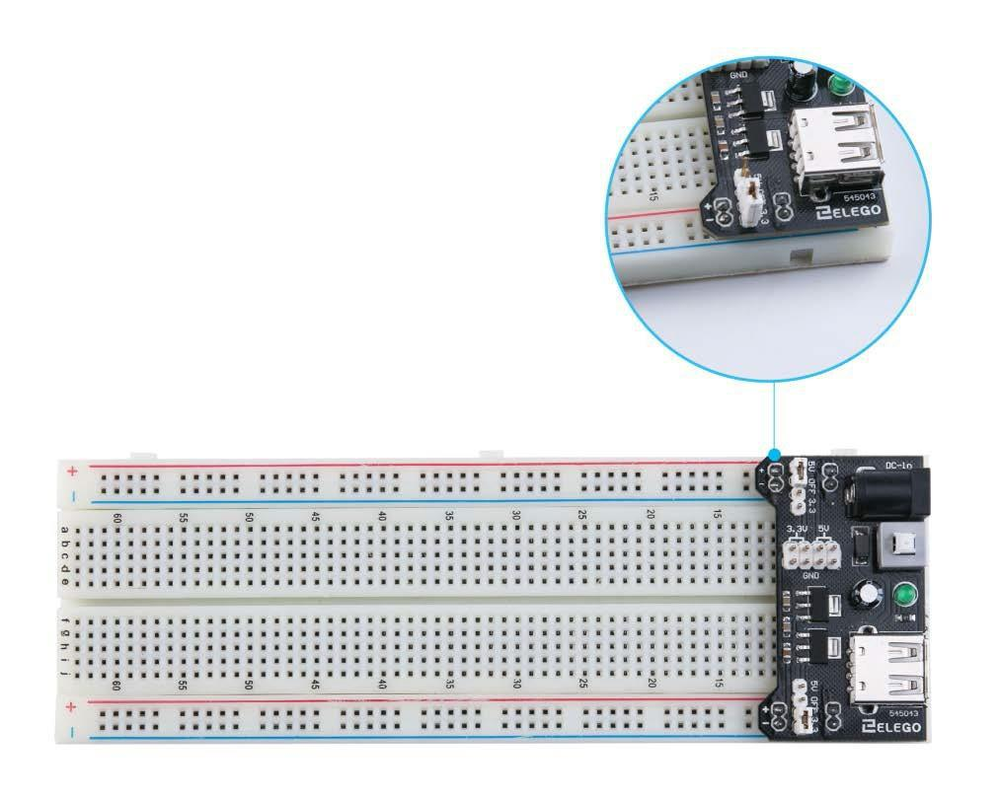

# Fuente de alimentación

El pequeño motor de corriente continua es probable que use más energía que la que``Arduino`` puede suministrar. Si tratamos de conectar el motor directamente a un pin, podríamos dañarlo. Para ello usar un **módulo de alimentación** que proporciona electricidad al motor.

---

---

## Especificaciones del producto

- Bloqueo Encendido interruptor LED Power indicador
- Entrada voltaje: 6.5-9v (CC) través 5.5mm x 2,1 mm enchufe
- Salida voltaje: 3.3V / 5v
- Máximo salida actual: 700 mA
- Independiente control riel salida. 0v, 3.3v, 5v a protoboard Salida pins principal para usos externos
- Tamaño: 2.1 en x 1.4 en
- USB dispositivo conector a bordo a power externos dispositivo

---

## Configuración de voltaje de salida

La izquierda y derecha de la tensión de salida puede configurarse independientemente. Para seleccionar la tensión de salida, mover el puente a los pines correspondientes. Nota: indicador de energía LED y los carriles de la energía de protoboard no se enciende si ambos puentes están en la posición "OFF".

---

Nota IMPORTANTE:

Asegúrese de alinear el módulo correctamente en la placa de pruebas.

- El pin negativo (-) en el módulo se alinea con la línea azul (-) de la placa-
- El pin positivo (+) se alinea con la línea roja (+).

---
