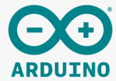
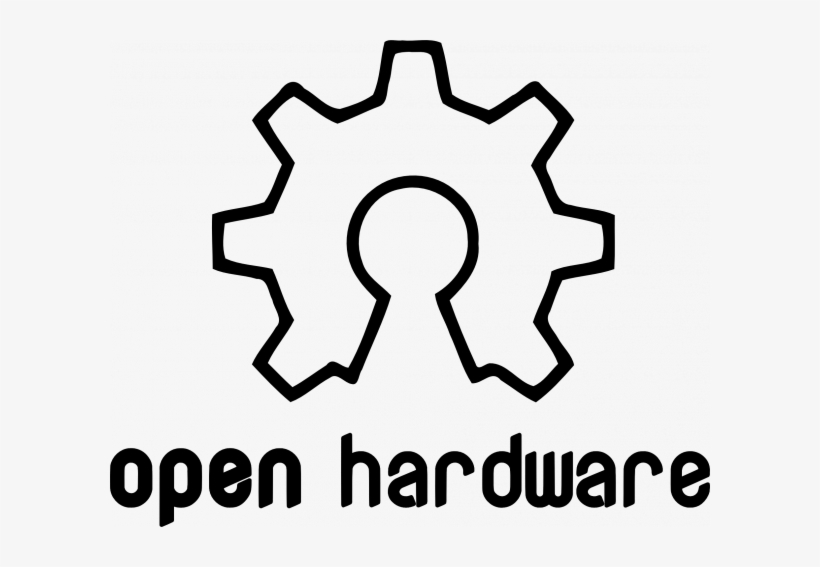
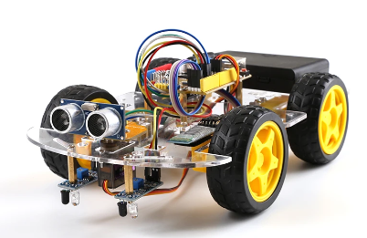
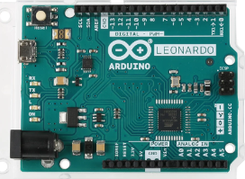
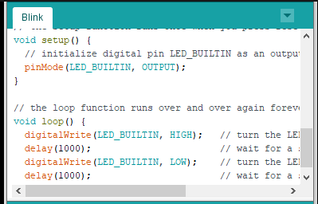

[🔙 Enrere](../) | [🏠 Pàgina principal](http://danimrprofe.github.io/apuntes/)

# Arduino

---

## Introducción

``Arduino`` es una plataforma de ``hardware libre``, basada en una placa con un microcontrolador y un entorno de desarrollo.

Hardware libre es aquel cuyas especificaciones y diagramas esquemáticos son de acceso público

---

Arduino está diseñado para permitir que los usuarios creen proyectos con una programación sencilla, sin necesidad de conocimientos previos de electrónica.

---

## Placa Arduino

La placa ``Arduino`` contiene un microcontrolador, que es una pequeña computadora que puede leer los datos de los sensores que se conectan, realizar algunas operaciones matemáticas y controlar los dispositivos a través de los pines de salida.

---

El ``microcontrolador`` puede ser programado para recibir instrucciones. Esto significa que los usuarios pueden ``programar`` la placa para que realice cualquier tarea que deseen, desde controlar motores hasta leer datos de sensores.

---
