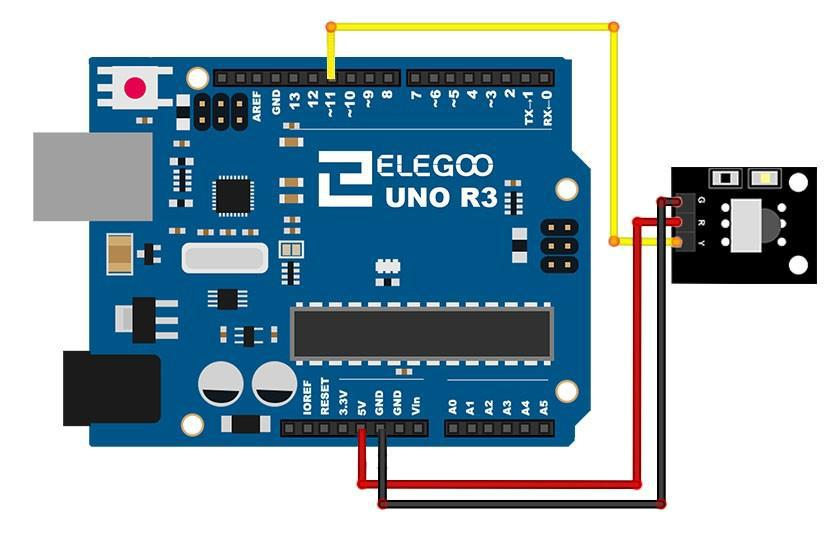
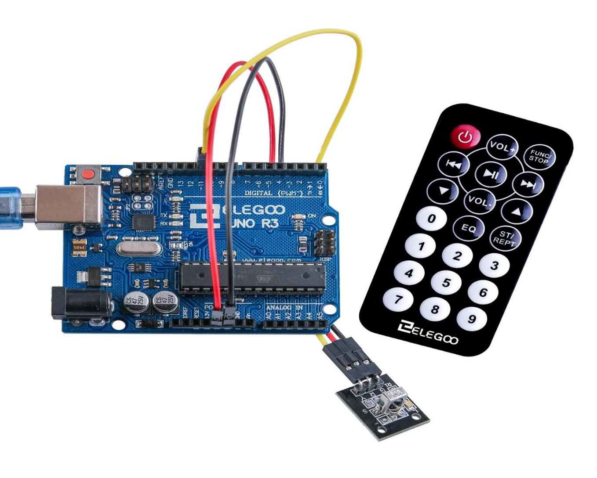
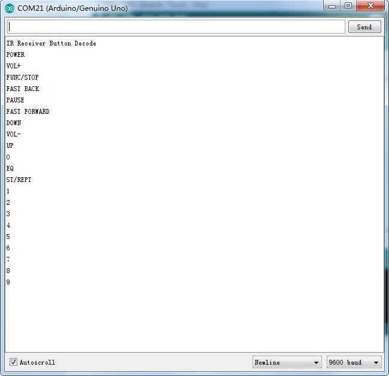

# Módulo de receptor IR

## Resumen

Los **mandos a distancia** infrarrojos son simples y fáciles de usar. En este tutorial nos conectando el receptor IR para el UNO y luego usaremos una **librería** que fue diseñada para este sensor en particular.

En nuestro dibujo tenemos todos los códigos de IR Hexadecimal que están disponibles en este control remoto, también detectará si el código fue reconocido y también si estamos manteniendo pulsada una tecla


### Componentes necesarios
```
(1) x Elegoo Uno R3
x IR modulo receptor
x IR control remoto
x F-M cables (cables de hembra a macho DuPont)ç
```

### Sensor receptor de infrarrojos

Los detectores infrarrojos son pequeños microchips con una célula fotoeléctrica que están configurados para recibir a la luz infrarroja.

Casi siempre se utilizan para la detección de control remoto - cada TV y reproductor de DVD tiene uno de estos en la parte delantera para escuchar la señal de IR desde el clicker.

Dentro del control remoto es un juego IR LED, que emite pulsos IR para comunicar al televisor para encender, apagar o cambiar de canal.

La luz infrarroja no es visible para el ojo humano.

Detectores infrarrojos son especialmente filtrados para IR ligero, no son buenos para detectar luz visible. Por otro lado, las fotocélulas son buenas para detectar luz visible de amarillo/verde y no son buenas para luz IR.

Detectores infrarrojos tienen un demodulador en ese aspecto para IR modulada a 38 KHz. Sólo brilla un LED IR no detectada, tiene que ser PWM intermitente en 38 KHz. fotocélulas no tienen ningún tipo de demodulador y puede detectar cualquier frecuencia (incluyendo CC) dentro de la velocidad de respuesta de la fotocélula (que es aproximadamente 1KHz)

Detectores infrarrojos son salida digital - tampoco detectan señal 38KHz IR y salida bajo (0V) o no detecta ninguno y salida alto (5V).

Las fotocélulas actúan como resistencias, los cambios de resistencia dependiendo de cuánto se exponen a la luz

## ¿Qué podemos medir?


Como se puede ver en estos gráficos de hoja de datos, la detección de frecuencia de peak es a 38 KHz y el pico color del LED es de 940 nm. Se puede usar desde unos 35 KHz kHz 41 pero la sensibilidad se desprenderá para que no detecte asídesde lejos. Asimismo, puede utilizar LEDs de 850 a 1100 nm pero no funcionan tan bien como 900 a 1000nm asíque asegúrese de obtener coincidencia de LEDs! Compruebe la ficha técnica para su IR LED verificar la longitud de onda.

## Esquema de conexiones


## Diagrama de cableado

Hay 3 conexiones para el receptor de infrarrojos.

Las conexiones son: señal, voltaje y tierra.

- El "-" es la tierra
- "S" es señal
- El del medio corresponde a 5V.



## Montaje



### Código

```c
#include "IRremote.h"

int receiver = 11; // Signal Pin of IR receiver

/*-----( Declare objects )-----*/
IRrecv irrecv(receiver);     // create instance of 'irrecv'
decode_results results;      // create instance of 'decode_results'

void translateIR()
{

  switch(results.value)

  {
  case 0xFFA25D: Serial.println("POWER"); break;
  case 0xFFE21D: Serial.println("FUNC/STOP"); break;
  case 0xFF629D: Serial.println("VOL+"); break;
  case 0xFF22DD: Serial.println("FAST BACK");    break;
  case 0xFF02FD: Serial.println("PAUSE");    break;
  case 0xFFC23D: Serial.println("FAST FORWARD");   break;
  case 0xFFE01F: Serial.println("DOWN");    break;
  case 0xFFA857: Serial.println("VOL-");    break;
  case 0xFF906F: Serial.println("UP");    break;
  case 0xFF9867: Serial.println("EQ");    break;
  case 0xFFB04F: Serial.println("ST/REPT");    break;
  case 0xFF6897: Serial.println("0");    break;
  case 0xFF30CF: Serial.println("1");    break;
  case 0xFF18E7: Serial.println("2");    break;
  case 0xFF7A85: Serial.println("3");    break;
  case 0xFF10EF: Serial.println("4");    break;
  case 0xFF38C7: Serial.println("5");    break;
  case 0xFF5AA5: Serial.println("6");    break;
  case 0xFF42BD: Serial.println("7");    break;
  case 0xFF4AB5: Serial.println("8");    break;
  case 0xFF52AD: Serial.println("9");    break;
  case 0xFFFFFFFF: Serial.println(" REPEAT");break;

  default:
    Serial.println(" other button   ");

  }// End Case

  delay(500); // Do not get immediate repeat

} //END translateIR
void setup()   /*----( SETUP: RUNS ONCE )----*/
{
  Serial.begin(9600);
  Serial.println("IR Receiver Button Decode");
  irrecv.enableIRIn(); // Start the receiver

}/*--(end setup )---*/

void loop()   /*----( LOOP: RUNS CONSTANTLY )----*/
{
  if (irrecv.decode(&results)) // have we received an IR signal?

  {
    translateIR();
    irrecv.resume(); // receive the next value
  }
}/* --(end main loop )-- */
```
## Visualizar datos en el monitor

Haga clic en el botón **Serial Monitor** para encender el monitor serie. De este modo podremos ir viendo los valores recibidos.


