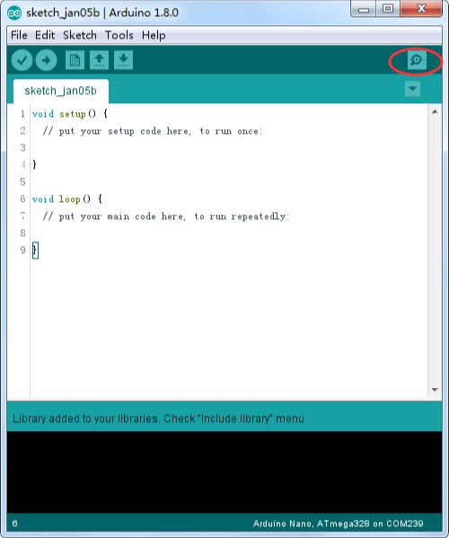
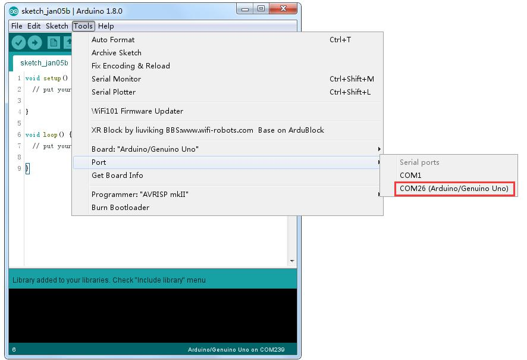
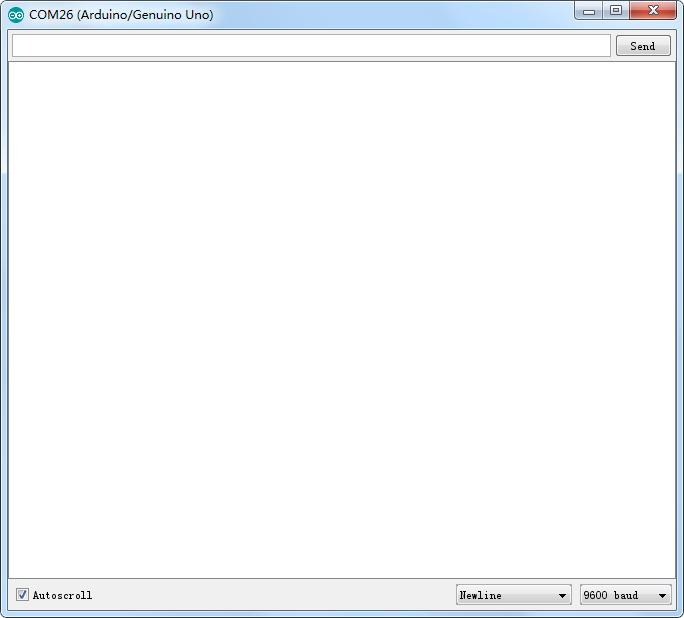
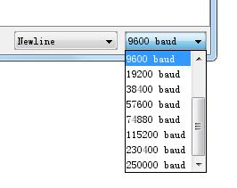
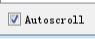

# Monitor serie

---

## Introducción

El Entorno de desarrollo integrado o ``IDE`` de **Arduino** es el software de la plataforma``Arduino``.

Incluye un `terminal` de serie con el software llamado  monitor serie. El Monitor de serie viene con cualquier versión del ``IDE Arduino``.

El monitor serie nos permite comunicarnos con el ``arduino`` a través de una ventana y recibir datos de él.

---

## Realizar la conexión

Para abrirlo, simplemente haga clic en el icono ``Serial Monitor``.

---

## Elegir puerto

Seleccionar cuál de los puertos a abrir en el Monitor Serial es lo mismo que seleccionar un puerto para cargar código de``Arduino``. Vaya a herramientas -> Serial Port y seleccione el puerto correcto.

Consejos: Elegir el mismo puerto ``COM`` que tienes en el administrador de dispositivos.

---

Una vez abierto, debería ver algo como esto:

---

### Configuración

El Monitor Serial ha limitado opciones, pero lo suficiente para manejar la mayoría de sus  necesidades de comunicación serial. El primer ajuste que se puede modificar es la velocidad  en baudios. Haga clic en la velocidad en baudios tasa lista desplegable para seleccionar la  velocidad correcta. (9600 baudios)

---

Por último, puede establecer el terminal desplazamiento automático o no marcando la casilla en la esquina inferior izquierda

---

El Monitor Serial es una gran manera rápida y fácil para establecer una conexión en serie con  el``Arduino``.
