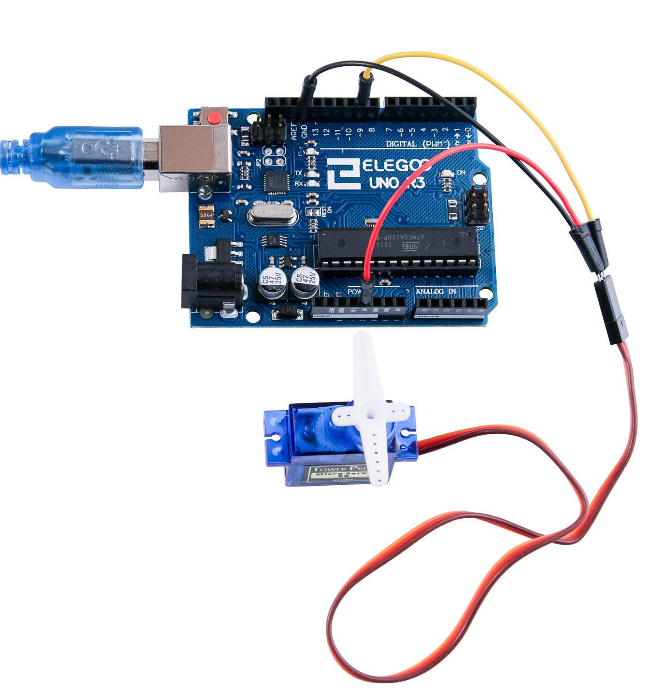
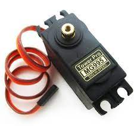

[游댗 Enrere](../) | [游 P많ina principal](http://danimrprofe.github.io/apuntes/) \n\n---
title: Motor servo
footer: Daniel Moreno 🌐 <github.com/danimrprofe>
_footer: ""
paginate: true
_paginate: false
_class: invert
marp: true
---

[游댗 Enrere](../) | [游 P많ina principal](http://danimrprofe.github.io/apuntes/)

# Motor servo

---

## Componentes necesarios

| Cant | Elemento                                     |
| ---- | -------------------------------------------- |
| 1    | Placa``Arduino`` UNO                         |
| 1    | Servo (SG90)                                 |
| 1    | M cables (cables de puente de macho a macho) |

---

## Resumen

Los servos son un tipo especial de motor de c.c. que se caracterizan por su capacidad para posicionarse de forma inmediata en cualquier posición dentro de su intervalo de operación. Se mueven en una precisión de 180º como máximo.

---

El servo tiene un eje que puede girar y que es accionado por un motor. La posición del eje puede ser controlada con una señal analógica.

---


Para ello, el servomotor espera un tren de pulsos que se corresponde con el movimiento a realizar.

---

# Cables

El Servo tiene tres cables:

- **Marrón** es el cable a tierra y deben conectarse a GND puerto UNO, el r
- **Rojo** es el cable de corriente y debe conectarse al puerto de 5v
- **Naranja** es el cable de señal y debe conectarse al puerto 9.

---

## Servomotor SG90

| Parámetro                  | Valor                                                           |
| -------------------------- | --------------------------------------------------------------- |
| Longitud del cable:        | 25cm                                                            |
| Sin carga;                 | Velocidad: 0,12 seg/60 degree (4.8V), 0.10 sec/60 grados (6.0V) |
| Puesto de par (4.8V):      | 1,6 kg/cm                                                       |
| Temperatura:               | -30 ~ 60' C                                                     |
| Ancho de banda muerta:     | 5 us                                                            |
| Voltaje de funcionamiento: | 3.5 ~ 6V                                                        |
| Dimensión:                 | 1.26 en x 1,18 en x 0,47 en (3,2 x 3 cm x 1.2 cm)               |
| Peso:                      | 4,73 onzas (134)                                                |

---

## Accesorios

El servo viene con diferentes accesorios que se pueden utilizar para sujetarlo a otras piezas.

---


---


---

## Diagrama de cableado


---

## Montaje

Necesitaremos 3 **jumpers** para conectar el servo a la placa.

---



---

## Código

Antes de ejecutar esto, debemos incluir la **biblioteca servo**. Esta librería incorpora funciones que nos permitirán manejar de forma más sencilla el comportamiento del motor.

---


---

# Ejemplo 1

---
```c
#include <Servo.h> // Incluimos la librería Servo

Servo miServo; // Creamos un objeto Servo

void setup() {
  miServo.attach(9); // Conectamos el servo al pin 9
}

void loop() {
  miServo.write(90); // Movemos el servo a 90 grados
  delay(1000); // Esperamos 1 segundo
  miServo.write(0); // Movemos el servo a 0 grados
  delay(1000); // Esperamos 1 segundo
}
```
---
# Ejemplo 2
Este código mueve el eje del motor ``180 grados`` en una dirección y luego en la contraria, indefinidamente.

---

```c title="pruebasServo.ino"
#include <Servo.h>

Servo myservo;  // create servo object to control a servo
// twelve servo objects can be created on most boards

int pos = 0;    // variable to store the servo position

void setup() {
  myservo.attach(9);  // Le asignamos el PIN 9.
}

void loop() {
  for (pos = 0; pos <= 180; pos += 1) { // goes from 0 degrees to 180 degrees
    // in steps of 1 degree
    myservo.write(pos);              // tell servo to go to position in variable 'pos'
    delay(15);                       // waits 15ms for the servo to reach the position
  }
  for (pos = 180; pos >= 0; pos -= 1) { // goes from 180 degrees to 0 degrees
    myservo.write(pos);              // tell servo to go to position in variable 'pos'
    delay(15);                       // waits 15ms for the servo to reach the position
  }
}
```
---

## Servo MG995

El servomotor **MG995** es un servomotor digital de alta velocidad y alta precisión. El servomotor está construido con una carcasa de plástico reforzado y un eje de metal.



Tiene una salida de 5 V y una corriente máxima de 2 A. Puede alcanzar una velocidad de giro de 0,12 segundos por vuelta.

---

## Comparativa

- El **SG90** es un microservo más pequeño y ligero que el MG995.
- También es más económico.
- El **SG90** tiene un rango de movimiento de aproximadamente 180 grados, mientras que el MG995 tiene un rango de movimiento de aproximadamente 360 grados.
