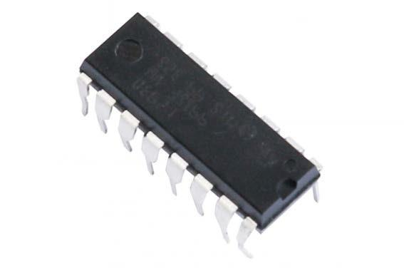
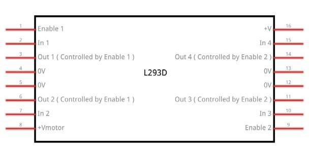
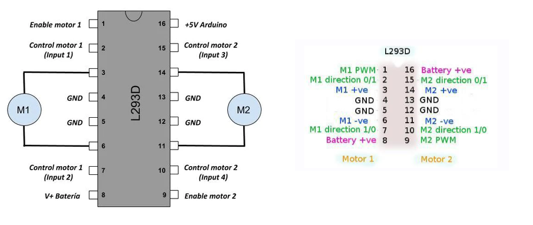
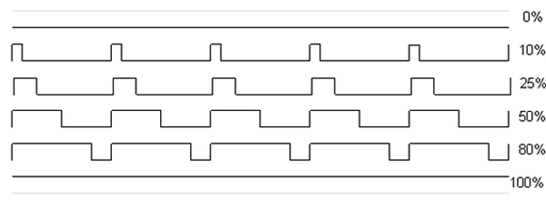
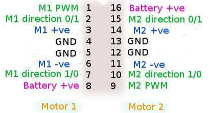
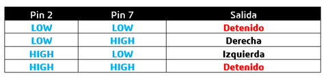
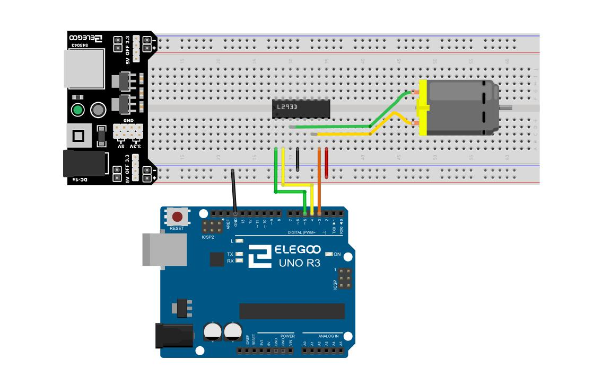
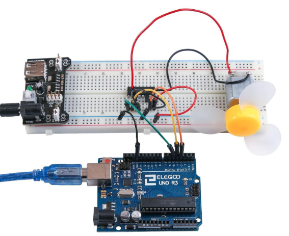

# <!-- fit -->  Motores de CC

<!-- _class: invert-->

# Fuente de alimentación de la placa

El pequeño motor de corriente continua es probable que use más energía que la que``Arduino`` puede suministrar. Si tratamos de conectar el motor directamente a un pin, podríamos dañarlo. Para ello usar un **módulo de alimentación** que proporciona electricidad al motor.

# Especificaciones

- Voltaje de entrada: 6.5-9v (CC)
- Voltaje de salida: 3.3V / 5v
- Máxima corriente de salida: 700 mA

# Configuración de voltaje


---

La izquierda y derecha de la tensión de salida puede configurarse independientemente. Para seleccionar la tensión de salida, mover el puente a los pines correspondientes. Nota: indicador de energía LED y los carriles de la energía de protoboard no se enciende si ambos puentes están en la posición "OFF".

# Importante

Asegúrese de alinear el módulo correctamente en la placa de pruebas.


# L293D

El L293D és un circuit integrat que s'utilitza com a controlador de motor i permet controlar la direcció i la velocitat d'un motor DC.

# L293D

El dispositiu inclou quatre drivers de pont H, que permeten controlar fins a dos motors DC de manera independent.



# Especificaciones

| Característica             | Valor                                |
| -------------------------- | ------------------------------------ |
| Tensión de alimentación    | 4,5 V a 36 V                         |
| Salida de corriente        | 1 A por canal (600 mA para el L293D) |
| Máxima salida de corriente | 2 A por canal (1.2 A para L293D)     |

# Diagrama de pines



# L293 y L293D

- El ``L293`` está diseñado para proporcionar corrientes de transmisión bidireccional de hasta 1 A con tensiones de 4,5 V a 36 V.
- El ``L293D`` está diseñado para proporcionar bidireccional corrientes de impulsión de hasta 600 mA en tensiones de 4,5 V a 36 V.

# Pines

- 4 pines per controlar la direcció dels motors
- 1 pin s'utilitza per controlar la  velocitat.



# Control de la velocidad

**M1 PWM** lo conectaremos a un pin PWM de``Arduino``. Está marcados en la ONU, el pin 5 es un ejemplo. Cualquier número entero entre 0 y 255, donde:

- ``0`` significa velocidad 0 (no hay movimiento)
- ``128`` es la mitad de velocidad
- ``255`` es la velocidad máxima de salida.

# Control de velocidad

Según el valor que escribamos, se generará una señal PWM diferente.



# Dirección de giro

La dirección se controla a través de las entradas de dirección:

- **M1 0/1** y **M1 1/0** determinan el sentido de giro del motor 1
- **M2 0/1** y **M2 1/0** determinan el sentido de giro del motor 2

# Dirección de giro



# Dirección de giro

En la siguiente tabla veréis las 4 combinaciones posibles para el motor 1:



# Esquema



# Montaje físico



# Código

```c

#define ENABLE 5
#define DIRA 3
#define DIRB 4

int i;

void setup() {
  //---set pin direction
  pinMode(ENABLE,OUTPUT);
  pinMode(DIRA,OUTPUT);
  pinMode(DIRB,OUTPUT);
  Serial.begin(9600);
}

void loop() {
  //---back and forth example
    Serial.println("One way, then reverse");
    digitalWrite(ENABLE,HIGH); // enable on
    for (i=0;i<5;i++) {
        digitalWrite(DIRA,HIGH); //one way
        digitalWrite(DIRB,LOW);
        delay(500);
        digitalWrite(DIRA,LOW);  //reverse
        digitalWrite(DIRB,HIGH);
        delay(500);
    }
    digitalWrite(ENABLE,LOW); // disable
    delay(2000);

    Serial.println("fast Slow example");
    //---fast/slow stop example
    digitalWrite(ENABLE,HIGH); //enable on
    digitalWrite(DIRA,HIGH); //one way
    digitalWrite(DIRB,LOW);
    delay(3000);
    digitalWrite(ENABLE,LOW); //slow stop
    delay(1000);
    digitalWrite(ENABLE,HIGH); //enable on
    digitalWrite(DIRA,LOW); //one way
    digitalWrite(DIRB,HIGH);
    delay(3000);
    digitalWrite(DIRA,LOW); //fast stop
    delay(2000);

    Serial.println("PWM full then slow");
    //---PWM example, full speed then slow
    analogWrite(ENABLE,255); //enable on
    digitalWrite(DIRA,HIGH); //one way
    digitalWrite(DIRB,LOW);
    delay(2000);
    analogWrite(ENABLE,180); //half speed
    delay(2000);
    analogWrite(ENABLE,128); //half speed
    delay(2000);
    analogWrite(ENABLE,50); //half speed
    delay(2000);
    analogWrite(ENABLE,128); //half speed
    delay(2000);
    analogWrite(ENABLE,180); //half speed
    delay(2000);
    analogWrite(ENABLE,255); //half speed
    delay(2000);
    digitalWrite(ENABLE,LOW); //all done
    delay(10000);
}

```
