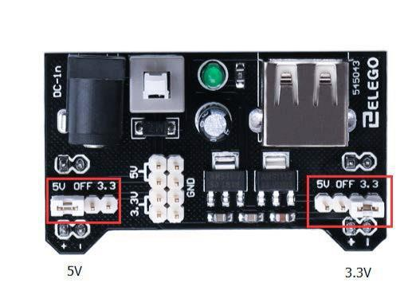

[游댗 Enrere](../) | [游 P많ina principal](http://danimrprofe.github.io/apuntes/)

## Fuente de alimentación de la placa

El pequeño motor de corriente continua es probable que use más energía que la que``Arduino`` puede suministrar. Si tratamos de conectar el motor directamente a un pin, podríamos dañarlo. Para ello usar un **módulo de alimentación** que proporciona electricidad al motor.

**Especificaciones del producto:**

- Bloqueo Encendido interruptor LED Power indicador
- Entrada voltaje: 6.5-9v (CC) través 5.5mm x 2,1 mm enchufe
- Salida voltaje: 3.3V / 5v
- Máximo salida actual: 700 mA
- Independiente control riel salida. 0v, 3.3v, 5v a protoboard Salida pins principal para usos externos
- Tamaño: 2.1 en x 1.4 en
- USB dispositivo conector a bordo a power externos dispositivo

---

Configuración de voltaje de salida:



---

La izquierda y derecha de la tensión de salida puede configurarse independientemente. Para seleccionar la tensión de salida, mover el puente a los pines correspondientes. Nota: indicador de energía LED y los carriles de la energía de protoboard no se enciende si ambos puentes están en la posición "OFF".

---


---

Nota IMPORTANTE:

Asegúrese de alinear el módulo correctamente en la placa de pruebas.

- El pin negativo (-) en el módulo se alinea con la línea azul (-) de la placa-
- El pin positivo (+) se alinea con la línea roja (+).

---

### L293D

El L293D és un circuit integrat que s'utilitza com a controlador de motor i permet controlar la direcció i la velocitat d'un motor DC.

El dispositiu inclou quatre drivers de pont H, que permeten controlar fins a dos motors DC de manera independent.


---

Especificaciones del producto:

|                            |                                      |
| -------------------------- | ------------------------------------ |
| Tensión de alimentación    | 4,5 V a 36 V                         |
| Salida de corriente        | 1 A por canal (600 mA para el L293D) |
| Máxima salida de corriente | 2 A por canal (1.2 A para L293D)     |

---

## Diagrama de pines


---

## Descripción

El ``L293`` y ``L293D`` son cuádruples controladores  de alta corriente.

- El L293 está diseñado para proporcionar corrientes de transmisión bidireccional de hasta 1 A con tensiones de 4,5 V a 36 V.
- El L293D está diseñado para proporcionar bidireccional corrientes de impulsión de hasta 600 mA en tensiones de 4,5 V a 36 V.

Els pins IN1, IN2, IN3 i IN4 es fan servir per controlar la direcció del motor, mentre que el pin ENABLE s'utilitza per controlar la seva velocitat.


## Control de la velocidad

**M1 PWM** lo conectaremos a un pin PWM de``Arduino``. Está marcados en la ONU, el pin 5 es un ejemplo. Cualquier número entero entre 0 y 255, donde:

- ``0`` significa velocidad 0 (no hay movimiento)
- ``128`` es la mitad de velocidad
- ``255`` es la velocidad máxima de salida.

Según el valor que escribamos, se generará una señal PWM diferente.


## Cambiar la dirección de giro

La dirección se controla a través de las entradas de dirección:

- **M1 0/1** y **M1 1/0** determinan el sentido de giro del motor 1
- **M2 0/1** y **M2 1/0** determinan el sentido de giro del motor 2


En la siguiente tabla veréis las 4 combinaciones posibles para el motor 1:


### Esquema


## Montaje físico


## Código

```c

#define ENABLE 5
#define DIRA 3
#define DIRB 4

int i;

void setup() {
  //---set pin direction
  pinMode(ENABLE,OUTPUT);
  pinMode(DIRA,OUTPUT);
  pinMode(DIRB,OUTPUT);
  Serial.begin(9600);
}

void loop() {
  //---back and forth example
    Serial.println("One way, then reverse");
    digitalWrite(ENABLE,HIGH); // enable on
    for (i=0;i<5;i++) {
        digitalWrite(DIRA,HIGH); //one way
        digitalWrite(DIRB,LOW);
        delay(500);
        digitalWrite(DIRA,LOW);  //reverse
        digitalWrite(DIRB,HIGH);
        delay(500);
    }
    digitalWrite(ENABLE,LOW); // disable
    delay(2000);

    Serial.println("fast Slow example");
    //---fast/slow stop example
    digitalWrite(ENABLE,HIGH); //enable on
    digitalWrite(DIRA,HIGH); //one way
    digitalWrite(DIRB,LOW);
    delay(3000);
    digitalWrite(ENABLE,LOW); //slow stop
    delay(1000);
    digitalWrite(ENABLE,HIGH); //enable on
    digitalWrite(DIRA,LOW); //one way
    digitalWrite(DIRB,HIGH);
    delay(3000);
    digitalWrite(DIRA,LOW); //fast stop
    delay(2000);

    Serial.println("PWM full then slow");
    //---PWM example, full speed then slow
    analogWrite(ENABLE,255); //enable on
    digitalWrite(DIRA,HIGH); //one way
    digitalWrite(DIRB,LOW);
    delay(2000);
    analogWrite(ENABLE,180); //half speed
    delay(2000);
    analogWrite(ENABLE,128); //half speed
    delay(2000);
    analogWrite(ENABLE,50); //half speed
    delay(2000);
    analogWrite(ENABLE,128); //half speed
    delay(2000);
    analogWrite(ENABLE,180); //half speed
    delay(2000);
    analogWrite(ENABLE,255); //half speed
    delay(2000);
    digitalWrite(ENABLE,LOW); //all done
    delay(10000);
}

```
