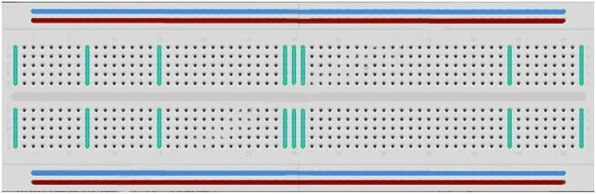

[游댗 Enrere](../) | [游 P많ina principal](http://danimrprofe.github.io/apuntes/) \n\n---
title: Protoboard
footer: Daniel Moreno 🌐 <github.com/danimrprofe>
_footer: ""
paginate: true
_paginate: false
marp: true
---

# Protoboard

---

## Introducción

Un **protoboard** permite crear prototipos de circuitos de forma rápida, sin necesidad de soldar las  conexiones. A continuación un ejemplo.

---

## Tipos

Las **protoboard** vienen en varios tamaños y configuraciones. La clase más simple es sólo una rejilla de agujeros en un bloque de plástico. En el interior son tiras de metal que proporcionan una conexión eléctrica entre los agujeros en las filas más cortas.

---

## Conexión

---

Conectando las patillas de dos componentes diferentes de la **misma fila** quedan unidos eléctricamente.

---

## Canales centrales

Los canales centrales indican que no están conectados ambos lados. Lo que significa, puede insertar un chip con las patillas a ambos lados del canal sin conectarlos juntos.

---

## Tiras laterales

- Algunos ``protoboards`` tienen dos tiras de agujeros que corre a lo largo de los bordes laterales del tablero.
- Estas tiras se denominan ``carriles`` y le permiten alimentar a muchos componentes o puntos en el tablero.
- Proporcionan una manera para conectar una tensión común. Son generalmente en pares para + 5 voltios y tierra.

---

## Desventajas

Si bien son protoboards para prototipos, tienen algunas limitaciones. Porque las conexiones son temporales y de acople, no son tan fiables como conexiones soldadas. Si tienes problemas intermitentes con un circuito, puede ser debido a una mala conexión en una protoboard.