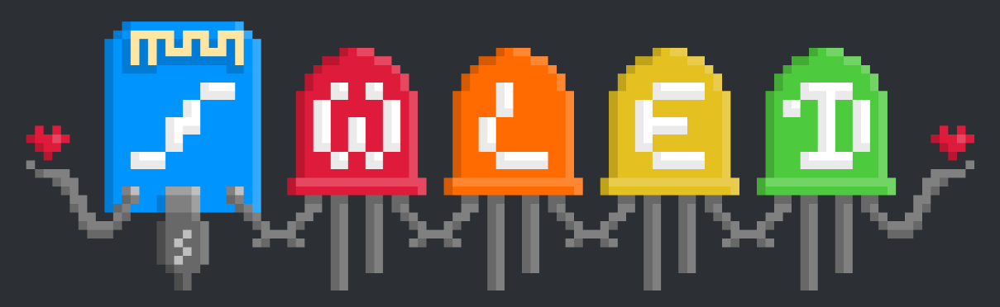
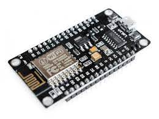
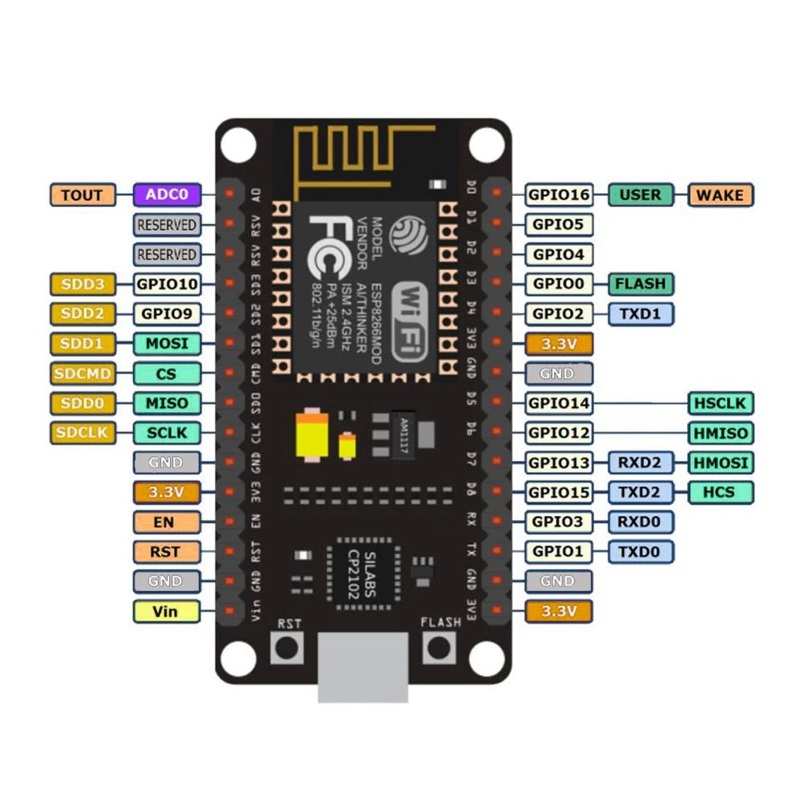
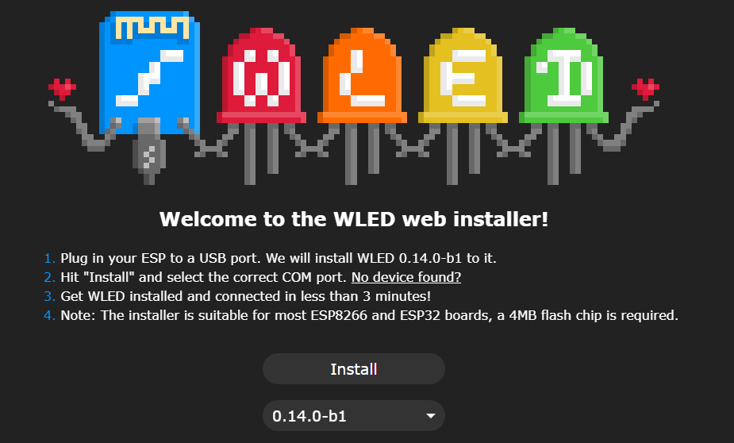
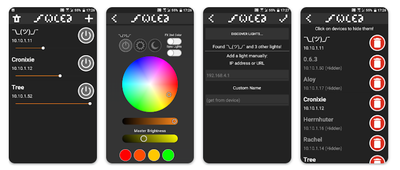

[🔙 Enrere](../) | [🏠 Pàgina principal](http://danimrprofe.github.io/apuntes/) \n\n---
title:
# Projecte WLED
footer: Daniel Moreno 🌐 <github.com/danimrprofe>
_footer: ""
paginate: true
_paginate: false
_class: invert
marp: true
---

# Il·luminació de tira de LED
## Maneig a travér d'app mòbil mitjançant WiFi

---

# Projecte WLED

El projecte WLED és un programari de codi obert que us permet controlar tires LED adreçables mitjançant una interfície web. Es pot instal·lar en diverses plataformes de maquinari, inclosa la placa NodeMCU basada en ESP8266.

https://kno.wled.ge/

---

L'``ESP8266`` és un xip ``Wi-Fi`` de baix cost que s'utilitza àmpliament en projectes de bricolatge i aplicacions ``IoT``. El NodeMCU és una placa de desenvolupament popular basada en l'ESP8266, que proporciona una manera senzilla de prototipar i desenvolupar projectes amb aquest xip.

---

---

# Instal·lació

Per utilitzar el programari ``WLED`` en una placa NodeMCU, primer heu de flashejar la placa amb el microprogramari WLED. Això es pot fer utilitzant l'IDE d'Arduino o altres eines intermitents.

https://install.wled.me/

---

---

# Connexió de la tira

Un cop instal·lat el microprogramari, podeu connectar la vostra tira de LED a la placa NodeMCU.  Connectarem la tira de led al ``pin D4``.

---

# Programari mòbil

https://play.google.com/store/apps/details?id=com.aircoookie.WLED&hl=es&gl=US&pli=1

---

# Control

Des del mòbil podrem canviar els colors i els efectes.

