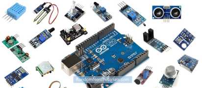

[🔙 Enrere](../) | [🏠 Pàgina principal](http://danimrprofe.github.io/apuntes/)

# Sensors

Els sensors d'Arduino són dispositius que permeten a una placa Arduino detectar i mesurar diferents variables del seu entorn. Aquests sensors poden mesurar coses com la temperatura, la humitat, la llum, la pressió, el moviment, el so, la proximitat, entre d'altres.

Els sensors són un component clau en molts projectes d'Arduino i són utilitzats per recollir dades del món físic per a ser processats per la placa Arduino.

- [Ultrasons](Sensor_ultrasonico.md)
- [Llum (fotocèlula)](Sensor_luz_(fotocelula).md)
- [Humitat i temperatura](Sensor_humedad_temperatura.md)
