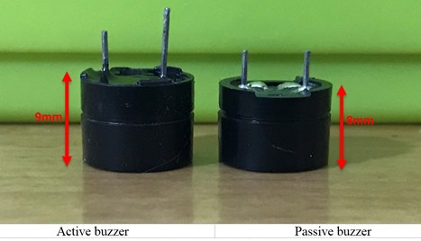
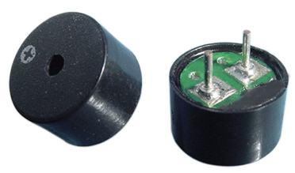
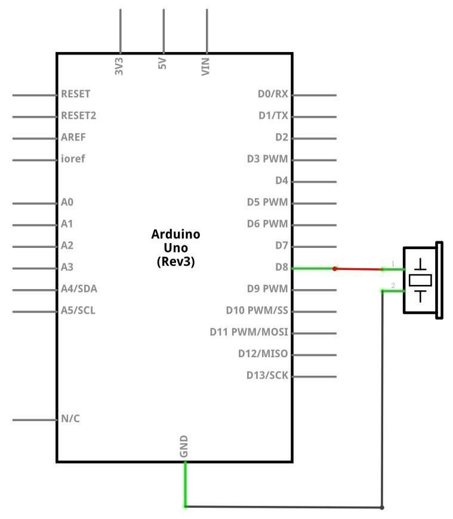
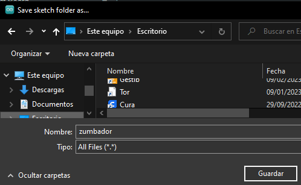
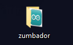
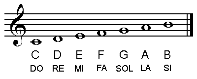
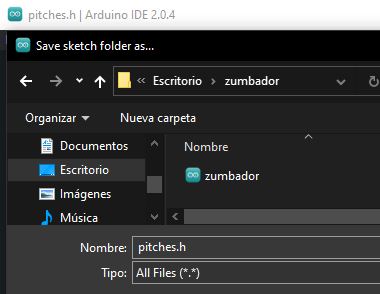

[游댗 Enrere](../) | [游 P많ina principal](http://danimrprofe.github.io/apuntes/)

# Zumbador Pasivo



## Resumen

El propósito del experimento es generar sonidos.
Cada nota musical tiene una vibra a una frecuencia determinada, por lo que generando una señal con la frecuencia correcta, podremos crear las notas que necesitemos.

| Nota    | Frecuencia (Hz) |
| ------- | --------------- |
| Do      | 523             |
| Re      | 587             |
| Mi      | 659             |
| Fa      | 698             |
| Sol     | 784             |
| La      | 880             |
| Si      | 988             |
| Do alto | 1047            |

## Componentes necesarios

| cantidad | componente                 |
| -------- | -------------------------- |
| 1        | Placa``Arduino`` UNO       |
| 1        | zumbador pasivo            |
| 2        | Cables jumper macho-hembra |

## Zumbador pasivo

El principio de funcionamiento del zumbador pasiva está utilizando ``PWM`` para hacer mover una membrana y hacer que el aire alrededor vibre. Debidamente cambiado tanto como la  frecuencia de vibración, puede generar diferentes sonidos.

Combinando frecuencias y retardos podemos crear cualquier canción que queramos.



Nosotros debemos tener cuidado de no utilizar la función de () escritura analógica Kit UNO R3 para generar un pulso el timbre, porque la salida de pulso de analógico (de escritura) se fija (500 Hz).

### Esquema



### Diagrama de conexiones


Cableado el zumbador conectado a la placa UNO R3, rojo (positivo) que el pin8, cable negro (negativo) a la tierra.


## Ejemplo 1: una nota

Vamos a ver un programa sencillo que cree una nota musical.

Vamos a crear un ``sketch`` nuevo y lo guardamos con el nombre ``zumbador``:



Se os creará una carpeta llamada ``zumbador`` en el escritorio:



Dentro de esta carpeta, se habrá creado un archivo tipo ``INO`` que contiene el programa.


### Código

Vamos a copiar este código para comprobar el funcionamiento del zumbador.

```c
void setup() {
}

void loop() {
    tone(8, 440, 500);
    delay(1000);
}
```

### 쯈u칠 hace el código?

En este programa, utilizaremos la función ``tone`` para crear un sonido.

1. Indicamos que en el ``pin 8`` queremos que se produzca un sonido
2. Con una frecuencia de ``440 Hz``, que correspondería a un LA.
3. El sonido durará medio segundo, es decir, ``500 ms``.
4. A continuación, esperaremos 1 segundo para continuar (``1000 ms)``.

Al tener esta secuencia de paso dentro de la función ``loop``, estos pasos se reproducirán en bucle.

## Ejemplo 2: una melodía

### Notación musical

En este segundo ejemplo reproduciremos una melodía, es decir, una secuencia de notas. Para ello, necesitamos saber un poco la notación musical inglesa:

- A es un La
- B es un Si
- C es un Do
- etc.



Entre los números:

- A1 es un la grave
- A2 es el siguiente la, más agudo
- A3 es más agudo aún

Tras el Si 3 (B3), viene el Do 4 (C4). A continuación: D4,E4, etc.

### Archivo con las notas

En primer lugar crearemos un archivo en el que guardaremos la información de las notas.

Guardaremos este archivo archivo en la misma carpeta que el programa principal, y le llamaremos ``pitches.h``. En este archivo guardaremos las constantes de cada una de las notas necesarias.

Las líneas que comienzan con ``#define`` son ``constantes``. Son variables que no cambian nunca. Así pues, cuando utilicemos ``NOTE_C2``, en nuestro programa principal, haremos referencia al número 65, que es la frecuencia que genera esta nota. De este modo, no tendremos que memorizar ni buscar todas las frecuencias.

Creamos un sketch nuevo y copiamos lo siguiente:

```c
#define NOTE_B0  31
#define NOTE_C1  33
#define NOTE_CS1 35
#define NOTE_D1  37
#define NOTE_DS1 39
#define NOTE_E1  41
#define NOTE_F1  44
#define NOTE_FS1 46
#define NOTE_G1  49
#define NOTE_GS1 52
#define NOTE_A1  55
#define NOTE_AS1 58
#define NOTE_B1  62
#define NOTE_C2  65
#define NOTE_CS2 69
#define NOTE_D2  73
#define NOTE_DS2 78
#define NOTE_E2  82
#define NOTE_F2  87
#define NOTE_FS2 93
#define NOTE_G2  98
#define NOTE_GS2 104
#define NOTE_A2  110
#define NOTE_AS2 117
#define NOTE_B2  123
#define NOTE_C3  131
#define NOTE_CS3 139
#define NOTE_D3  147
#define NOTE_DS3 156
#define NOTE_E3  165
#define NOTE_F3  175
#define NOTE_FS3 185
#define NOTE_G3  196
#define NOTE_GS3 208
#define NOTE_A3  220
#define NOTE_AS3 233
#define NOTE_B3  247
#define NOTE_C4  262
#define NOTE_CS4 277
#define NOTE_D4  294
#define NOTE_DS4 311
#define NOTE_E4  330
#define NOTE_F4  349
#define NOTE_FS4 370
#define NOTE_G4  392
#define NOTE_GS4 415
#define NOTE_A4  440
#define NOTE_AS4 466
#define NOTE_B4  494
#define NOTE_C5  523
#define NOTE_CS5 554
#define NOTE_D5  587
#define NOTE_DS5 622
#define NOTE_E5  659
#define NOTE_F5  698
#define NOTE_FS5 740
#define NOTE_G5  784
#define NOTE_GS5 831
#define NOTE_A5  880
#define NOTE_AS5 932
#define NOTE_B5  988
#define NOTE_C6  1047
#define NOTE_CS6 1109
#define NOTE_D6  1175
#define NOTE_DS6 1245
#define NOTE_E6  1319
#define NOTE_F6  1397
#define NOTE_FS6 1480
#define NOTE_G6  1568
#define NOTE_GS6 1661
#define NOTE_A6  1760
#define NOTE_AS6 1865
#define NOTE_B6  1976
#define NOTE_C7  2093
#define NOTE_CS7 2217
#define NOTE_D7  2349
#define NOTE_DS7 2489
#define NOTE_E7  2637
#define NOTE_F7  2794
#define NOTE_FS7 2960
#define NOTE_G7  3136
#define NOTE_GS7 3322
#define NOTE_A7  3520
#define NOTE_AS7 3729
#define NOTE_B7  3951
#define NOTE_C8  4186
#define NOTE_CS8 4435
#define NOTE_D8  4699
#define NOTE_DS8 4978

```

Ahora guardar como, y lo guardamos dentro de la carpeta ``zumbador``, del siguiente modo:



Eligiendo all files evitaremos que nos añada ``.ino`` al nombre del archivo.

Ahora en el archivo ``zumbador`` vamos a agregar la primera línea para incluir este archivo que contiene la información de las notas.

```c
#include "pitches.h"
void setup() {
}

void loop() {
    tone(8, NOTE_G5, 500);
    delay(1000);
}
```

Al escribir en lugar de la frecuencia la variable ``NOTE_G5``, buscará cual es su número de frecuencia en el archivo ``pitches.h``.

## Ejemplo 3: melodía

A partir de aquí, podemos crear una lista en la que guardar una secuencia de notas, para posteriormente recorrer esta lista y tocar cada una de las  notas.

```c
#include "pitches.h"

// En esta lista colocaremos las notas de nuestra melodía
int melody[] = {
  NOTE_C5, NOTE_D5, NOTE_E5, NOTE_F5, NOTE_G5, NOTE_A5, NOTE_B5, NOTE_C6};
int duration = 500;  // 500 milisegundos

void setup() {

}

void loop() {
  for (int thisNote = 0; thisNote < 8; thisNote++) {
    tone(8, melody[thisNote], duration);
    delay(1000);
  }

  // dos segundos y volverá a comenzar la melodía
  delay(2000);
}
```
