# práctica 1

Introducción

En esta unidad vamos a utilizar el programa Audacity. Es probable que lo hayas utilizado antes. En los ordenadores de informática ya está instalado, pero seguramente en tu casa deberás instalarlo para poder avanzar con las prácticas.

Vamos a crear una carpeta donde guardaremos las prácticas, vamos al escritorio y creamos la siguiente carpeta

Una vez dentro, crearemos una carpeta para cada práctica. Por ahora creamos una para la primera práctica.

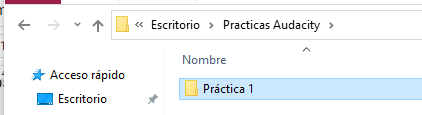

Descarga e instalación

Para descargar Audacity desde la siguiente dirección:

Descarga última versión de Audacity

Nos descargamos la versión 2.4.2 de Audacity para Windows. Si tenéis Mac OS, os descargáis e instaláis la de MAC.

EDITANDO CON AUDACITY

En esta práctica usaremos un clip de sonido de la emisora de radio de RNE, Radio 5 todo noticias. Para este tutorial, usamos sólo las prestaciones básicas de Audacity.

Menú superior

Si te fijas, en la parte superior izquierda, observamos que está activada la herramienta de selección por defecto F1.

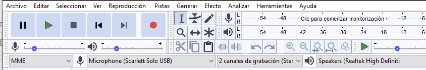

Subir y bajar volumen de micrófono y altavoz

Arriba verás que puedes regular el volumen del micrófono y de los altavoces.

Abriendo un archivo de sonido

Antes de que podamos editar, necesitamos primero abrir un fichero, en este caso lo haremos con "Morcheeba en R5".

Este archivo lo tenéis para descargar en la misma tarea de classroom, lo tenéis que descargar a vuestro ordenador.

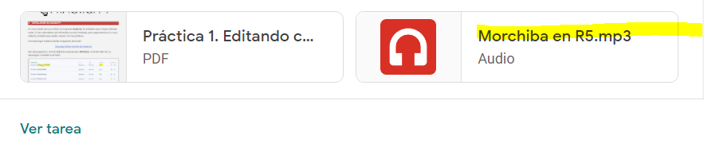

En principio nos permitirá escuchar el audio, pero para descargarlo:

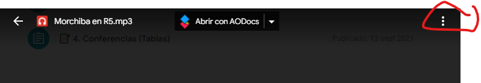

y luego:

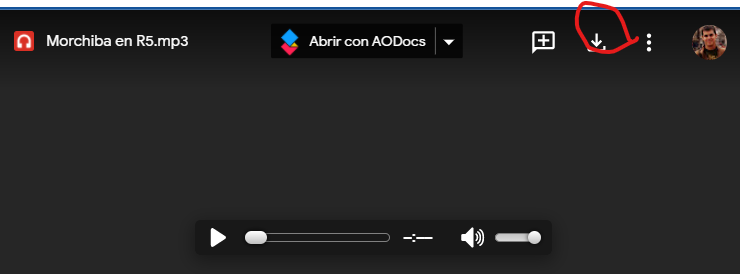

Vamos a buscar el archivo a descargas

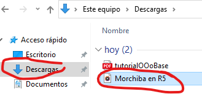

Lo copiaremos en la carpeta de la práctica 1 que hemos creado anteriormente.

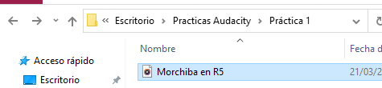

Para abrir un archivo de audio (una canción o grabación de sonido) vamos a Archivo > Abrir o Ctrl+O.

 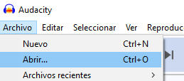

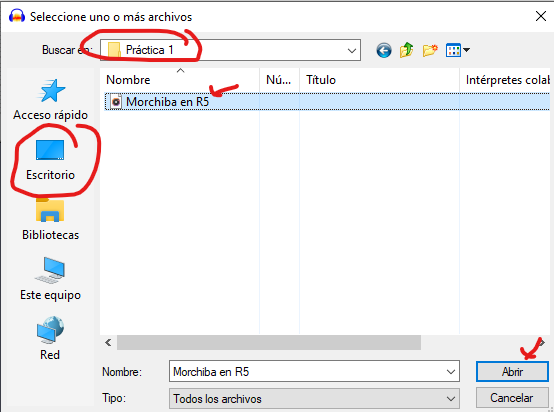

Lo que está en el recuadro amarillo que tiene la onda dentro es una pista. Esta pista contiene la canción.

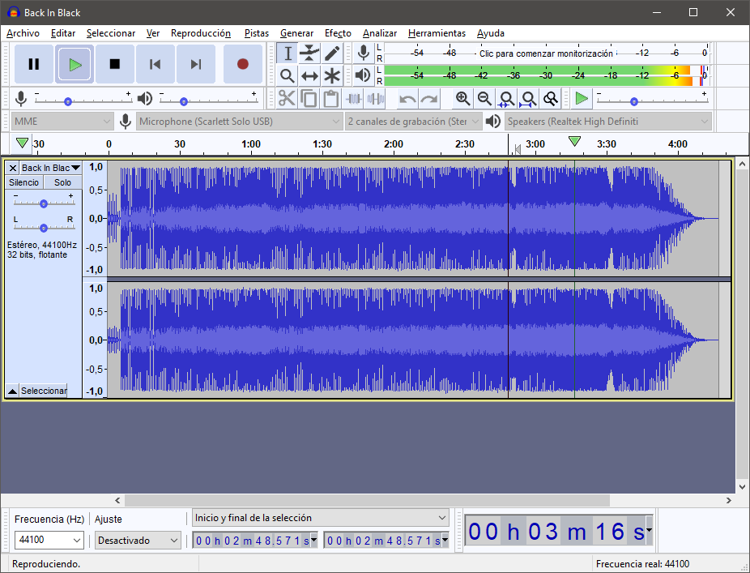

Aparecen dos ondas diferentes porque la canción es estéreo. Es decir, una es lo que se escucha por la izquierda y otra por la derecha. Si escuchamos con auriculares, veremos que por el oído izquierdo no siempre oímos lo mismo que por el derecho.

Oído izquierdo

Oído derecho

Zoom

Es recomendable utilizar la lupa (Zoom) para aumentar la onda y poder seleccionar con mayor precisión el fragmento que queremos.

Podéis hacer zoom con tecla control y ruedecita del ratón para acercaros u alejaros. También podéis acceder a esta función en el icono:

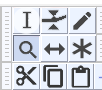

Veréis que la onda se “estira” cuando nos acercamos, y se “comprime” cuando nos alejamos.

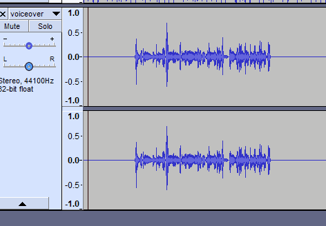

Si ponéis el ratón encima del 15 y hacéis zoom lo haréis sobre esa zona. Siempre se hace zoom hacia el lugar en el que estáis apuntando con el ratón.

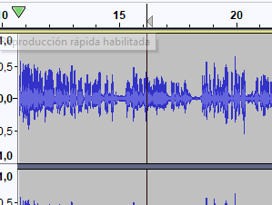

Amplitud de la onda (volumen)

Cuando la onda, mirando en vertical, es pequeña (corta) es porque el sonido es flojo. Cuando es más larga, el sonido es fuerte. Esto se llama amplitud.

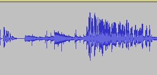
Flojo

Fuerte

Si la onda es pequeña, el sonido es flojo y es posible que necesitemos amplificarlo para escucharlo mejor.

Si la onda es tan grande que toca los bordes, el sonido será demasiado fuerte y además distorsionará. Se dice que está saturando.

Arriba podemos ver unos números que nos dicen en qué momento estamos (minuto y segundos) seleccionando o reproduciendo la canción.

Botones principales de reproducción

Probad las siguientes teclas con el archivo ya abierto.

Play (barra espaciadora).

Pausa (tecla P)

Ir al principio (Inicio) o al final (Fin)

Stop

Grabar (tecla R)

Ya iremos mencionando otros botones, según sean necesarios. Verás que muchas funciones se pueden activar con teclas directamente, por lo que es recomendable que las utilices para trabajar.

Asegúrate de que el sonido de tu ordenador funciona, también que los altavoces de tu ordenador o los cascos están conectados.

Si haces sonar el fichero oirás que al principio el locutor, Tomás Fernando Flores, dice: “Información del mundo del Pop, aquí en Radio 5 todo noticias”.

Suprimir locución

Nuestra primera tarea va a consistir en borrar esa locución del archivo "mp3" que estamos manejando.

Vuelve a hacer sonar el fichero hasta que localices perfectamente dónde termina la frase del locutor.

Después, usando el ratón, selecciona cuidadosamente el sonido en el gráfico de la onda.  La herramienta que tenéis que tener seleccionada es esta:

Una vez activada, pincháis y arrastráis con el botón izquierdo del ratón. El trozo clarito es el que tenéis seleccionado.

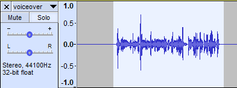

Después usa el menú "Editar", "Cortar" o Ctrl+X y suprime esta parte del archivo de sonido.

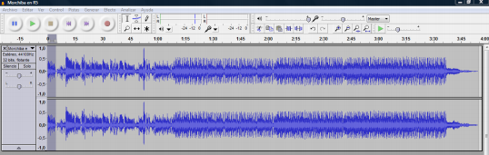

Si vuelves a escuchar el audio, notarás que la parte que has borrado ya no está.

Efecto de desvanecimiento o “Fade out”

Cuando termina una canción, no lo hace siempre de golpe, sino que progresivamente va bajando el volumen conforme termina hasta que se deja de oír.

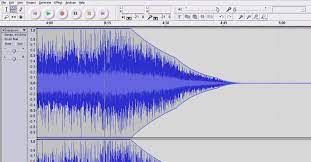

El efecto de disminuir gradualmente el volumen se llama fade out. Se suele aplicar al final del audio.

El efecto contrario, se llama fade in. Se suele aplicar al comienzo del audio.

Vamos a aplicar fade out a la última parte de la frase que estamos editando, es decir, cuando dice “[…] Radio 5 todo noticias”.

Para hacerlo, simplemente tienes que:

Seleccionar la parte final, a la derecha del momento en que pronuncia las palabras.

Cuando hayas seleccionado ese final de la exclamación, utiliza el menú Efecto > Desvanecer progresivamente.

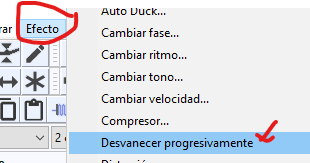

Prueba varias veces hasta que consigas el efecto deseado. ¡Escucha el resultado!

Cambiar un trozo de la locución

Vamos a cambiar la parte donde el locutor termina de presentar el último trabajo del grupo Morcheeba y lo hace repitiendo su nombre y el de la emisora (Tomás Fernando Flores, Radio 5 todo noticias) a la altura del segundo 50.

Vamos a sustituir esa frase por “Morcheeba”, que tendremos que copiar de alguna de las frases anteriores.

Para seleccionar dicho fragmento, marcamos con el cursor del ratón y lo vamos moviendo (justo cuando nos aparece la mano en cada uno de los extremos por donde lo queremos expandir o contraer lo seleccionado) según las necesidades.

Cuando hayas seleccionado la palabra "Morcheeba", utiliza el "Play" para asegurarte de que lo que has seleccionado es exactamente lo que buscas.

Entonces, utiliza el menú "Editar" "Copiar" o CTRL+C. La expresión "Morcheeba" habrá sido copiada...

Ahora sólo nos queda pegar lo que hemos copiado en el fragmento donde se despide el locutor.

¡Hemos terminado con la edición! Lo último que tienes que hacer es probar por última vez el fichero editado, para asegurarte de que toda la edición se ha hecho correctamente.

Utilizaremos el botón para ir al principio del fichero.

Ahora dale al Play. Hazlo sonar y quédate conforme con el resultado

Guardar el archivo modificado

Para guardar, atiende a la siguiente recomendación. No nos interesa perder el fichero original de Radio 5. Por ello, para guardar seguiremos estos pasos:

Primero guardar el proyecto por si queremos editarlo de nuevo otra vez.

En el menú, escogemos: Archivo > Guardar proyecto como

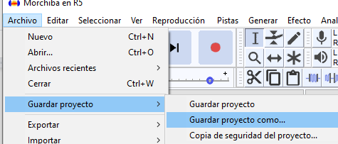

Cambiaremos el nombre del fichero como Practica1.aup3 (esto último se pone automáticamente)

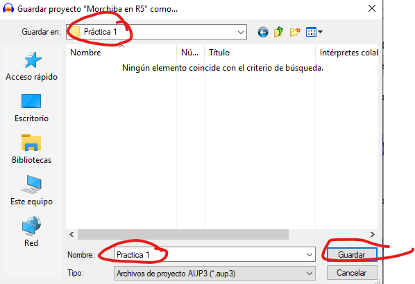

De esta manera, el fichero original no se pierde y a la vez hemos guardado nuestro proyecto, el que hemos editado.

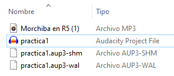
Archivo del proyecto

La extensión aup es la propia del programa Audacity, ésta nos permitirá editarla con posterioridad. En cambio, no podemos escuchar este archivo con un programa de audio ni reproductor mp3 normal, lo tenemos que exportar.

Exportar nuestro fichero con dos formatos: WAV y mp3

Para crear el archivo de audio final, tenemos que exportarlo a un formato de audio que los reproductores de música puedan entender, como WAV o mp3, por ejemplo.

MP3 nos permite guardar los archivos comprimidos para que ocupen menos espacio. Otra cosa que es importante a tener en cuenta es el grado de compresión que deseamos para nuestro archivo mp3 resultante. Ésta es la diferencia entre que nuestro archivo tenga mejor o peor calidad.

Exportamos el archivo como mp3.

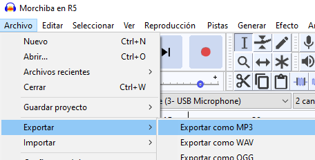

MP3 es un formato que ocupa mucho menos y permite su reproducción en múltiples medios. Ya sabes, debes cambiar el nombre del fichero para que no se confunda con el original, que deseamos guardar íntegro.

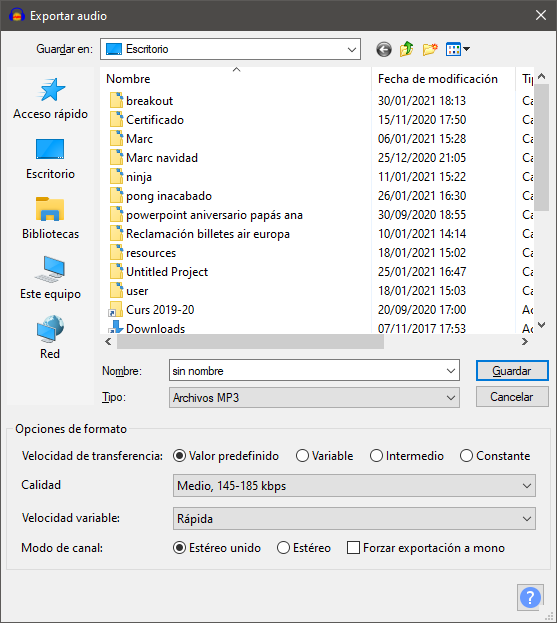

¿Qué calidad elegir?

Una buena opción, que estaría en el punto medio, sería seleccionar la opción 128, que sería el estándar y que está seleccionada de forma predeterminada por el programa.

Guardarlo con una compresión menor de 112 supondría muy mala calidad.

Si se quiere una calidad semejante a la que aprecia el oído en una reproducción de un CD de audio, se puede elegir la compresión 256.

En realidad, cualquier opción entre 112 y 256 sería aconsejable, pero debemos comprobar siempre que la pérdida de calidad no es apreciable por el oído.

Para una aplicación multimedia, se aconseja usar la compresión 256, lo que mantendrá todo lo posible la calidad con que se ha grabado el archivo.