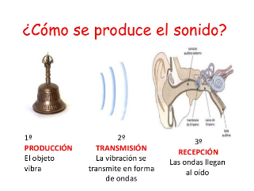
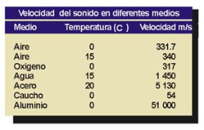

# 1. SONIDO

El sonido es una sensación producida en el oído por un movimiento vibratorio que se propaga por un medio (generalmente por el aire) que transmite la vibración hasta nuestro oído.

En el ejemplo, al vibrar la campana, mueve el aire que hay alrededor con una frecuencia determinada. Cuando esta llega al oído, activa el mecanismo de oído interno que traduce esta vibración en señales eléctricas que llegan a nuestro cerebro.

El sonido se propaga por un medio físico que generalmente es el aire, pero no es el único. En cambio, no se propaga en el vacío, por lo que en el espacio no podríamos oír nada, por ejemplo.

