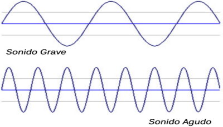
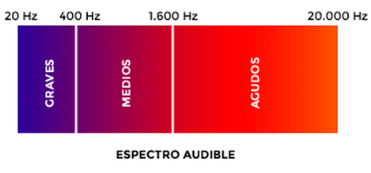
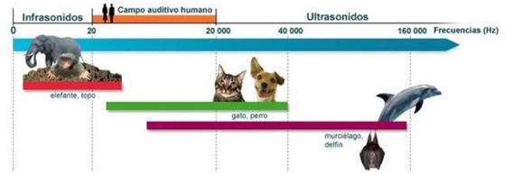
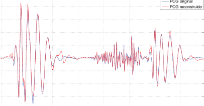
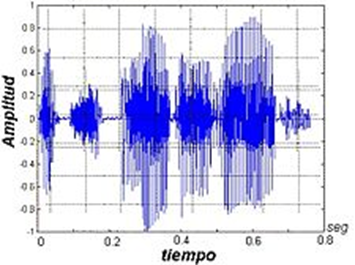

# 2. Características del sonido

## 2.1 FRECUENCIA DE UN SONIDO

La frecuencia de sonido es el número de vibraciones por segundo que produce. Se mide en Herzios (Hz), aunque generalmente se **utilizan** unidades más grandes: KHz, MHz
Los sonidos agudos tienen una frecuencia más alta, mientras que los sonidos graves tienen frecuencias más bajas.

El oído humano percibe sonidos entre 20 Hz y 20 KHz (20.000 Hz). Esto es así puesto que la mayoría de los sonidos que interesan al ser humano se dan entre estas frecuencias. Por encima de 20.000 Hz o por debajo de 20 Hz hay sonidos, pero las personas no somos conscientes de ellos.

En este vídeo, podéis comprobar los diferentes sonidos que puede percibir un ser humano, de más grave a más agudo:

https://www.youtube.com/watch?time_continue=47&v=qNf9nzvnd1k&feature=emb_logo

Los sonidos por encima del máximo humano se llaman ultrasonidos, y pueden ser percibidos por ciertos animales. En el caso del delfín y los murciélagos los utilizan a modo de sónar para comunicarse a largas distancias u orientarse a través de ellos. Por el contrario, también existen los infrasonidos.

## 2.2 FORMA DE ONDA

Normalmente los sonidos o canciones contienen más de una frecuencia, puesto que están compuestos de varios instrumentos y voces al mismo tiempo.

Por ello, cada sonido tiene una forma de onda, que representa la amplitud (más fuerte o más flojo) y la frecuencia del sonido en cada segundo.

- En este caso, los fragmentos de izquierda y derecha son sonidos más graves (se ve más distancia entre las ondas), pero más fuertes (por ello suben más alto).
- Por el contrario, el fragmento de en medio suena más flojo pero tiene una frecuencia más aguda.

Aquí podemos ver el sonido correspondiente a una palabra pronunciada por una persona. Cada trozo corresponde a una sílaba. Cada sílaba de una palabra produce un golpe de sonido, separadas una de otra por un breve espacio.

