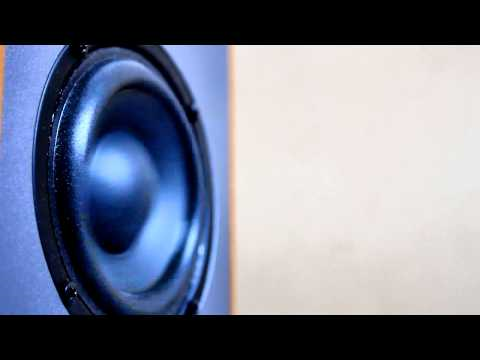
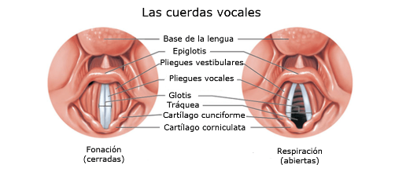

# 2. Generación de sonido

Para generar un sonido necesitamos hacer vibrar el aire de alguna forma (palmas, cuerdas vocales, etc.). Algunos aparatos e instrumentos musicales generan sonido utilizando unas membranas que se mueven en función de la frecuencia del sonido. Otros modifican el aire de alguna forma para producir sonido.

## 2.1. Sonido en altavoces

Los altavoces, según la electricidad que reciben, activan un electroimán. Este electroimán mueve la membrana, que al desplazarse mueve a su vez el aire creando sonido.

Podéis ver un vídeo del proceso a cámara lenta. Se ha filmado a cámara lenta, porque normalmente la vibración de la membrana es tan rápida que no podemos percibirlo.

En los sonidos graves (generalmente en los subwoofers), la vibración es más lenta y por tanto fácil de ver.

## 2.2. SONIDO DE LA VOZ

Otro método de generar diferentes sonidos es el empleado por las cuerdas vocales que todos tenemos en la garganta. Éstas funcionan de un modo ligeramente diferente.
El aire es impulsado por los pulmones, y las cuerdas vocales, según su posición, simplemente “modulan” cómo será el sonido.

Este funcionamiento tiene lógica, puesto que no únicamente utilizamos los pulmones para hablar, sino también para respirar, y no siempre nos interesa emitir algún sonido.

Podéis ver un video del funcionamiento de las cuerdas vocales a continuación.
Las cuerdas vocales se mueven mucho más rápido de lo que se ve, imaginad que, para un sonido de 1000 Hz, se moverían a razón de 1000 veces por segundo.

