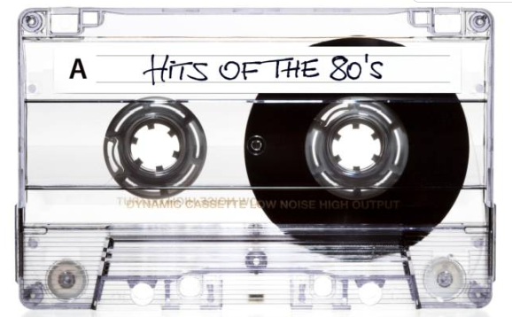
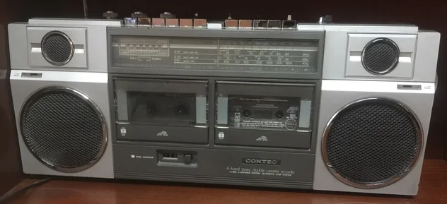
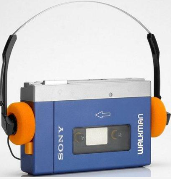
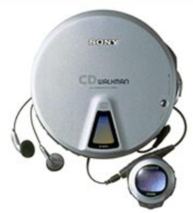
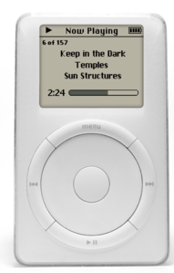
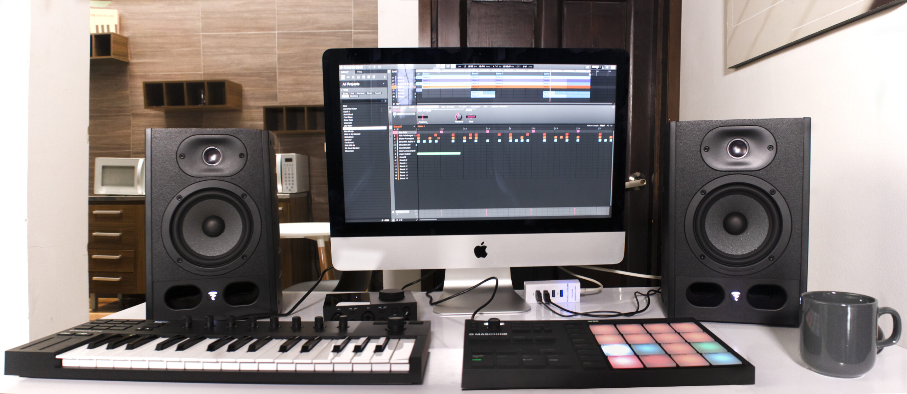

# 4. CAPTURA DEL SONIDO

Gracias a diversos inventos, hoy en día podemos capturar el sonido, mediante a micrófonos o tarjetas de sonido y, también podemos:

- Almacenar en dispositivos como CD, discos duros, para utilizarlos a posteriori.
- Se puede transmitir a unos altavoces.
- Utilizando técnicas de streaming lo podemos enviar a través de Internet a cualquier lugar del mundo.
- Por último, tenemos la posibilidad de reproducir este sonido en un lugar y momento diferente al original.

## 4.1	MICRÓFONOS

Los micrófonos contienen una membrana que vibra cuando le llega aire.  En función de la fuerza del aire y la frecuencia, fibra de una forma u otra. Esta vibración se convierte en una señal eléctrica que se envía a un equipo de sonido para ser amplificada o guardada de algún modo.

Existen multitud de tipos de micrófonos, según su construcción y su uso. En este caso, podéis ver dos modelos de micrófono habituales.

También podemos adquirir un set de grabación que también incluye un soporte o trípode, además de diferentes filtros, como los antipop o anti viento.

## 4.2 Grabación de sonido

Antes de la informática, todo el proceso de grabación, mezcla y reproducción se hacían con equipos eléctricos de forma analógica.

### VINILOS

El sonido grabado se guardaba en formatos analógicos (vinilos). Estos discos están formados de diferentes surcos microscópicos. Según como se mueve una aguja al recorrer los surcos del disco, el sonido suena de una forma u otra.

### CASSETTE Y CD

Posteriormente invención del **DAT** (cassette) y posteriormente el compact disc (CD) permite grabar el sonido de forma digital, consiguiendo una mayor calidad y permitiendo transportar la música de un modo más sencillo, dando lugar a reproductores portátiles, como los walkmans.

Gracias a ello podemos digitalizar el sonido y mejorar la calidad de las grabaciones, así como facilitar su edición y producción (y copia).

Las cadenas musicales pronto incorporaron dos reproductores, a fin de poder grabar de uno a otro.

## Dispositivos portátiles

El primer modelo de walkman se creó en 1979.
Hasta entonces no había forma de llevar la música contigo

- Guardians Of the Galaxy [Intro dance scene] 1080p HD
- KIDS REACT TO WALKMANS (Portable Cassette Players)

Lanzamiento de discman en 1985.

### iPod

El primer IPod es presentado el 23 de octubre de **2001**. Tenía un disco duro de **5 GB**, una pantalla LCD monocromática de 1,5 pulgadas, y una batería recargable que duraba hasta 10 horas.

El iPod podía contener hasta 1.000 canciones codificadas con MP3 o AA.

## 4.3 INFORMÁTICA

Gracias a la informática, podemos guardar el sonido en formato digital (ceros y unos) en un ordenador, en forma de archivo de audio. Estos archivos, se pueden modificar, editar y mezclar directamente utilizando un ordenador utilizando diferentes programas.

Para poder hacer todo esto necesitamos introducir (digitalizar) los sonidos dentro del ordenador para poder trabajar con ellos.

Si tenemos que grabar un instrumento como guitarras acústicas, baterías, etc. o la voz, necesitamos traducir estos sonidos analógicos a sonido digital. Para ello utilizamos un conversor analógico-digital. Este conversor suele venir incluido en una tarjeta de sonido.

A esta tarjeta conectaremos los dispositivos que queremos grabar en nuestro ordenador mediante diferentes cables.

## 4.4. TARJETAS DE SONIDO INTERNAS

También existen tarjetas de sonido internas, aunque ya están en desuso, en forma de tarjetas de expansión. Se utilizan fundamentalmente en ordenadores para reproducir sonido y grabar voz de menor calidad, pero no se suelen utilizar para producción musical.

## 4.5. Tarjetas integradas

Actualmente estas tarjetas no se instalan como tarjetas de expansión independientes
Están integradas en la propia placa base del dispositivo.

## 4.6. TARJETAS DE SONIDO EXTERNAS

Las tarjetas de sonido más profesionales son tarjetas externas. En esta ocasión tienen forma de cajas con botones y entradas, que se conectan a través de un puerto externo como USB.

Estas tarjetas se pueden conectar a diferentes dispositivos, según nuestra necesidad.

La tarjeta tiene diferentes entradas y salidas para conectar instrumentos y micrófonos (jack, cannon, etc).

- Las entradas por la parte frontal permiten conectar 1, 2 o más instrumentos para introducir sonido y convertirlo a sonido digital que se envía al ordenador.
- Una vez el ordenador reproduce una canción, o un vídeo, convierte estos archivos digitales otra vez a señal analógica que sale por las salidas traseras, por ejemplo, hacia unos altavoces. Los altavoces solo entienden de señales analógicas para poder funcionar.
- También tenemos una serie de botones para poder controlar el volumen, por ejemplo.
- Por último, una salida USB nos permitirá conectarlo al ordenador.

En la siguiente imagen podéis ver una configuración para un pequeño estudio casero, utilizando una tarjeta de sonido, un micrófono, una guitarra eléctrica, un ordenador y altavoces.

## Home studio

 Un home studio es un espacio de grabación de audio profesional en el hogar. Se utiliza para grabar, mezclar y masterizar música, y es propiedad de un músico o productor musical.

 Un home studio suele estar equipado con una computadora y una variedad de equipos de audio digitales y análogos, como interfaces de audio, mezcladores, micrófonos, sintetizadores, etc.

 