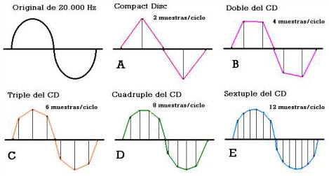
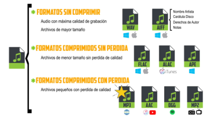

# 4. DIGITALIZACIÓN DEL SONIDO

Para poder introducir uno sonido en un equipo informático, hace falta transformar un sonido de naturaleza analógica (continua) en una señal digital en forma de 1s y 0s, el lenguaje que se utiliza en informática.

En primer lugar, se toman muestras de la señal cada cierto tiempo (**muestreo**)
A cada una de estas muestras se les da un valor numérico en función de su fuerza (**cuantización**).

En el muestreo, el ordenador toma muestras de la señal sonora cada cierto tiempo. Cuantas más muestras tomamos por segundo, la calidad en el sonido digital cuanto será mayor puesto que se parecerá más al original.

La frecuencia de muestreo se suele expresar en **KHz**.

**Ejemplo**

Mira la señal original de color negro. Es analógica y por ello tiene formas más onduladas.

- En A, podemos ver cómo solo se toman dos muestras, y por tanto la forma digital se parece muy poco a la original.
- En B,al tomar el doble de muestras, se parece un poco más.
- Por último, la E es en la que se han tomado más muestras.

Algunas medidas típicas son:

- 11 KHz (calidad baja)
- 22 KHz (calidad media)
- 44,1 KHz (calidad alta)
- 96 KHz (calidad muy alta)

## 4.1. FORMATO DE AUDIO DIGITAL

Una vez convertido el audio en sonido digital (ceros y unos), lo podemos guardar de diferentes formas. El formato del archivo indica la estructura con la que el sonido es almacenado.

La **extensión** del archivo (mp3, wav, flac) nos indica el tipo de archivo del que se trata. Cada formato tiene unas ventajas y unos inconvenientes concretos. Además, ayuda al sistema operativo a saber que es un archivo de audio y decidir con qué programa se va a abrir.

## 4.2. COMPRESIÓN

Si los guardamos tal cual, los archivos de audio contienen toda la información del sonido original. De esta forma, tenemos archivos de mejor calidad, pero mayor tamaño.

Gracias a los ordenadores podemos comprimir los archivos de sonido y vídeo utilizando operaciones matemáticas para reducir el tamaño descartando parte de la información que no somos capaces de apreciar.

La calidad del sonido es menor pero también disminuye el tamaño. Una canción comprimida en MP3 puede ocupar **una décima parte** de lo que ocuparía la misma canción sin comprimir

La invención del archivo MP3 permitió que la música ocupara menos en los ordenadores. Gracias a ello se popularizaron los reproductores MP3, que permitían almacenar cientos de canciones, mientras que un CD normal daba para unas 15 aproximadamente.

Al ocupar menos los archivos también se popularizó la piratería musical a través de internet, a través de diferentes programas de intercambio de archivos, como Napster, Ares, o eMule, por ejemplo.

## 4.3. FORMATO MIDI

Interfaz digital de instrumentos musicales. Lo utilizan ordenadores, sintetizadores y dispositivos electrónicos musicales para comunicarse entre ellos.

Guarda descripción musical de un audio. El sonido final depende del instrumento que lo reproduzca

Gracias a esta tecnología, entre otras cosas, podemos **emular** (simular de forma artificial), utilizando teclados midi, el sonido de cualquier instrumento, desde una batería hasta una guitarra, etc. Con solo una herramienta, podemos crear una canción musical completa.

Ejemplos:

- https://www.youtube.com/watch?v=C_C0rAKiBEA
- https://www.youtube.com/watch?v=WaHMwMruD80
