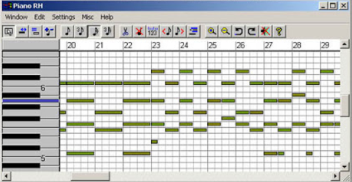
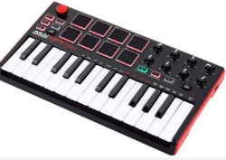

# MIDI

Este es un formato de comunicación digital entre instrumentos musicales. Lo utilizan instrumentos, ordenadores, sintetizadores y dispositivos electrónicos musicales para comunicarse entre ellos. También se puede grabar esta información en archivos .midi
¿Qué información guardan los archivos midi?
Los archivos midi guardan la descripción musical de un audio. La nota, la duración, la fuerza con que se toca, etc. Sin embargo, no se guarda ningún sonido. El sonido final depende del instrumento que lo reproduzca.

Gracias a ello podemos editar sonido y cambiar notas de lugar, copiarlas, recortarlas, entre otras cosas, utilizando el software adecuado. También podemos reproducir estas notas con el instrumento que queramos, como por ejemplo un VST o instrumento virtual. Estos son pequeños programas que simulan el sonido de un instrumento completo utilizando el ordenador.

## Controladores MIDI

Gracias a esta tecnología, entre otras cosas, podemos emular (simular de forma artificial), utilizando teclados midi, el sonido de cualquier instrumento, desde una batería hasta una guitarra, etc.

Con solo una herramienta, podemos crear una canción musical completa
Ejemplos:

[Daft Punk - Around The World (Cover)](https://www.youtube.com/watch?v=C_C0rAKiBEA)

https://www.youtube.com/watch?v=WaHMwMruD80
