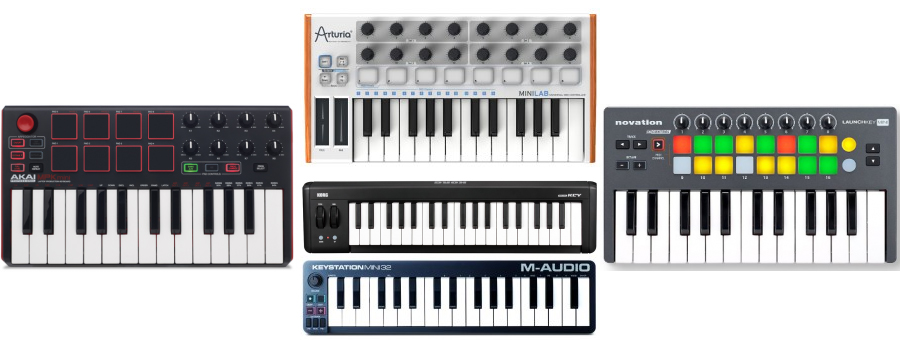

# 7. FORMATO MIDI

Interfaz digital de instrumentos musicales. Lo utilizan ordenadores, sintetizadores y dispositivos electrónicos musicales para comunicarse entre ellos.

Guarda descripción musical de un audio. El sonido final depende del instrumento que lo reproduzca

Gracias a esta tecnología, entre otras cosas, podemos **emular** (simular de forma artificial), utilizando teclados midi, el sonido de cualquier instrumento, desde una batería hasta una guitarra, etc. Con solo una herramienta, podemos crear una canción musical completa.

## Teclados midi

Un teclado MIDI es un dispositivo de entrada que se conecta a un sistema de audio digital para controlar los parámetros de sonido. Estos parámetros incluyen el tono, la velocidad, el volumen, los efectos y otros parámetros.

Los teclados MIDI se usan para crear música, componer canciones, grabar pistas y realizar demostraciones de audio. Estos teclados se conectan a un ordenador, una consola de producción de audio digital, una unidad de control de sonido y otros dispositivos.

Se pueden programar para generar una amplia variedad de sonidos digitales, desde los sonidos clásicos de la música clásica hasta el sonido contemporáneo de la música moderna.

Ejemplos:

- https://www.youtube.com/watch?v=C_C0rAKiBEA
- https://www.youtube.com/watch?v=WaHMwMruD80
