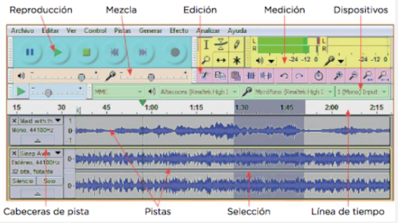

# 5. Software de audio

## 5.1. REPRODUCTORES

Aplicación que permite escuchar audio digital
Algunos incluyen funcionalidades
Crear listas de reproducción
Escuchar emisoras online
Sincronizar archivos entre ordenador y dispositivos portátiles
Añadir etiquetas ID3

## 5.2.	DAWs o estaciones de trabajo

Una estación de trabajo de audio digital o DAW, es un software que permite crear música sobre la base de audio o sonidos MIDI. Los sonidos pueden insertarse desde medios externos micrófono, instrumento musical, teclado, sintetizador.

Los sonidos se pueden trabajar en **pistas** separadas y aplicar diferentes efectos a una pista a o a un trozo concreto.Permite también exportar el resultado en diferentes formatos de audio.

## DAWs comerciales

Algunos ejemplos son:

- Cubase (Steinberg)
- Pro Tools (Avid)
- Reaper
- Ableton Live
- Otros: Ardour, Cakewalk Sonar, FL Studio, lmms, DSP-Quattro, etc

Los sonidos se pueden trabajar en pistas separadas y aplicar diferentes efectos a una pista o a un trozo concreto. Permite también exportar el resultado en diferentes formatos de audio.

