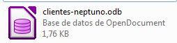

# 1. INSTALACIÓN Y ENTORNO BASE. CREAR BD

¿Qué programa de bases de datos vamos a utilizar?

Libreoffice base es un programa que nos permite guardar cualquier tipo de información de un tema en concreto en una base de datos, para actualizarla o consultarla en cualquier momento.

Libreoffice es un conjunto de programas de ofimática, que además de ser libre, contiene otras herramientas como por ejemplo Calc o Writer, que nos ayudan a redactar informes o realizar cálculos.

## ¿Qué tipos de bases de datos podemos encontrar?

Ejemplos de bases de datos podrían ser:

- Información académica: alumnos, profesores, evaluaciones, amonestaciones, etc.
- Información hospitalaria: pacientes, enfermedades, listas de espera, recetas, médicos, etc.

## ¿Cómo se guarda toda esta información?

Toda esta información está guardada en forma de tablas separadas:

- Tabla alumnos
- Tabla materias
- Tabla profesores
- Tabla clases
- Etc.

## ¿Cómo se relacionan estas tablas= 

Toda esta información está guardada en forma de tablas que se interrelacionan entre ellas. Es decir:

- Un alumno puede cursar X materias
- X alumnos pertenecen a 1 grupo concreto.
- Un profesor puede tener X alumnos
- Un profesor es tutor de un grupo
- Un profesor puede dar X asignaturas

## Primera ejecución de Base y creación de base de datos 

Base forma parte del paquete de ofimática de Libreoffice. Una vez tenemos instalado Libreoffice base buscamos en **inicio** hasta dar con la aplicación.

Al entrar en Base nos encontraremos la ventana “Asistente para base de datos” donde se nos da a elegir entre crear una nueva base de datos, abrir una base de datos existente o conectar con una base de datos existente. 

## Crear una base de datos

En esta unidad se va a crear la base de datos que se usará el resto del curso; por tanto, en este caso, elegiremos la primera opción.

Una vez que esté creada y volvamos a entrar a Base tendremos que marcar la segunda opción y elegir nuestra base de datos. 

Nos debe aparecer una ventana. Por un lado, debemos elegir entre registrar o no la base de datos y, por otro, entre abrir o no la base de datos para editarla y crear tablas usando el asistente. Lo vamos a dejar todo tal cual.

A continuación le damos al botón finalizar.

## Guardar la base de datos.

La base de datos se guarda toda dentro de un único **archivo** en nuestro ordenador. Recordad que tenéis que guardar de vez en cuando para no perder la información.

Para finalizar debemos elegir la carpeta donde guardaremos nuestra base de datos y el nombre de la misma.

La base de datos que vamos a crear se llamará **peliculas** y la vamos a guardar. La extensión que tienen los tipos de archivo de base de datos es **.odb**.

