# 2. Creación de tablas

## Crear una tablas: películas

Las bases de datos guardan la información en una o más **tablas**.

En este apartado vamos a crear nuestra primera tabla. Para ello nos situamos en el entorno en el menú de tablas y, dentro de las tareas, pulsamos sobre crear tabla en vista diseño.

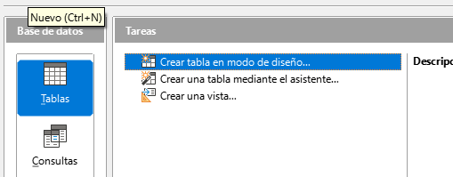

## Definir campos de la tabla

A continuación nos aparece una pantalla para definir las columnas o **campos** que tendrá la tabla .

Por cada columna de nuestra futura tabla podemos indicar el **nombre**, el **tipo** de datos y una breve **descripción** sobre lo que almacenará dicha columna.

A continuación nos aparecerá la siguiente ventana. Cada fila contendrá un campo o columna.

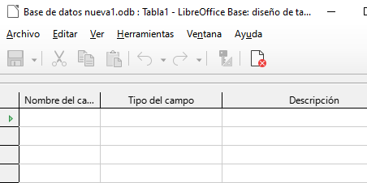

Comenzamos a definir la primera columna: nos situamos en la primera fila de la rejilla y en la columna Nombre del campo escribimos **id_pelicula**

## Tipo de datos

A continuación tenemos que especificar qué tipo de datos guarda este campo: ¿un número, un texto, una fecha?

Por defecto, nos indica **Texto[VARCHAR]** como tipo de dato. En nuestro caso, para este campo vamos a elegir uno de los de tipo numérico llamado **Número[Numeric]**

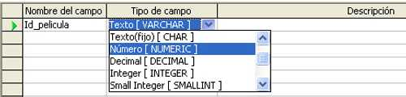

A continuación, en la columna Descripción, sería aconsejable que se introdujese un comentario acerca del campo que se acaba de insertar

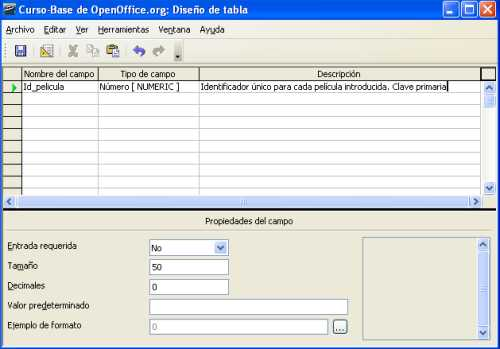

## Crear una clave primaria

!!! note

    Todas las tablas necesitan tener un campo como **clave primaria**

En el caso de nuestra **tabla peliculas** , a priori, no hay ningún campo acerca de una película que podamos utilizar para diferenciar una película de otra.

Por ejemplo, podemos tener dos películas con el mismo título o dos películas con el mismo director o dos películas que se produjeron el mismo año.

Para este tipo de tablas se suele definir un campo de tipo numérico (como acabamos de hacer nosotros con nuestro **id_pelicula**) que debe cumplir dos condiciones:

1. Ese campo siempre tiene que tomar un valor para cada fila de la tabla
2. Dicho valor no puede repetirse en ninguna fila.

Cuando un campo cumple estas dos propiedades (sin nulos y sin repetidos) se le llama **clave primaria** o clave principal. Toda tabla debe tener una.

## Asignar a un campo la clave primaria

!!! note

    la clave primaria puede consistir en ser varios campos

Para indicar que queremos que el campo **id_pelicula** sea nuestra **clave primaria** seguimos los siguientes pasos:

Nos situamos en la parte izquierda del campo

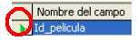

Pulsamos botón derecho del ratón

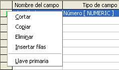

Seleccionamos la opción Llave primaria

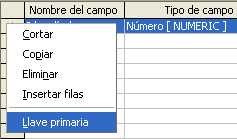

Quedando finalmente el campo como se muestra. La llave indica que este campo es la clave principal de la tabla.

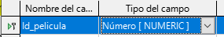

## Crear el resto de campos

Una vez insertado este primer campo, insertaríamos el resto de columnas, que van a ser:

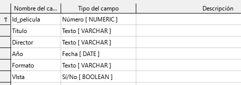

## Guardar la tabla

Una vez creados todos los campos con sus propiedades, debemos guardar la tabla. Para ello pulsamos sobre el icono en forma de disquete de la esquina superior izquierda

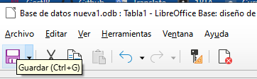

A continuación nos aparece una ventana que nos pide que introducimos el nombre de la tabla. En dicha ventana introducimos el nombre **Peliculas** y pulsamos el botón Aceptar.

Si hemos seguido todos los pasos correctamente, nuestra **tabla peliculas** debe aparecer dentro del apartado Tablas en la parte inferior de la ventana principal

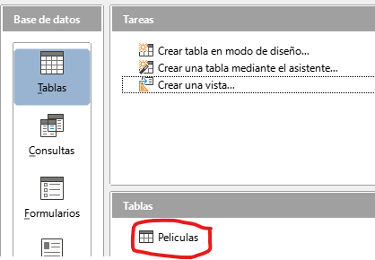

Las tildes pueden producir problemas por lo que es mejor evitar su uso en los nombres.

**Cambiar o modificar columnas**

Si quisiéramos agregar o modificar columnas, elegimos editar.

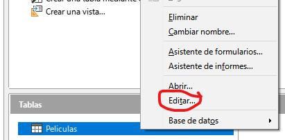

**Editar datos**

Una vez que tenemos creada nuestra **tabla peliculas** vamos a aprender a editar filas de datos; es decir, en nuestro caso, vamos a editar los datos de cada una de las películas para modificar su contenido.

**Insertar datos**

Para insertar datos a través de la hoja de datos tenemos que situarnos en la pantalla principal de en el apartado de Tablas y hacer doble clic con el botón izquierdo del ratón sobre la **tabla peliculas**

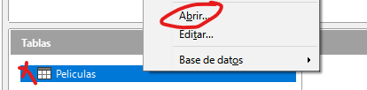

Aparece entonces la pantalla de hoja de datos que se muestra.

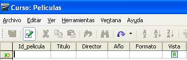

En primer lugar, podemos ver que:

- Aparecen las 6 columnas
- Ninguna fila insertada
- La columna Vista aparece con un cuadrado. Este cuadrado nos indica que es un campo del tipo Sí/No y que aparezca con fondo verde significa que no hay ninguna opción elegida por el momento.
- La flecha indica el lugar en el que se va a insertar la información.

Para pasar de una celda a otra, recomiendo utilizar la tecla <kbd>TAB</kbd>.

**Insertar una fila nueva**

A continuación vamos a introducir la información de nuestra primera fila.

¡Ojo! No podemos dejar ninguna celda de la fila en blanco. De lo contrario, nos puede saltar un error

Deberá quedar así:

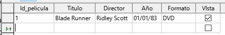

Nota: Como no sabemos el día exacto en el que se estrenó cada una de las películas que tenemos, vamos a indicar siempre el 1 de enero

Si continuamos insertando filas, hay que hacer un recordatorio: la columna **id_pelicula** iba a ser nuestra Llave Primaria; es decir, que los valores de este campo, no podían repetirse para ninguna fila.

**Rellenar el resto de películas**

A continuación rellenamos el resto de filas, con la información de las películas, tal como se muestra.

Poned la información tal cual. Si modificamos algo, en ejercicios posteriores no os cuadrará el resultado.

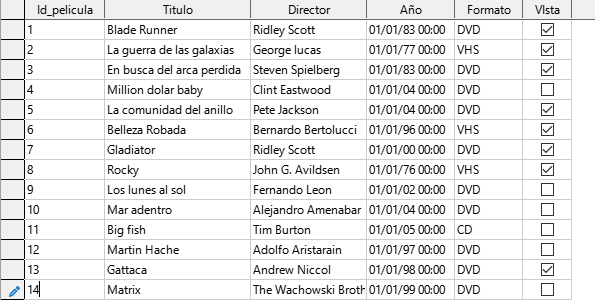

## Ordenar tablas

Podemos ordenar las filas según el valor de cualquiera de las columnas, tanto en orden descendente como ascendente.

Dentro de las opciones de ordenación tenemos tres posibilidades:

- Especificar los criterios de clasificación para visualizar los datos
- Ordenar de forma ascendente
- Ordenar de forma descendente en función de la columna elegida.

Supongamos que deseamos ordenar nuestra filas del siguiente modo:

1. En función de la columna **Formato** de forma **ascendente**
2. En el caso de valores repetidos en formato,  que aplique el orden alfabético de los nombres de los directores en el campo Director
3. En caso de que el nombre del director aparezca repetido, que ordene de la película más reciente a la más antigua usando el campo Año.

En este caso, los criterios de ordenación serían los que aparecen:

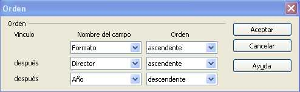

El resultado debería ser el siguiente. Si no os cuadra, comprobad que habéis puesto bien la información y los criterios de ordenación.

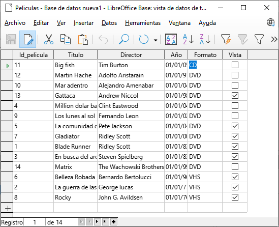

## Filtrado de datos

Por último, las opciones de filtrado de datos nos permiten elegir de forma simple qué datos queremos que se muestren.

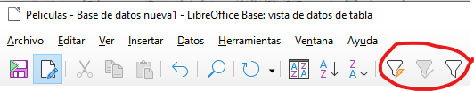

Elegid los siguientes valores para visualizar las películas entre 1980 y 1989. Para ello, filtraremos por el campo año.

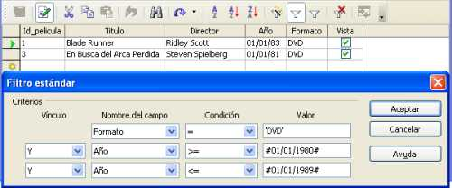

Tocarían aperecer 2 resultados, que son los que coinciden con las condiciones que hemos establecido.

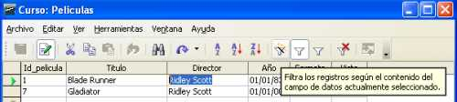

Lo que estamos viendo es la información filtrada, si volvemos a darle al icono del embudo , desactivaremos el filtro y veremos todas las películas de nuevo.

## Crear la tabla intérpretes

Lo siguiente que realizaremos es la tabla de actores y actrices. Para ello crearemos una tabla llamada Interpretes con lo siguientes campos:

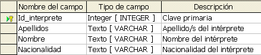

Una vez creada la estructura de la tabla, deberemos Insertar las siguientes filas en ella.

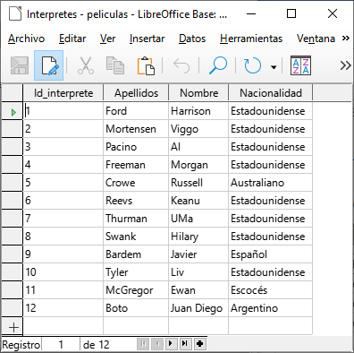

Ahora deberíamos tener dos tablas creadas. Repasa que están todos los datos en ella y que no se te ha olvidado nada, antes de continuar.
