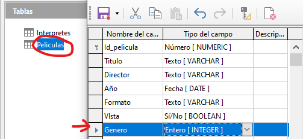
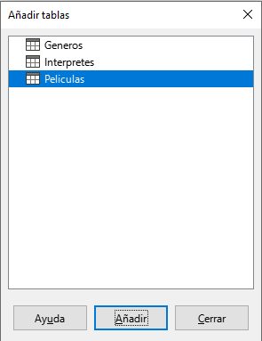
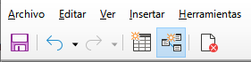

# 4.4. Relación uno a muchos

Para este tipo de relaciones la solución siempre es crear una nueva columna en la tabla del lado del muchos, es decir, debemos crear una nueva columna en la tabla cuyas filas sólo pueden estar relacionadas con una fila de la otra tabla, de manera que el valor de ese campo me indique sin lugar a dudas con qué fila está relacionada de la otra tabla. 

En el caso de Generos y Peliculas, esto supone que tenemos que crear en Peliculas un nuevo campo que para cada película mantenga un valor que me indique sin error al género al que pertenece. 

Por tanto, la columna debe ser del mismo tipo de dato que la columna que sea clave primaria en la otra tabla y los valores que podrá contener será cualquiera de los valores que tome la clave primaria en dicha tabla. 

Crear columna género dentro de la tabla películas

Es decir, en la tabla Peliculas tendremos que crear una columna del mismo tipo que a la que llamaremos Genero. 

Los valores que pondremos en esa columna estarán comprendidos en los distintos valores que toma ese valor en la **tabla Generos**. 

Rellenar género de las películas

Como la columna que hemos creado en la tabla películas es nueva, tendremos que completarla con el número correspondiente al género al  que pertenece la película.

## Herramienta relaciones

Falta indicarle que las dos tablas están relacionadas y que vamos a utilizar para mantener dicha relación la nueva columna id_genero que hemos creado en peliculas. 

Para realizar esta operación tenemos que abrir la herramienta QUE SOLO ENCONTRARÉIS EN LA VENTANA PRINCIPAL, llamada Relaciones. 

Veréis que se abre una ventana nueva.

## Agregar tablas

Lo primero que nos ocurre nada más entrar en la ventana Relaciones. Seleccionamos cada tabla y le damos a añadir.

Deberemos ver esto. Las tablas que aquí vemos las podremos unir con flechas. Estas flechas que pondremos indicarán las relaciones que tienen entre ellas.

## Relacionar las tablas películas y géneros

A continuación ya podemos establecer la relación que queremos indicar. Para ello pinchamos en el icono que aparece a la derecha en la ventana relaciones 

Entonces, nos debe aparecer una ventana donde primero debemos indicar las tablas que queremos relacionar para, a continuación, elegir en función de qué columna vamos a establecer la relación. Debería quedar así:

En la parte inferior de esta ventana veremos que nos pide que indiquemos dos opciones: 

- Opciones de actualización 
- Opciones de eliminación

Nos ofrece cuatro posibilidades para cada una de ellas. Estas opciones sirven para indicar qué hacer si algún valor del campo de clave primaria que está siendo referenciada (en nuestro caso Id_genero) sufre alguna modificación o si esa fila es eliminada.

Para la **actualización**, lo normal suele ser elegir la posibilidad de actualizar en cascada, y para el borrado no existe una opción preferida sino que dependerá bastante del contexto, en nuestro caso, para esta relación, indicaremos poner a nulos. 

Hacemos clic en el botón aceptar para confirmar la relación.

## Posibles errores

En caso de que la relación no se pueda crear debido a algún error, revisad que:

- Los campos relacionados de las dos tablas tengan el mismo **tipo de campo**.
- Ningún campo esté vacío (sin rellenar) en ninguna de las dos tablas
- No exista un valor en un campo que no aparezca en el mismo campo de la otra tabla.

## Visualizar la relación creada

Una vez hemos terminado de indicar la relación, ésta debe aparecer indicada tal y como se muestra.

Ahora aparece una línea uniendo ambas tablas y que en el extremo de esa línea;

- En el lado de la tabla Generos aparece el valor 1
- En el extremo de la tabla Peliculas, nos aparece el valor n. 

Estos valores nos están indicando que el tipo de relación es de **uno (1) a muchos (n). **
