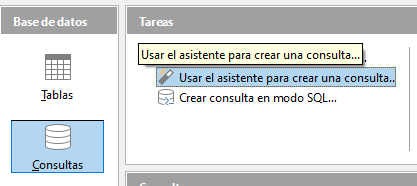
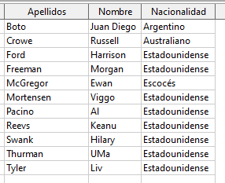

## 5.2. Consultas sobre una única tabla

Vamos a comenzar realizando una consulta que nos devuelva de la tabla Interpretes , el nombre, los apellidos y la nacionalidad de los que no son españoles.

Para ello, teniendo seleccionada la sección “Consultas”, nos situamos sobre el apartado de tareas y elegimos “Usar el asistente para crear consulta…”.

## Asistente de creación de consultas

Nos aparece entonces la primera ventana del asistente donde debemos elegir qué campos queremos que se muestren, y seleccionamos entonces los campos Nombre, Apellidos,y Nacionalidad de la tabla Interpretes.

Tiene que quedar así:

## Orden de clasificación

A continuación, podemos elegir si queremos que se muestren ordenados en función de los valores de uno o varios campos. Nosotros vamos a seleccionar que se ordenen alfabéticamente por los apellidos del intérprete.

## Condiciones de búsqueda

En el siguiente paso podemos elegir si queremos indicar uno o varios criterios de búsqueda; es decir, si queremos que las filas que se muestran cumplan alguna condición en particular.

Como en nuestro caso el objetivo es mostrar sólo los intérpretes no españoles, debemos indicar que para el campo Nacionalidad no deseamos aquellos que contengan el valor “Español” (ver Figura 5.5).

## Alias

A continuación, podemos elegir con qué nombre (**alias**), se mostrarán las cabeceras de las columnas de los campos que hemos elegido al mostrar el resultado de la consulta. En este caso, como los nombres de los campos son bastante claros simplemente les quitamos el nombre de la tabla que figura delante del nombre.

A continuación podemos cambiar el nombre de la consulta si queremos. Es importante que este nombre refleje el contenido que vamos a obtener ejecutando dicha consulta.

## Comprobación del resultado

Como resultado veremos el listado ordenado por apellido en orden ascendente, y evitando los intérpretes españoles.

Siempre que queramos hacer esta consulta, simplemente hacemos doble clic sobre su nombre.

Cuando añadamos nueva información a las tablas, la consulta automáticamente nos mostrará los resultados actualizados en el momento de realizarla.

