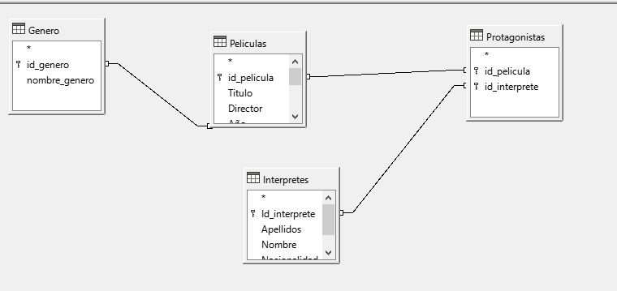
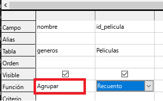
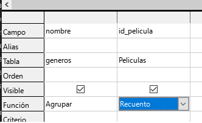
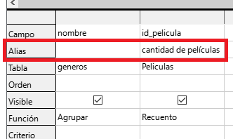

# 6.2. Creación en vista Diseño de consulta sobre varias tablas 

Vamos a crear nuestra primera consulta completamente en **vista diseño**. En particular, vamos a crear una consulta que nos muestre todos los actores que protagonizan películas junto con los datos de la película, incluido el nombre del género. Es decir, vamos a construir una consulta que utiliza **las cuatro tablas** de nuestra base de datos. 

Para empezar, nos vamos a la ventana principal, a la sección Consultas y seleccionamos la tarea **Crear consulta en vista Diseño**.

## Seleccionar tablas a utilizar

Nada más entrar en el modo Diseño, nos mostrará una ventana donde indicar las tablas que queremos incluir en la consulta que se va a crear. En nuestro caso, vamos a añadir las cuatro disponibles y veremos como nos muestra las relaciones existentes automáticamente.

Las puedes recolocar un poco para que te sea más fácil ver las relaciones

## Especificar criterios

A continuación vamos a especificar que queremos que los resultados de la consulta se muestran ordenados por los apellidos y el nombre de los intérpretes.

Para incluir los campos de la **tabla peliculas** vamos a seleccionar Peliculas:* y así no tenemos que incluir los campos uno a uno

Para seleccionar los campos de la tabla Interpretes no hemos utilizado la posibilidad **Interpretes.*** porque es necesario seleccionar cada campo individualmente, ya que vamos a establecer algún criterio de ordenación en función de alguno de los campos de la tabla. 

Como en nuestro caso vamos a mostrar los resultados ordenados en función de los apellidos y el nombre de los intérpretes necesitamos seleccionar uno a uno cada campo de Interpretes. 

Para terminar, vamos a seleccionar el campo Nombre de la **tabla Generos** y, en el alias, vamos a poner “NombreGenero”, para distinguirlo de los campos ya seleccionados, Nombre de la tabla Interpretes y genero de la **tabla peliculas**.

Guardamos la consulta con el nombre “ConsultaTotal” y al ejecutarla el resultado es el siguiente:

## Consultas con funciones

Vamos a crear una consulta que realiza operaciones sobre los resultados.

Así, vamos a crear una consulta que muestre el nombre de cada género almacenado y el total de películas que tenemos de cada género. 

Es decir, el objetivo es realizar una consulta sobre Generos y Peliculas de manera que agrupemos las filas devueltas en función de cada género para así poder contarlas y poder saber el número de películas asociadas a cada uno de ellos. 

El resultado de nuestra consulta, con las filas que tenemos actualmente en Generos y Peliculas, debe ser como la siguiente: 

Para empezar, elegimos las tablas sobre las que vamos a realizar la consulta, Generos y Peliculas.

Los campos que necesitamos son, por una lado Nombre de Generos, que es sobre el que agruparemos los resultados devueltos y, por otro, un campo de la **tabla peliculas** que estemos seguros que siempre tendrá un valor (no estará vacío) para cada fila de Peliculas. 

Por ejemplo, podemos elegir el campo **id_pelicula** que siempre va a tener valor para cada película. Los campos seleccionados se muestran.

A continuación, debemos asociar la función correspondiente a cada uno de los dos campos. 

## Función agrupar

En primer lugar, hemos dicho que queremos agrupar los resultados en función de cada género, para ello vamos a incluir la **función agrupar** asociada al campo Nombre de Generos. 

## Función recuento

En segundo lugar, lo que queremos es contar las películas relacionadas con cada género. Esto último lo conseguimos asociando la **función recuento** al campo **Id_pelicula** de la **tabla peliculas**.

## Guardar la consulta

Guardamos entonces la consulta como **peliculas_por_genero**.

## Ejecutar la consulta

Al lanzarla (F5) nos encontramos una pantalla como esta: 

Como vemos, la cabecera con el total de películas está mostrando la función que estamos utilizando junto con el nombre del campo.

## Asignar un alias

Si queremos que el resultado aparezca como el que mostraremos en la figura., es decir, con una cabecera significativa, debemos añadir el alias **cantidad de peliculas**.

